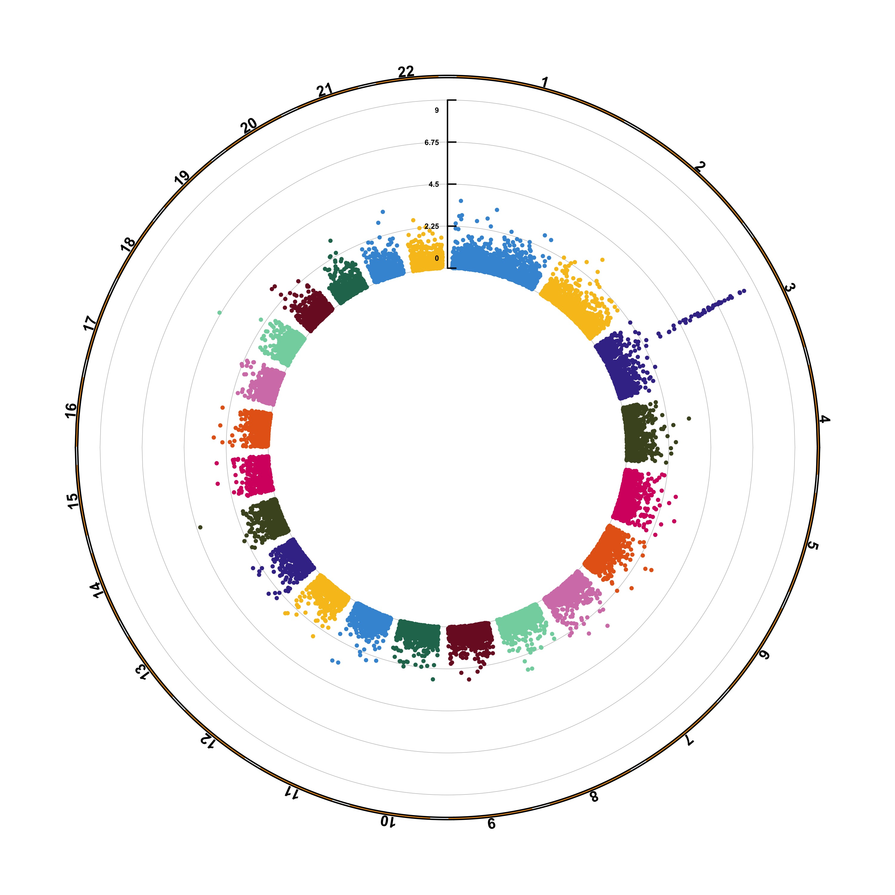
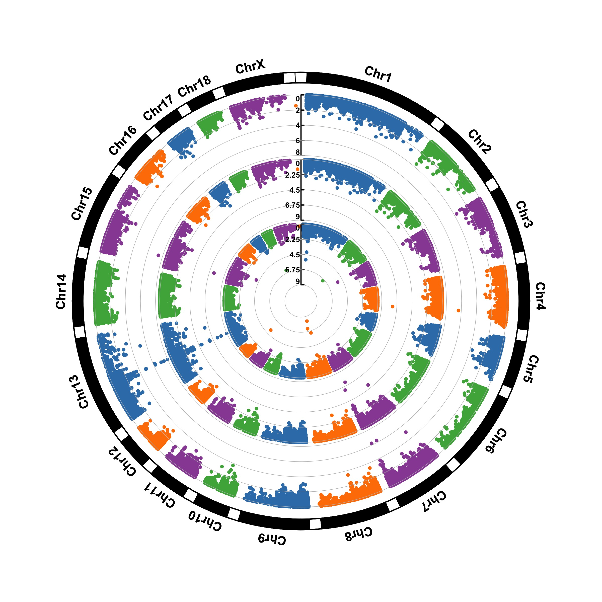

```{r global options, include = FALSE}
knitr::opts_chunk$set( warning=FALSE, message=FALSE)
```


<div class="container">


# Quick start with the qqman library
***

The [qqman library](https://github.com/stephenturner/qqman) by [Stephen D. Turner](http://stephenturner.us/#!index.md) is the most widely used way to create a Manhattan plot with R.  A version is on CRAN and can be installed with `install.packages("qqman")`. It provides a GWAS result data frame (`gwasResults`) that we will use as an example dataset in this post.

The manhattan function allows to build the plot in just a few characters. Several customizations are also possible, as listed below. These examples come from the [package vignette](https://cran.r-project.org/web/packages/qqman/vignettes/qqman.html) that I advise to consult.

# Basic
***

The [manhattan function](https://www.rdocumentation.org/packages/qqman/versions/0.1.2/topics/manhattan) is straightforward: it just needs to have 4 columns identified properly, and does a proper job.

```{r, warning=FALSE, message=FALSE, fig.width=9}
# Load the library
library(qqman)

# Make the Manhattan plot on the gwasResults dataset
manhattan(gwasResults, chr="CHR", bp="BP", snp="SNP", p="P" )
```

# SNP of interest
***

A common task is to highlight a group of SNP on the Manhattan plot. For example it is handy to show which SNP are part of the clumping result. This is an easy task with qqman once you have identified the SNPs of interest.

```{r, warning=FALSE, message=FALSE, fig.width=9}
# Let's highlight them, with a bit of customization on the plot
snpsOfInterest
manhattan(gwasResults, highlight = snpsOfInterest)
```

# Annotate
***

You probably want to know the name of the SNP of interest: the ones with a high pvalue. You can automatically annotate them using the annotatePval argument:

```{r, warning=FALSE, message=FALSE, fig.width=9}
manhattan(gwasResults, annotatePval = 0.01)
```


# QQplot
***

It is a good practice to draw a qqplot from the output of a GWAS. It allows to compare the distribution of the pvalue with an expected distribution by chance. Its realisation is straightforward thanks to the qq function:

```{r, align="center"}
qq(gwasResults$P)
```


# Highly customisable with ggplot2 
***

If you want to access a maximum level of customization it is sometimes good to build your plot from scratch. Here is an example using dplyr and [ggplot2](https://www.r-graph-gallery.com/portfolio/ggplot2-package/).

First of all, we need to compute the cumulative position of SNP and then we need to prepare the X axis. Indeed we do not want to display the cumulative position of SNP in bp, but just show the chromosome name instead.

```{r, echo=FALSE, warning=FALSE, message=FALSE}
library(tidyverse)
```

```{r}
don <- gwasResults %>% 
  
  # Compute chromosome size
  group_by(CHR) %>% 
  summarise(chr_len=max(BP)) %>% 
  
  # Calculate cumulative position of each chromosome
  mutate(tot=cumsum(chr_len)-chr_len) %>%
  select(-chr_len) %>%
  
  # Add this info to the initial dataset
  left_join(gwasResults, ., by=c("CHR"="CHR")) %>%
  
  # Add a cumulative position of each SNP
  arrange(CHR, BP) %>%
  mutate( BPcum=BP+tot)

axisdf = don %>%
  group_by(CHR) %>%
  summarize(center=( max(BPcum) + min(BPcum) ) / 2 )
```

Ready to make the plot using ggplot2:

```{r, fig.width=9, fig.height=5, warning=FALSE}
ggplot(don, aes(x=BPcum, y=-log10(P))) +
    
    # Show all points
    geom_point( aes(color=as.factor(CHR)), alpha=0.8, size=1.3) +
    scale_color_manual(values = rep(c("grey", "skyblue"), 22 )) +
    
    # custom X axis:
    scale_x_continuous( label = axisdf$CHR, breaks= axisdf$center ) +
    scale_y_continuous(expand = c(0, 0) ) +     # remove space between plot area and x axis
  
    # Custom the theme:
    theme_bw() +
    theme( 
      legend.position="none",
      panel.border = element_blank(),
      panel.grid.major.x = element_blank(),
      panel.grid.minor.x = element_blank()
    )
```


# Highlight SNPs
***

Let's suppose the you have a group of SNP that you want to highlight on the plot. This can be done following almost the same procedure. We just need to add them a flag in the dataframe, and use the flag for the color:

```{r, fig.width=9, fig.height=5, warning=FALSE}
# List of SNPs to highlight are in the snpsOfInterest object
# We will use ggrepel for the annotation
library(ggrepel)

# Prepare the dataset
don <- gwasResults %>% 
  
  # Compute chromosome size
  group_by(CHR) %>% 
  summarise(chr_len=max(BP)) %>% 
  
  # Calculate cumulative position of each chromosome
  mutate(tot=cumsum(chr_len)-chr_len) %>%
  select(-chr_len) %>%
  
  # Add this info to the initial dataset
  left_join(gwasResults, ., by=c("CHR"="CHR")) %>%
  
  # Add a cumulative position of each SNP
  arrange(CHR, BP) %>%
  mutate( BPcum=BP+tot) %>%

  # Add highlight and annotation information
  mutate( is_highlight=ifelse(SNP %in% snpsOfInterest, "yes", "no")) %>%
  mutate( is_annotate=ifelse(-log10(P)>4, "yes", "no")) 

# Prepare X axis
axisdf <- don %>% group_by(CHR) %>% summarize(center=( max(BPcum) + min(BPcum) ) / 2 )

# Make the plot
ggplot(don, aes(x=BPcum, y=-log10(P))) +
    
    # Show all points
    geom_point( aes(color=as.factor(CHR)), alpha=0.8, size=1.3) +
    scale_color_manual(values = rep(c("grey", "skyblue"), 22 )) +
    
    # custom X axis:
    scale_x_continuous( label = axisdf$CHR, breaks= axisdf$center ) +
    scale_y_continuous(expand = c(0, 0) ) +     # remove space between plot area and x axis

    # Add highlighted points
    geom_point(data=subset(don, is_highlight=="yes"), color="orange", size=2) +
  
    # Add label using ggrepel to avoid overlapping
    geom_label_repel( data=subset(don, is_annotate=="yes"), aes(label=SNP), size=2) +

    # Custom the theme:
    theme_bw() +
    theme( 
      legend.position="none",
      panel.border = element_blank(),
      panel.grid.major.x = element_blank(),
      panel.grid.minor.x = element_blank()
    )
```  


# A note about speed
***

A common problem in genomics is the high number of data points. It is not unusual to make a GWAS with millions of SNPs, which makes the plot very long to build. However, it is important to notice that the vast majority of these SNPs have a high p-value and thus do not interest us for the analysis.

A quick work around is thus to plot only SNP with a p-value below a given threshold (~0.05). The graphic will be as informative, but made in seconds. The filtering is straightforward. For example with dplyr:

```{r}
gwasResults %>% 
  filter(-log10(P)>1)
```

Decreasing the number of data points has another interest: it allows to switch to an interactive version.


# Switch to an interactive version with plotly
***

Plotly is an [HTML widget](http://www.htmlwidgets.org): an R library that allows to call javascript under the hood to create [interactive visualizations](https://www.r-graph-gallery.com/interactive-charts/). The good thing with plotly is that it can transform a [ggplot2 graphic](https://www.r-graph-gallery.com/portfolio/ggplot2-package/) in an interactive version using the [ggplotly](https://www.r-graph-gallery.com/get-the-best-from-ggplotly/) function. Let's apply it to our manhattan plot.

- **Note 1**: You probably want to filter your data before doing an interactive version. Having thousands of points will slow down the graphic, and you surely don't care about SNP with a high p-value.
- **Note 2**: the [Manhattanly library](https://github.com/sahirbhatnagar/manhattanly) is another good way to make an interactive manhattan plot. It wraps the plotly library, so you will have less code to type than the example below, but less customization available.
- **Note 3**: Interactivity allows to: zoom on a specific region of the graphic, hover a SNP, move axis, export figure as png.

```{r, message=FALSE, warning=FALSE, fig.width=9}
library(plotly)

# Prepare the dataset
don <- gwasResults %>% 
  
  # Compute chromosome size
  group_by(CHR) %>% 
  summarise(chr_len=max(BP)) %>% 
  
  # Calculate cumulative position of each chromosome
  mutate(tot=cumsum(chr_len)-chr_len) %>%
  select(-chr_len) %>%
  
  # Add this info to the initial dataset
  left_join(gwasResults, ., by=c("CHR"="CHR")) %>%
  
  # Add a cumulative position of each SNP
  arrange(CHR, BP) %>%
  mutate( BPcum=BP+tot) %>%

  # Add highlight and annotation information
  mutate( is_highlight=ifelse(SNP %in% snpsOfInterest, "yes", "no")) %>%

  # Filter SNP to make the plot lighter
  filter(-log10(P)>0.5)
  
# Prepare X axis
axisdf <- don %>% group_by(CHR) %>% summarize(center=( max(BPcum) + min(BPcum) ) / 2 )

# Prepare text description for each SNP:
don$text <- paste(
    "SNP: ", don$SNP,
    "\nPosition: ", don$BP,
    "\nChromosome: ", don$CHR,
    "\nLOD score:", -log10(don$P) %>% round(2),
    "\nWhat else do you wanna know", sep=""
)

# Make the plot
p <- ggplot(don, aes(x=BPcum, y=-log10(P), text=text)) +
    
    # Show all points
    geom_point( aes(color=as.factor(CHR)), alpha=0.8, size=1.3) +
    scale_color_manual(values = rep(c("grey", "skyblue"), 22 )) +
    
    # custom X axis:
    scale_x_continuous( label = axisdf$CHR, breaks= axisdf$center ) +
    scale_y_continuous(expand = c(0, 0) ) +     # remove space between plot area and x axis
    ylim(0,9) +

    # Add highlighted points
    geom_point(data=subset(don, is_highlight=="yes"), color="orange", size=2) +
  
    # Custom the theme:
    theme_bw() +
    theme( 
      legend.position="none",
      panel.border = element_blank(),
      panel.grid.major.x = element_blank(),
      panel.grid.minor.x = element_blank()
    )
p = ggplotly(p, tooltip="text")

# save the widget
library(htmlwidgets)
saveWidget(p, file="HtmlWidget/interactiveManhattanPlot.html")
```


<center><iframe src="HtmlWidget/interactiveManhattanPlot.html" height="700" width="700" style="border:none;"></iframe></center>


# Circular version with CMplot
***

The [CMplot library](https://github.com/YinLiLin/R-CMplot) by Lilin Yin is a good choice if you want to make a circular version of your manhattanplot. I believe than doing a circular version makes sense: it gives less space to all the non significant SNPs that do not interest us, and gives more space for the significant association. Moreover, the CMplot makes their realization straightforward.

```{r, warning=FALSE, message=FALSE}
library("CMplot")
CMplot(gwasResults, plot.type="c", r=1.6,
        outward=TRUE, cir.chr.h=.1 ,chr.den.col="orange", file="jpg",
        dpi=300, chr.labels=seq(1,22))
```

<center>
  
</center>


Note that it also gives the possibility to compare the p-values of several traits. Here is an example using another dataset:

```{r, warning=FALSE, message=FALSE}
data(pig60K)
CMplot(pig60K, plot.type="c", chr.labels=paste("Chr",c(1:18,"X","Y"),sep=""), r=0.4, 
      outward=FALSE, cir.chr.h=1.3 ,chr.den.col="black", file="jpg", dpi=300)
```

<center>
  
</center>


<!-- Close container -->
</div>

```{r, echo=FALSE}
htmltools::includeHTML("htmlChunkRelatedCorrelation.html")
```


