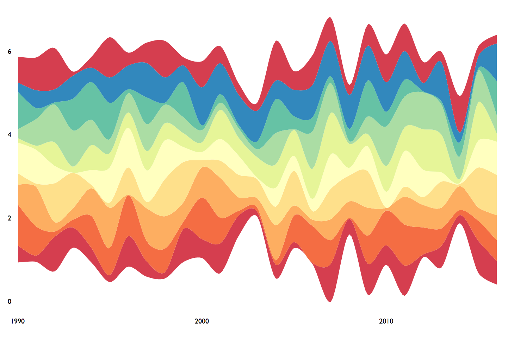

```{r global options, include = FALSE}
knitr::opts_chunk$set( warning=FALSE, message=FALSE)
```

<div class="container">


<div class = "row">

<div class = "col-md-6  col-sm-12 align-self-center">

In `R`, [streamgraphs](streamgraph.html) are built thanks to the `streamgraph` package that is an htmlwidget. They are thus rendered as interactive graphics.

It is possible to get a static version, using the `interactive=FALSE` option.

It is however tricky to export the html format to an usual `.png` image. You have to use the `webshot` library which allows to take screenshots of web page from R. Check the commented code below to see how to proceed:


</div>


<div class = "col-md-6  col-sm-12">

</img>

</div>
</div>


```{r eval=FALSE}
# Library
library(streamgraph)
# Create data:
data <- data.frame(
  year=rep(seq(1990,2016) , each=10),
  name=rep(letters[1:10] , 27),
  value=sample( seq(0,1,0.0001) , 270)
)
# Start with a classic stream graph. It is supposed to open in a browser
streamgraph(data, key="name", value="value", date="year")
# Copy the URL of the html window you get
# load webshot library
library(webshot)

#install phantom:
webshot::install_phantomjs()
# Make a webshot in pdf : high quality but can not choose printed zone
webshot("paste_your_html_here.html" , "output.pdf", delay = 0.2)

# Make a webshot in png : Low quality - but you can choose shape
webshot("paste_your_html_here" , "output.png", delay = 0.2 , cliprect = c(440, 0, 1000, 10))
```


</div>


```{r, echo=FALSE}
htmltools::includeHTML("htmlChunkRelatedEvolution.html")
```
