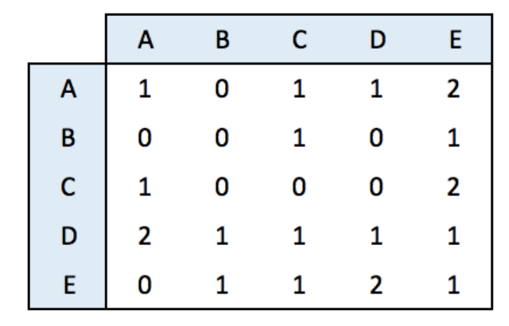
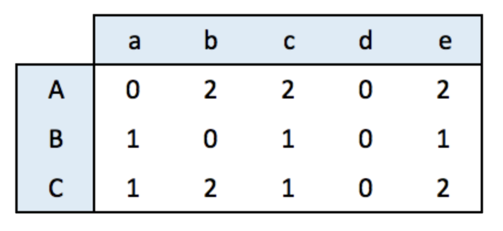
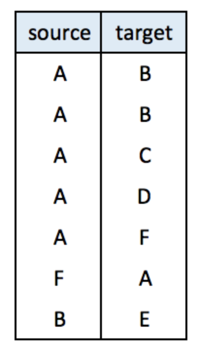

```{r global options, include = FALSE}
knitr::opts_chunk$set( warning=FALSE, message=FALSE)
```

<div class="container">


# Adjacency matrix
***

<div class = "row">

<div class = "col-md-6  col-sm-12 align-self-center">

An adjacency matrix is a square matrix where individuals in rows and columns are the same.

It’s typically the kind of matrix you get when calculating the correlation between each pair of individual. In this example, we have 1 connection from E to C, and 2 connections from C to E. By default, we get an unweighted and oriented network.

</img>

</div>


<div class = "col-md-6  col-sm-12">

```{r thecode2, echo=FALSE, out.width = "100%", fig.height=7}
#library
library(igraph)

# Create data
set.seed(10)
data <- matrix(sample(0:2, 25, replace=TRUE), nrow=5)
colnames(data) = rownames(data) = LETTERS[1:5]
 
# build the graph object
network <- graph_from_adjacency_matrix(data)
 
# plot it
plot(network)
```

</div>
</div>


```{r thecode2, eval=FALSE}
```


# Incidence matrix
***

<div class = "row">

<div class = "col-md-6  col-sm-12 align-self-center">

An incidence matrix is not square and entities provided in rows and columns are not necessary the same.

<u>Note</u>: by default, the graph object is directed from rows to columns.

</img>

</div>


<div class = "col-md-6  col-sm-12">

```{r thecode3, echo=FALSE, out.width = "100%", fig.height=7}
# create data
library(igraph)
set.seed(1)
data <- matrix(sample(0:2, 15, replace=TRUE), nrow=3)
colnames(data) <- letters[1:5]
rownames(data) <- LETTERS[1:3]
 
# create the network object
network=graph_from_incidence_matrix(data)
 
# plot it
plot(network)
```

</div>
</div>


```{r thecode3, eval=FALSE}
```


# Edge list
***

<div class = "row">

<div class = "col-md-6  col-sm-12 align-self-center">

An edge list has 2 columns. Each row represents a connection between an origin (first column) and a destination (left column).

<u>Note</u>: this kind of input often goes with another dataframe providing features for each node. (See [this post](249-igraph-network-map-a-color.html)). It is also possible to add information concerning each link in the edge list.

<center></img></center>

</div>


<div class = "col-md-6  col-sm-12">

```{r thecode4, echo=FALSE, out.width = "100%", fig.height=7}
# create data:
links <- data.frame(
    source=c("A","A", "A", "A", "A","F", "B"),
    target=c("B","B", "C", "D", "F","A","E")
    )

# create the network object
network <- graph_from_data_frame(d=links, directed=F) 

# plot it
plot(network)
```

</div>
</div>


```{r thecode4, eval=FALSE}
```


# Literal List of connections
***

<div class = "row">

<div class = "col-md-6  col-sm-12 align-self-center">

Last option that is less often used: a litteral list of the connection. Can be understand by `igraph` thanks to the  `graph_from_literal()` function.


</div>


<div class = "col-md-6  col-sm-12">

```{r thecode5, echo=FALSE, out.width = "100%", fig.height=7}
# create data:
network <- graph_from_literal( A-B-C-D, E-A-E-A, D-C-A, D-A-D-C )

# plot it
plot(network)
```

</div>
</div>


```{r thecode5, eval=FALSE}
```


<!-- Close container -->
</div>


```{r, echo=FALSE}
htmltools::includeHTML("htmlChunkRelatedPartOfWhole.html")
```
