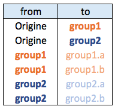
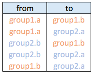

```{r global options, include = FALSE}
knitr::opts_chunk$set( warning=FALSE, message=FALSE)
```

<div class="container">


# Input data
***

[Hierarchical Edge Bundling](hierarchical-edge-bundling.html) is a data visualisation method allowing to check connections between leaves of a hierarchical network. It requires two inputs:

<div class = "row">

<div class = "col-md-4  col-sm-12" align-self-center>

<br>

- A hierarchical network structure, also called tree
- An adjacency matrix that describes connections between some nodes of the tree

</div>


<div class = "col-md-4  col-sm-12">

<span>Hierarchical network data frame:</span>

</img>

</div>


<div class = "col-md-4  col-sm-12">

Connections data frame:

</img>

</div>


</div>


# Visualizing the hierarchy
***

Let’s start by creating the hierarchic structure with `R`. A hierarchic structure is basically a set of nodes, with edges linking nodes. We often accompany it with a second data frame that gives features for each node of the first data frame.

Let’s build these 2 tables:

```{r}
# Libraries
library(ggraph)
library(igraph)

# create a data frame giving the hierarchical structure of your individuals.
# Origin on top, then groups, then subgroups
d1 <- data.frame(from="origin", to=paste("group", seq(1,10), sep=""))
d2 <- data.frame(from=rep(d1$to, each=10), to=paste("subgroup", seq(1,100), sep="_"))
hierarchy <- rbind(d1, d2)

# create a vertices data.frame. One line per object of our hierarchy, giving features of nodes.
vertices <- data.frame(name = unique(c(as.character(hierarchy$from), as.character(hierarchy$to))) )
```

<br><br>

A hierarchical structure is a network structure. Thus, we can visualise it with the `igraph` or the `ggraph` library quite easily, like described in the [network section](network.html) of the gallery.

```{r out.width = c("33%", "33%", "33%"), fig.height=7, fig.show='hold'}
# Create a graph object with the igraph library
mygraph <- graph_from_data_frame( hierarchy, vertices=vertices )
# This is a network object, you visualize it as a network like shown in the network section!

# With igraph:
plot(mygraph, vertex.label="", edge.arrow.size=0, vertex.size=2)

# With ggraph:
ggraph(mygraph, layout = 'dendrogram', circular = FALSE) +
  geom_edge_link() +
  theme_void()

ggraph(mygraph, layout = 'dendrogram', circular = TRUE) +
  geom_edge_diagonal() +
  theme_void()
```


# Add a few connections
***

Now, let’s add a second input to our data: connections. Suppose that nodes 18, 20 and 30 are connected to nodes 19, 50 and 70 respectively.

An obvious solution to represent this link could be to add a straight line (left). The hierarchical edge bundling method does almost that. But it curves the lines to make thelm follow the edges of our structure (right).

This method offers a `tension` parameters which controls how much we want to curve the lines.


```{r out.width = c("50%", "50%"), fig.height=7, fig.show='hold'}
# left: What happens if connections are represented with straight lines
ggraph(mygraph, layout = 'dendrogram', circular = TRUE) +
  geom_edge_diagonal(alpha=0.1) +
  geom_conn_bundle(data = get_con(from = c(18,20,30), to = c(19, 50, 70)), alpha=1, width=1, colour="skyblue", tension = 0) +
  theme_void()

# right: using the bundle method (tension = 1)
ggraph(mygraph, layout = 'dendrogram', circular = TRUE) +
  geom_edge_diagonal(alpha=0.1) +
  geom_conn_bundle(data = get_con(from = c(18,20,30), to = c(19, 50, 70)), alpha=1, width=1, colour="skyblue", tension = 1) +
  theme_void()
```


# Hierarchical Edge Bundling
***
Usually connections are stored in another data frame, here called `connect`. We have to pass it to `ggraph` to automatically plot all the connections. You get a hierarchical edge bundling chart.

<u>Note</u>: `ggraph` expect nodes to be called following their id. Thus, it is necessary to get them using the `match()` function.

```{r out.width = c("50%", "50%"), fig.height=7, fig.show='hold'}
# create a dataframe with connection between leaves (individuals)
all_leaves <- paste("subgroup", seq(1,100), sep="_")
connect <- rbind(
  data.frame( from=sample(all_leaves, 100, replace=T) , to=sample(all_leaves, 100, replace=T)),
  data.frame( from=sample(head(all_leaves), 30, replace=T) , to=sample( tail(all_leaves), 30, replace=T)),
  data.frame( from=sample(all_leaves[25:30], 30, replace=T) , to=sample( all_leaves[55:60], 30, replace=T)),
  data.frame( from=sample(all_leaves[75:80], 30, replace=T) , to=sample( all_leaves[55:60], 30, replace=T))
  )

# The connection object must refer to the ids of the leaves:
from <- match( connect$from, vertices$name)
to <- match( connect$to, vertices$name)

# plot
ggraph(mygraph, layout = 'dendrogram', circular = TRUE) +
  geom_conn_bundle(data = get_con(from = from, to = to), alpha=0.2, colour="skyblue", tension = 0) +
  geom_node_point(aes(filter = leaf, x = x*1.05, y=y*1.05)) +
  theme_void()

# plot
ggraph(mygraph, layout = 'dendrogram', circular = TRUE) +
  geom_conn_bundle(data = get_con(from = from, to = to), alpha=0.2, colour="skyblue", tension = 0.9) +
  geom_node_point(aes(filter = leaf, x = x*1.05, y=y*1.05)) +
  theme_void()
```


# Conclusion
***

This blogpost defined what hierarchical edge bundling is, and demonstrates how to build a basic one with `R` and `ggraph`. Now, go to the next level and learn how to [customize](hierarchical-edge-bundling.html) this figure.


<!-- Close container -->
</div>


```{r, echo=FALSE}
htmltools::includeHTML("htmlChunkRelatedFlow.html")
```
