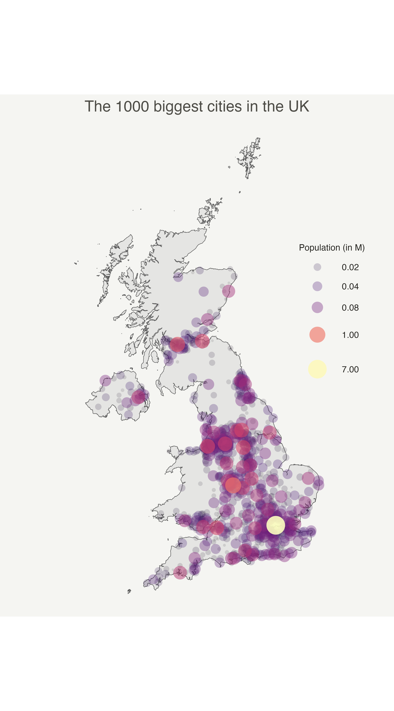

```{r global options, include = FALSE}
knitr::opts_chunk$set(warning = FALSE, message = FALSE, dev = "ragg_png", dpi = 300)
```

<div class="container" style="padding-top: 100px">

# About
***

This post explains how to make a [bubble map](bubble-map.html) with [ggplot2](ggplot2-package.html). 

A bubble map is like a [bubble chart](bubble-chart.html), but with a map in the background. As input you need:

- a list of GPS coordinates (longitude and latitude of the places you want to represent)
- a numeric variable used for bubble color and size 

This post provides a step-by-step approach to build the map beside, showing the 1000 biggest cities of the UK.


<div class = "row">

<div class = "col-md-6  col-sm-12  align-self-center">

</img>

</div>


<div class = "col-md-6  col-sm-12  align-self-center">


# Load data
***

The first step is to **get the boundaries** of the zone that interests you. Several option are available in R, as extensively described in the [background map](map.html) section of the gallery.

Briefly, you can find this information somewhere under the [shapefile](168-load-a-shape-file-into-r.html) format or under the [geoJSON](325-background-map-from-geojson-format-in-r.html) format. You can also load google like backgrounds with the [ggmap](324-map-background-with-the-ggmap-library.html) library. 

This post uses the last approach: it loads the `giscoR` package that provides the boundaries of every world country. 

</div>
</div>


```{r}
# Libraries
library(ggplot2)
library(dplyr)

# Get the world polygon and extract UK
library(giscoR)
UK <- gisco_get_countries(country = "UK", resolution = 1)
```

<br>

The second step is to load a data frame with the info of the bubble you want to draw. The `maps` library provides a list of the biggest cities in the world. Let's use it to get information on the UK.

```{r}
# Get a data frame with longitude, latitude, and size of bubbles (a bubble = a city)
library(maps)
data <- world.cities %>% filter(country.etc == "UK")
```


# Basic scatterplot map
***

`ggplot2` makes it a breeze to map both information on the same graph. Use `geom_sf()` for the shape of UK first, and add your scatter plot on it with `geom_point()`. 

On the right figure, note the use of the `ggrepel` library to avoid overlapping between city names.


```{r thecode, echo=FALSE, out.width = c("50%","50%"), fig.show="hold", fig.height=6}
# Left chart
ggplot() +
  geom_sf(data = UK, fill = "grey", alpha = 0.3) +
  geom_point(data = data, aes(x = long, y = lat)) +
  theme_void() +
  ylim(50, 59)

# Second graphic with names of the 10 biggest cities
library(ggrepel)
ggplot() +
  geom_sf(data = UK, fill = "grey", alpha = 0.3) +
  geom_point(data = data, aes(x = long, y = lat, alpha = pop)) +
  geom_text_repel(
    data = data %>% arrange(pop) %>% tail(10),
    aes(x = long, y = lat, label = name), size = 5
  ) +
  geom_point(
    data = data %>% arrange(pop) %>% tail(10), aes(x = long, y = lat),
    color = "red", size = 3
  ) +
  theme_void() +
  ylim(50, 59) +
  theme(legend.position = "none")
```


```{r thecode, eval=FALSE}
```


# Basic bubble map
***

Now we want to add another information. The **number of inhabitant per city will be mapped** to the colour and the size of the bubbles.

Note that the order of city matters! It is advised to show the **most important information on top** (center). This can been done sorting your dataset before making the plot.

```{r thecode5, echo=FALSE, out.width = c("33%","33%","33%"), fig.show="hold", fig.height=7}
# Left: use size and color
ggplot() +
  geom_sf(data = UK, fill = "grey", alpha = 0.3) +
  geom_point(data = data, aes(x = long, y = lat, size = pop, color = pop)) +
  scale_size_continuous(range = c(1, 12)) +
  scale_color_viridis_c(trans = "log") +
  theme_void() +
  ylim(50, 59)

# Center: reorder your dataset first! Big cities appear later = on top
data %>%
  arrange(pop) %>%
  mutate(name = factor(name, unique(name))) %>%
  ggplot() +
  geom_sf(data = UK, fill = "grey", alpha = 0.3) +
  geom_point(aes(x = long, y = lat, size = pop, color = pop), alpha = 0.9) +
  scale_size_continuous(range = c(1, 12)) +
  scale_color_viridis_c(trans = "log") +
  theme_void() +
  ylim(50, 59) +
  theme(legend.position = "none")

# Right: just use arrange(desc(pop)) instead
data %>%
  arrange(desc(pop)) %>%
  mutate(name = factor(name, unique(name))) %>%
  ggplot() +
  geom_sf(data = UK, fill = "grey", alpha = 0.3) +
  geom_point(aes(x = long, y = lat, size = pop, color = pop), alpha = 0.9) +
  scale_size_continuous(range = c(1, 12)) +
  scale_color_viridis_c(trans = "log") +
  theme_void() +
  ylim(50, 59) +
  theme(legend.position = "none")
```
 


```{r thecode5, eval=FALSE}
```


 
# Customized bubble map
***


<div class = "row">

<div class = "col-md-6  col-sm-12 align-self-center">

```{r thecode6, echo=FALSE, out.width="100%", fig.height=9, fig.width=5}
# Create breaks for the color scale
mybreaks <- c(0.02, 0.04, 0.08, 1, 7)

# Reorder data to show biggest cities on top
data <- data %>%
  arrange(pop) %>%
  mutate(name = factor(name, unique(name))) %>%
  mutate(pop = pop / 1000000)

# Build the map
data %>%
  ggplot() +
  geom_sf(data = UK, fill = "grey", alpha = 0.3) +
  geom_point(aes(x = long, y = lat, size = pop, color = pop, alpha = pop),
    shape = 20, stroke = FALSE
  ) +
  scale_size_continuous(
    name = "Population (in M)", trans = "log",
    range = c(1, 12), breaks = mybreaks
  ) +
  scale_alpha_continuous(
    name = "Population (in M)", trans = "log",
    range = c(0.1, .9), breaks = mybreaks
  ) +
  scale_color_viridis_c(
    option = "magma", trans = "log",
    breaks = mybreaks, name = "Population (in M)"
  ) +
  theme_void() +
  guides(colour = guide_legend()) +
  ggtitle("The 1000 biggest cities in the UK") +
  theme(
    legend.position = c(1, 0.6),
    text = element_text(color = "#22211d"),
    plot.margin = margin(r = 2, l = 2, unit = "cm"),
    plot.background = element_rect(fill = "#f5f5f2", color = NA),
    panel.background = element_rect(fill = "#f5f5f2", color = NA),
    plot.title = element_text(size = 14, hjust = 0.5, color = "#4e4d47"),
    legend.title = element_text(size = 8),
    legend.text = element_text(size = 8)
  )
```


</div>


<div class = "col-md-6  col-sm-12  align-self-center">

We can custom a little bit this figure for a better looking result (first image of this post).

Note that here the legend shows **both the size, the color and the transparency** on the same circles. This is possible only if these **3 informations are redundant**, with the same name, transformation and breaks.

 
Note that here the legend shows both the size, the color and the transparency on the same circles. This is possible only if these 3 informations are redundant, with the same name, transformation and breaks.

</div>
</div>

```{r thecode6, eval=FALSE}
```


# Interactive bubble map with plotly
***


<div class = "row">

<div class = "col-md-8  col-sm-12 align-self-center">

<center><iframe src="HtmlWidget/bubblemapUK.html" width="100%" height="600px" style="border:none"></iframe></center>

</div>


<div class = "col-md-4  col-sm-12 align-self-center">

Last but not least, `plotly` allows to quickly get an **interactive version**. This is really handy since it allows to zoom on the map and hover a city to know its name and population!

</div>
</div>

This mainly relies on the `ggplotly()` function that converts a ggplot2 object into a **plotly**, interactive object.


```{r, eval=FALSE}
# Load the plotly package
library(plotly)

# Rorder data + Add a new column with tooltip text
data <- data %>%
  arrange(pop) %>%
  mutate(name = factor(name, unique(name))) %>%
  mutate(mytext = paste(
    "City: ", name, "\n",
    "Population: ", pop,
    sep = ""
  ))

# Make the map (static)
p <- data %>%
  ggplot() +
  geom_sf(data = UK, fill = "grey", alpha = 0.3) +
  geom_point(aes(
    x = long, y = lat, size = pop, color = pop, text = mytext,
    alpha = pop
  )) +
  scale_size_continuous(range = c(1, 9)) +
  scale_color_viridis_c(option = "inferno", trans = "log") +
  scale_alpha_continuous(trans = "log") +
  theme_void() +
  theme(legend.position = "none")

p <- ggplotly(p, tooltip = "text")
p

# save the widget in a html file if needed.
# library(htmlwidgets)
# saveWidget(p, file=paste0( getwd(), "/HtmlWidget/bubblemapUK.html"))
```


# Going further 
***

This post explains how to make a bubble map with [ggplot2](ggplot2-package.html).

You might be interested in this post that [combines bubble map with a cartogram](web-dorling-cartogram-with-R.html), and more generally in the [bubble map section](bubble-map.html) of the gallery.


<!-- Close container -->
</div>


```{r, echo=FALSE}
htmltools::includeHTML("htmlChunkRelatedMap.html")
```
