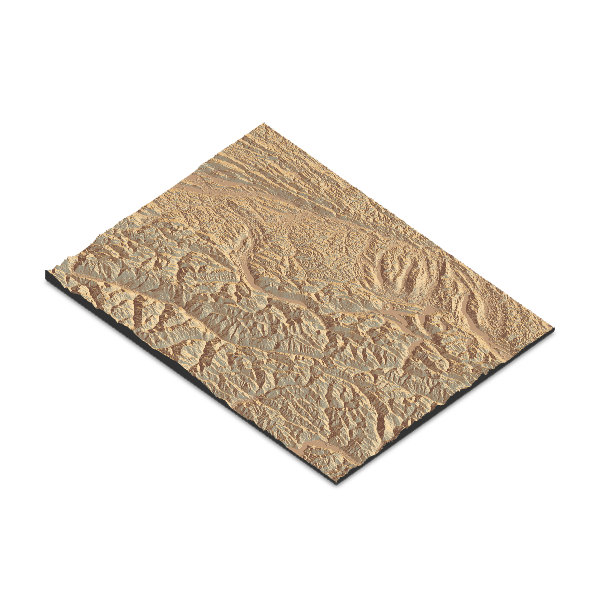
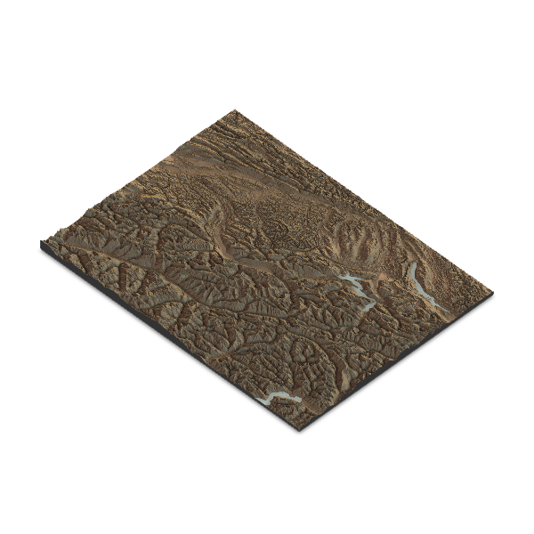

```{r global options, include = FALSE}
knitr::opts_chunk$set(warning=FALSE, message=FALSE, fig.align='center')
```

<div class="container">


# Libraries
***

The [rayshader package](package/rayshader.html) makes it **simple** to create **shaded 2D relief maps**.

Since the package is on **CRAN**, you can **install it** with `install.packages("rayshader")`.

We also load the **`raster` package** to **access data** to work with.

```{r}
# install.packages("rayshader")
library(rayshader)
library(raster)
```


# Data format
***

The [rayshader](package/rayshader.html) package requires input data in **elevation matrix format**. This special matrix has each cell containing the **elevation value** of the corresponding map point.

Here's how to obtain the **elevation matrix** from a **raster file** using the `raster` package.

```{r}
# Define a region for the SRTM data (example: Swiss Alps)
extent_alps <- extent(7.0, 9.0, 46.0, 47.5)

# Download SRTM data
srtm_alps <- getData("SRTM", lon = 8.0, lat = 46.75)

# Crop the SRTM data to the defined extent
srtm_alps_cropped <- crop(srtm_alps, extent_alps)

# Convert the raster data to matrix
elevation_matrix <- raster_to_matrix(srtm_alps_cropped)
```


# Basic 3D map
***

To create a basic **3D map** with [rayshader](package/rayshader.html) using the `sphere_shade()` and `plot_3d()` functions, follow these steps:

1. **Load** your elevation data.
2. **Generate** a shaded texture using `sphere_shade()`.
3. **Render** the 3D map using `plot_3d()`.

When you render it, a **3D window** will open where you can **interact** with the map.

```{r}
elevation_matrix %>%
  sphere_shade(texture="desert", sunangle = 45) %>%
  plot_3d(elevation_matrix, zscale = 50)

render_snapshot('img/graph/411-map-3d-with-rayshader-1.png')
```




# Change texture
***

[rayshader](package/rayshader.html) includes a **specialized function** to create textures: `create_texture()`. This function accepts **5 colors as input** and generates a texture suitable for use in the `sphere_shade()` function.

```{r}
texture <- create_texture("darkgreen", "green", "yellow", "brown", "white")
elevation_matrix %>%
  sphere_shade(texture=texture, sunangle = 45) %>%
  plot_3d(elevation_matrix, zscale = 50)
render_snapshot('img/graph/411-map-3d-with-rayshader-2.png')
```


# Add water
***

To **add water**, you first need to **detect the water** in the elevation matrix using the `detect_water()` function.

After that, you can use the `add_water()` function to **integrate the water** into the map.

```{r}
elevation_matrix %>%
  sphere_shade(texture="desert", sunangle = 45) %>%
  add_water(detect_water(elevation_matrix)) %>%
  plot_3d(elevation_matrix, zscale = 50)
render_snapshot('img/graph/411-map-3d-with-rayshader-3.png')
```


# Change shade properties
***

The `add_shadow()` function can be used to add a shadow to the map. The `ray_shade()` function creates a shadow based on the sun angle, while the `ambient_shade()` function creates a shadow based on the ambient light.

```{r, cache=TRUE}
elevation_matrix %>%
  sphere_shade(texture="desert", sunangle = 45) %>%
  add_water(detect_water(elevation_matrix)) %>%
  add_shadow(ray_shade(elevation_matrix), 0.5) %>% # this line adds a shadow
  add_shadow(ambient_shade(elevation_matrix), 0) %>% # this line adds an ambient shadow
  plot_3d(elevation_matrix, zscale = 50)
render_snapshot('img/graph/411-map-3d-with-rayshader-4.png')
```




# Going further
***

You might be interested in

- creating [2d maps with rayshader](410-map-2d-with-rayshader.html)
- learning more about [rayshader with more examples](package/rayshader.html)


<!-- Close container -->
</div>


```{r, echo=FALSE}
htmltools::includeHTML("htmlChunkRelatedMap.html")
```
