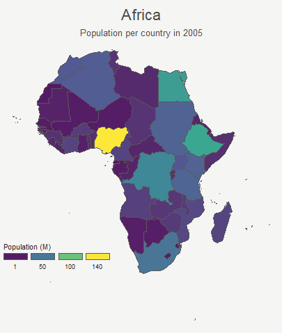

```{r global options, include = FALSE}
knitr::opts_chunk$set(warning = FALSE, message = FALSE, dpi = 300, dev = "ragg_png")
```

<div class="container">


# Goal and Packages
***

<div class = "row">

<div class = "col-md-6  col-sm-12 align-self-center">

At the end of this tutorial, you should get a `gif` file containing the following animation.

Before we start, make sure you've got the following libraries:

</div>


<div class = "col-md-6  col-sm-12">

<center></img>
</div>
</div>

```{r}
# Load libraries
library(dplyr) # data wrangling
library(cartogram) # for the cartogram
library(ggplot2) # to realize the plots
library(transformr) # needed in order to make gganimate works with sf
library(gganimate) # To realize the animation
library(sf) # read shapefiles
```


# A basic map of Africa
***

<div class = "row">

<div class = "col-md-6  col-sm-12 align-self-center">

Let's get a geospatial object from a shape file available [here](http://thematicmapping.org/downloads/world_borders.php). 
This step is extensively described in [this post](168-load-a-shape-file-into-r.html) in case you're not familiar with it.

All the country boundaries are stored in the `world_simpl` object. Let's load this object, keep only Africa, and draw a basic representation. This requires only 3 lines of code.

</div>


<div class = "col-md-6  col-sm-12">

```{r thecode2, echo=FALSE, out.width = "100%", fig.height=7}
# Get the shape file of Africa, see how on
# https://r-graph-gallery.com/168-load-a-shape-file-into-r.html

# I stored the data on a DATA folder and read it from there
wrld_simpl <- read_sf("DATA/world_shape_file/TM_WORLD_BORDERS_SIMPL-0.3.shp")
afr <- wrld_simpl[wrld_simpl$REGION == 2, ]

# We can visualize the region's boundaries with the plot function
plot(st_geometry(afr))
```
</div>
</div>


```{r thecode2, eval=FALSE}
```


# Compute cartogram boundaries
***


<div class = "row">

<div class = "col-md-6  col-sm-12 align-self-center">

The `afr` object is a spatial object. Thus it has a **data** that gives a few information concerning each region. You can visualize this info typing `af` in our case. 

You will see a column called `POP2005`, providing the number of inhabitants per country in 2005.

Using this information we can use the `cartogram` library to build... a [cartogram](cartogram.html)! Basically, it will distort the shape of every country proportionally to its number of inhabitants. 

The output is a new geospatial object that we can map like we've done before. As you can see, Nigeria appears way bigger on this map, since it has a population of about 141M inhabitants.

</div>


<div class = "col-md-6  col-sm-12">

```{r thecode3, echo=FALSE, out.width = "100%", fig.height=7}
# need first to "change" the projection to Mercator (AKA Google Maps): EPSG: 3857
afr <- st_transform(afr, 3857)


# construct a cartogram using the population in 2005
afr_cartogram <- cartogram_cont(afr, "POP2005", itermax = 7)

# A basic representation
plot(st_geometry(afr_cartogram))
```
</div>
</div>


```{r thecode3, eval=FALSE}
```


# A nicer representation using ggplot2
***


<div class = "row">

<div class = "col-md-6  col-sm-12 align-self-center">

Let's improve the appearance of the previous maps using the [ggplot2](ggplot2-package.html) library. 

The `geom_sf()` function is used to draw map data. See the [graph #327](327-chloropleth-map-from-geojson-with-ggplot2.html) of the gallery for more explanation on [choropleth](choropleth-map.html) maps with `ggplot2`.

</div>


<div class = "col-md-6  col-sm-12">

```{r thecode4, echo=FALSE, out.width = "100%", fig.height=7}
# Using the advice of chart #331 we can custom it to get a better result:

ggplot() +
  geom_sf(
    data = afr, aes(fill = POP2005 / 1000000),
    linewidth = 0, alpha = 0.9
  ) +
  theme_void() +
  scale_fill_viridis_c(
    name = "Population (M)", breaks = c(1, 50, 100, 140),
    guide = guide_legend(
      keyheight = unit(3, units = "mm"),
      keywidth = unit(12, units = "mm"),
      label.position = "bottom",
      title.position = "top", nrow = 1
    )
  ) +
  labs(title = "Africa", subtitle = "Population per country in 2005") +
  theme(
    text = element_text(color = "#22211d"),
    plot.background = element_rect(fill = "#f5f5f4", color = NA),
    panel.background = element_rect(fill = "#f5f5f4", color = NA),
    legend.background = element_rect(fill = "#f5f5f4", color = NA),
    plot.title = element_text(
      size = 22, hjust = 0.5, color = "#4e4d47",
      margin = margin(b = -0.1, t = 0.4, l = 2, unit = "cm")
    ),
    plot.subtitle = element_text(
      size = 13, hjust = 0.5, color = "#4e4d47",
      margin = margin(b = -0.1, t = 0.4, l = 2, unit = "cm")
    ),
    legend.position = c(0.2, 0.26)
  )

# You can do the same for afr_cartogram
```
</div>
</div>


```{r thecode4, eval=FALSE}
```


# Compute several intermediate maps
***


```{r thecode5, out.width=c("33%","33%","33%"), fig.show="hold", echo=FALSE, fig.height=7 }
# Loop to create states
afr$id <- seq(1, nrow(afr))
afr$.frame <- 0

# Store the loop on this object
dt1 <- afr
afr_cartogram <- afr

for (i in 1:15) {
  afr_cartogram <- cartogram_cont(afr_cartogram, "POP2005", itermax = 1)
  afr_cartogram$.frame <- i

  dt1 <- rbind(dt1, afr_cartogram)
}

# Arrange in the inverse order now to go back to the initial state
dt2 <- dt1 %>%
  arrange(desc(.frame), id) %>%
  mutate(.frame = -1 * .frame + 31)

dt <- bind_rows(dt1, dt2) %>% arrange(.frame, id)

# check a few frames
ggplot() +
  geom_sf(data = dt %>% filter(.frame == 0), aes(fill = POP2005), linewidth = 0)

ggplot() +
  geom_sf(
    data = dt %>% filter(.frame == 5), aes(fill = POP2005),
    linewidth = 0
  )

ggplot() +
  geom_sf(
    data = dt %>% filter(.frame == 15), aes(fill = POP2005),
    linewidth = 0
  )
```

The goal being to make a smooth animation between the 2 maps, we need to create a multitude of intermediate maps using interpolation. 


This is possible by using the `itermax` parameter on the `cartogram_cont()` function. We can compute
several intermediate cartograms and consider each one of them as a frame.

At the end we've got a big data frame which contains enough information to draw 30 maps. Three of these maps are presented above.


```{r thecode5, eval=FALSE}
```


# Make the animation with gganimate
***

The last step consists at building the 30 maps and compile them in a .gif file. This is done using the `gganimate` library. This library uses another functions `transition_states()` and `ease_aes()`. A new plot is made for each frame, that allows us to build the gif afterwards.


```{r eval=FALSE}
# Remove CRS due to a bug on gganimate
dt <- st_set_crs(dt, NA)

p <- ggplot(dt) +
  geom_sf(aes(fill = POP2005 / 1000000, group = id), linewidth = 0, alpha = 0.9) +
  theme_void() +
  scale_fill_viridis_c(
    name = "Population (M)",
    breaks = c(1, 50, 100, 140),
    guide = guide_legend(
      keyheight = unit(3, units = "mm"),
      keywidth = unit(12, units = "mm"),
      label.position = "bottom",
      title.position = "top", nrow = 1
    )
  ) +
  labs(title = "Africa", subtitle = "Population per country in 2005") +
  theme(
    text = element_text(color = "#22211d"),
    plot.background = element_rect(fill = "#f5f5f4", color = NA),
    panel.background = element_rect(fill = "#f5f5f4", color = NA),
    legend.background = element_rect(fill = "#f5f5f4", color = NA),
    plot.title = element_text(
      size = 22, hjust = 0.5, color = "#4e4d47",
      margin = margin(
        b = -0.1, t = 0.4, l = 2,
        unit = "cm"
      )
    ),
    plot.subtitle = element_text(
      size = 13, hjust = 0.5, color = "#4e4d47",
      margin = margin(
        b = -0.1, t = 0.4, l = 2,
        unit = "cm"
      )
    ),
    legend.position = c(0.2, 0.26)
  ) +
  # from gganimate
  transition_states(.frame) +
  ease_aes("cubic-in-out")

# Make the animation
animate(p, duration = 5)
anim_save("Animated_Cartogram_Africa.gif", p, duration = 5)
```

Done! You should have the gif in your working directory.


# Conclusion
***

This post uses several concepts that are extensively described in the [R graph gallery](https://www.r-graph-gallery.com):

- The [choropleth map](choropleth-map.html) section gives several examples of choropleth maps, using different input types and several tools
- The [cartogram](cartogram.html) section gives further explanation about cartograms
- The [animation](animation.html) section explains more deeply how `tweenR` and `gganimate` work
- The [map](map.html) section is a good starting point if you are lost in the map related packages jungle

If you are interested in dataviz, feel free to visit the [gallery](https://www.r-graph-gallery.com), or to follow me on [twitter](https://twitter.com/R_Graph_Gallery)!


<!-- Close container -->
</div>


```{r, echo=FALSE}
htmltools::includeHTML("htmlChunkRelatedMap.html")
```
