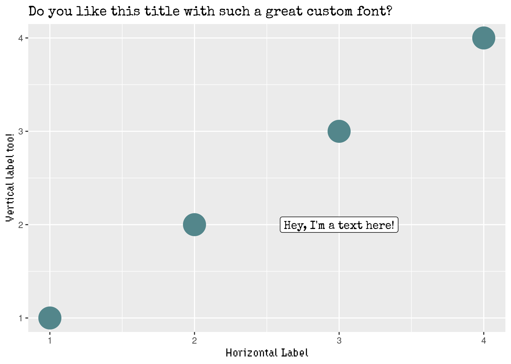

```{r global options, include = FALSE}
knitr::opts_chunk$set(warning = FALSE, message = FALSE)
```

<div class="container" style="padding-top: 100px">
```{r}
library(ggplot2)
```

* **Hydrophilia Iced**. Available from Floodfonts [here](https://www.floodfonts.com/). 
[This link](https://www.floodfonts.com/freefont/download/hydrophilia.zip) 
gives you a zipped folder with the font. In this case we get both `.otf` and `.ttf` types.
* **Special Elite**. Available from Google Fonts [here](https://fonts.google.com/specimen/Special+Elite).


```{r}
data = data.frame(
  x = 1:4,
  y = 1:4
)

plt = ggplot(data) +
  geom_point(aes(x, y), size=10, color="cadetblue4") +
  geom_label(
    aes(x, y), 
    data = data.frame(x = 3, y = 2), 
    label = "Hey, I'm a text here!",
    family = "Special Elite"
  ) + 
  labs(
    x = "Horizontal Label",
    y = "Vertical label too!",
    title = "Do you like this title with such a great custom font?"
  ) +
  theme(
    axis.title = element_text(family = "Hydrophilia Iced"),
    title = element_text(family = "Special Elite")
  )
```

```{r, include=FALSE}
ggsave(here::here("img", "custom-font.png"))
```

<br>

<center>
{width=70%}
</center>

<!-- Close container -->
</div>

```{r, echo=FALSE}
# Correlation | Ranking | Evolution.. 
htmltools::includeHTML("htmlChunkRelatedRanking.html")
```
