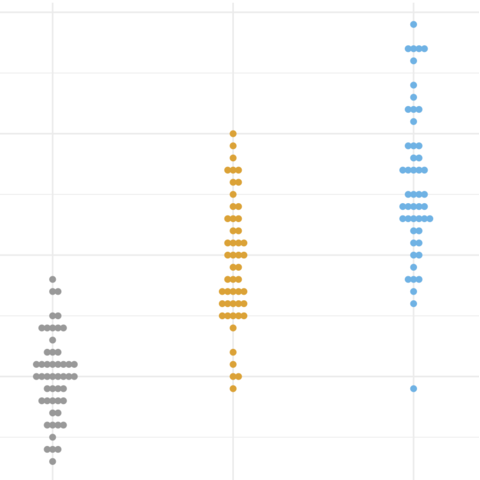
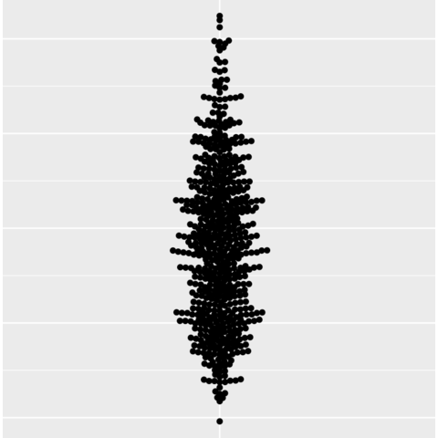

```{r global options, include = FALSE}
knitr::opts_chunk$set( warning=FALSE, message=FALSE, fig.align='center')

data(iris)
iris <- do.call(rbind, replicate(4, iris, simplify = FALSE))
iris$Sepal.Length <- iris$Sepal.Length + rnorm(nrow(iris), 0, 0.2)
```

<div class="container">

# Quick start
***
The `ggbeeswarm` package in R is an extension of the [ggplot2](https://r-graph-gallery.com/ggplot2-package.html) package, designed to simplify the process of creating **beeswarm plots**.

<div class = "row">

<div class = "col-md-5  col-sm-12 align-self-center">

It offers 2 main functions to create beeswarm plots: `geom_quasirandom()` and `geom_beeswarm()`.

✍️ **author** &rarr; Erik Clarke

📘 **documentation** &rarr; [github](https://github.com/eclarke/ggbeeswarm)

⭐️ *more than 500 stars on github*
</div>

<div class = "col-md-7  col-sm-12">
```{r, echo=FALSE, out.width = "85%", fig.align='center'}
library(ggplot2)
library(ggbeeswarm)

# Create a simple beeswarm plot
ggplot(iris, aes(x = Species, y = Sepal.Length, colour=Species)) +
  geom_beeswarm() +
  theme_minimal() +
  scale_color_manual(values = c("#00AFBB", "#E7B800", "#FC4E07"))
```
</div>
</div>

# Installation
***
To get started with `ggbeeswarm`, you can install it directly from CRAN using the `install.packages` function:

```{r eval=FALSE}
install.packages("ggbeeswarm")
```

# Basic usage 
***

The `ggbeeswarm` package makes it easy to create beeswarm plots using the `geom_beeswarm()` function.

Here's a basic example:

```{r}
library(ggplot2)
library(ggbeeswarm)

ggplot(iris, aes(x = Species, y = Sepal.Length, colour=Species)) +
  geom_beeswarm()
```

# Key features
***

## &rarr; Customizing color and theme

```{r}
ggplot(iris, aes(x = Species, y = Sepal.Length, colour=Species)) +
  geom_beeswarm() +
  theme_minimal() +
  scale_color_manual(values = c("#00AFBB", "#E7B800", "#FC4E07"))
```

<br>

## &rarr; Changing dots size

Thanks to the `size` argument, you can change the **size of the dots**. Here is an example with `size=3`:

```{r}
ggplot(iris, aes(x = Species, y = Sepal.Length, colour=Species)) +
  geom_beeswarm(size=3) +
  theme_minimal()
```


<br>

## &rarr; Changing dots position

There are multiple methods to **position the dots**. Here is an example with `method = "center"`:

```{r}
ggplot(iris, aes(x = Species, y = Sepal.Length, colour=Species)) +
  geom_beeswarm(method = "center") +
  theme_minimal()
```


<br>

## &rarr; Splitting the plot

You can **split the plot** by a variable using the `split` argument.

With `side=1L` it will be on the **right side** of the axis and with `side=-1L` it will be on the **left side** of the axis.

```{r}
ggplot(iris, aes(x = Species, y = Sepal.Length, colour=Species)) +
  geom_beeswarm(side = -1L) +
  theme_minimal()
```


# Gallery of ggbeeswarm examples
***

For **more beeswarm example**, you can check the [dedicated section](https://r-graph-gallery.com/beeswarm.html) of the R graph gallery.

<section class="bg" id="portfolio" style="padding-top:10px"><div class="container"><div class="row" id="portfolio-items"><div class="portfolio-item col-sm-6 col-md-6"><a class="portfolio-link" href="../374-grouped-beeswarm-with-ggbeeswarm.html"><div class="portfolio-hover"><div class="portfolio-hover-content"><p>Grouped beeswarm</p><hr><p class="explanation_portfolio">A grouped beeswarm plot with customized layout and colors.</p></div></div></a></div><div class="portfolio-item col-sm-6 col-md-6"><a class="portfolio-link" href="../373-basic-beeswarm-with-ggbeeswarm.html"><div class="portfolio-hover"><div class="portfolio-hover-content"><p>Basic beeswarm plot</p><hr><p class="explanation_portfolio">A basic beeswarm plot with default settings.</p></div></div></a></div></div></div></section>


<!-- Close container -->
</div>
