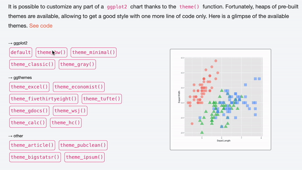

```{r global options, include = FALSE}
knitr::opts_chunk$set(warning = FALSE, message = FALSE, fig.align = "center")
```

<div class="container">

# Quick start
***
The `ggthemes` package in R extends [ggplot2](../ggplot2-package.html) by providing additional **themes and scales** inspired by various sources, including popular data visualization styles and software.

<div class = "row">

<div class = "col-md-5  col-sm-12 align-self-center">

It offers a set of **pre-built themes** that can be easily applied to ggplot2 charts to quickly change their appearance.

✍️ **author** &rarr; Jeffrey Arnold

📘 **documentation** &rarr; [github](https://jrnold.github.io/ggthemes/)

⭐️ *more than 1000 stars on github*
</div>

<div class = "col-md-7  col-sm-12">
```{r, echo=FALSE, out.width = "85%", fig.align='center'}
library(ggplot2)
library(ggthemes)
p <- ggplot(iris, aes(x = Sepal.Length, y = Sepal.Width, color = Species)) +
  geom_point(size = 4)
p + theme_economist() + scale_color_economist()
```
</div>
</div>

# Installation
***
To get started with `ggthemes`, you can install it directly from CRAN using the `install.packages` function:

```{r eval=FALSE}
install.packages("ggthemes")
```

# Basic usage 
***

The `ggthemes` package allows you to apply pre-built themes to your ggplot2 charts using the `theme_*()` functions.

Here's a basic example:

```{r}
library(ggplot2)
library(ggthemes)

p <- ggplot(iris, aes(x = Sepal.Length, y = Sepal.Width, color = Species, shape = Species)) +
  geom_point(size = 4) +
  labs(
    title = "Sepal Length vs Sepal Width by Species",
    x = "Sepal Length (cm)",
    y = "Sepal Width (cm)",
    caption = "Data source: Iris dataset"
  )

p + theme_economist()
```

# Key features
***

**`ggthemes`** provides a wide range of **pre-built themes** inspired by various **sources**. 

It includes a comprehensive set of **`theme_*()` functions** that can transform the overall appearance of a chart, as well as several **additional functions** such as:

- **`scale_color_*()`**: maps data to the **`color`** aesthetic
- **`scale_shape_*()`**: maps data to the **`shape`** aesthetic

This allows for easy and seamless **integration** of theme, color, and shape in any chart.

The following examples will **demonstrate excellent combinations** of these functions and their visual impact!

<br>

## &rarr; Theme 538 + color 538

```{r}
p + theme_fivethirtyeight() + scale_color_fivethirtyeight()
```

<br>

## &rarr; Theme economist


```{r}
p + theme_economist()
```

<br>

## &rarr; Theme excel + color excel


```{r}
p + theme_excel() + scale_color_excel()
```

<br>

## &rarr; Theme calc + color calc + shape calc


```{r}
p + theme_calc() + scale_color_calc() + scale_shape_calc()
```

<br>

## &rarr; Theme igray


```{r}
p + theme_igray()
```

<br>

## &rarr; Theme few


```{r}
p + theme_few()
```

<br>

## &rarr; Theme solarized + color solarized


```{r}
p + theme_solarized() + scale_color_solarized()
```

<br>

## &rarr; Theme solarized (dark) + color solarized


```{r}
p + theme_solarized(light = FALSE) + scale_color_solarized()
```

<br>

## &rarr; Theme tufte


```{r}
p + theme_tufte()
```

<br>

## &rarr; Theme theme_wsj


```{r}
p + theme_wsj()
```

<br>

## &rarr; Theme theme_stata + color stata + shape stata


```{r}
p + theme_stata() + scale_color_stata() + scale_shape_stata()
```

<br>

# Gallery of ggthemes examples
***

If you'd like to try it out interactively, **click on the video** below!

<center><a href='../ggplot2-package.html#theme-widget'>
  
</a></center>

<!-- Close container -->
</div>