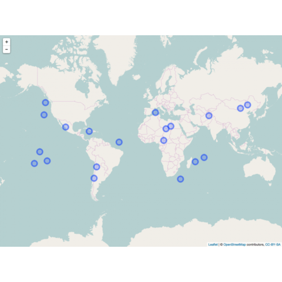
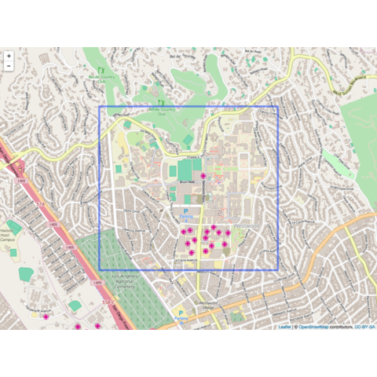

```{r global options, include = FALSE}
knitr::opts_chunk$set(warning = FALSE, message = FALSE)
```

<div class="container">

# Quick start
***
The `leaflet` package in R is an interface to the Leaflet JavaScript library, one of the most popular open-source libraries for interactive maps.

<div class = "row">

<div class = "col-md-5  col-sm-12 align-self-center">

It allows R users to create interactive maps with just a **few lines of code**, leveraging the power of Leaflet's features.

✍️ **authors** &rarr; Joe Cheng, Bhaskar Karambelkar, Yihui Xie

📘 **documentation** &rarr; [Documentation](https://rstudio.github.io/leaflet/)

⭐️ *more than 800 stars on GitHub*
</div>

<div class = "col-md-7  col-sm-12">
```{r, echo=FALSE, out.width = "85%", fig.align='center'}
library(leaflet)
m <- leaflet() %>%
  addTiles() %>% # Add default OpenStreetMap map tiles
  addMarkers(lng = 3.8773, lat = 43.6119, popup = "Montpellier, France")
htmltools::save_html(m, file = "../HtmlWidget/quick-start-leaflet.html")
```

<center><iframe src="../HtmlWidget/quick-start-leaflet.html" height="400" width="100%" style="border:none;"></iframe></center>

</div>
</div>

# Installation
***
To get started with `leaflet`, you can install it directly from CRAN using the `install.packages` function:

```{r eval=FALSE}
install.packages("leaflet")
```

# Basic usage 
***

The `leaflet` package uses a pipe-friendly structure to create maps. Here's a basic example:

```{r}
library(leaflet)

m <- leaflet() %>%
  addTiles() %>% # Add default OpenStreetMap map tiles
  addMarkers(lng = 174.768, lat = -36.852, popup = "The birthplace of R")
htmltools::save_html(m, file = "../HtmlWidget/leaflet-1.html")
```

<center><iframe src="../HtmlWidget/leaflet-1.html" height="400" width="100%" style="border:none;"></iframe></center>

# Key features
***

## &rarr; Map Layers

In web mapping, layers represent various geographic data types. You can enhance your map's functionality and appearance by **adding different layers**. Each layer can be tailored to your specific requirements, such as emphasizing certain features or data points.

To find suitable map layers, you can explore [online tile providers](https://leaflet-extras.github.io/leaflet-providers/preview/) to find the layers that suits you the best. 

Here is an example using the `OpenTopoMap` that we add using the `addProviderTiles()` function:

```{r}
library(leaflet)

m <- leaflet() %>%
  setView(lng = -71.0589, lat = 42.3601, zoom = 12) %>%
  addProviderTiles(providers$OpenTopoMap)
htmltools::save_html(m, file = "../HtmlWidget/leaflet-2.html")
```

<center><iframe src="../HtmlWidget/leaflet-2.html" height="400" width="100%" style="border:none;"></iframe></center>

<br>

## &rarr; Markers

Markers are used to **pinpoint specific locations on a map**, often with additional information such as labels or popups. They are useful for highlighting points of interest, such as cities, landmarks, or events.

In the following code:

- `addTiles()`: Adds the **default basemap tiles** to the map.
- `addMarkers()`: Places markers at the specified **longitude** and **latitude** coordinates.
  - `lng` and `lat`: **Vectors** specifying the longitude and latitude of the markers.
  - `popup`: A **vector of strings** that appear when the marker is clicked, providing additional information about each location.

Example of adding markers with Leaflet:

```{r}
m <- leaflet() %>%
  addTiles() %>%
  addMarkers(
    lng = c(-118.2437, -74.0060), lat = c(34.0522, 40.7128),
    popup = c("Los Angeles, CA", "New York City, NY")
  )
htmltools::save_html(m, file = "../HtmlWidget/leaflet-3.html")
```

<center><iframe src="../HtmlWidget/leaflet-3.html" height="400" width="100%" style="border:none;"></iframe></center>

<br>

## &rarr; Customization

Because Leaflet is an HTML widget (it generates html code), you can easily **add your own HTML/CSS** code to your cards, allowing you to **customise them as much as you like**.

**Title Styling:**

- The `title` variable defines HTML and CSS to style a title element.
- The CSS class `.custom-title` sets the text color, shadow effects, and background with transparency. It also applies padding and rounded corners.
- The hover effect changes the background color and reduces the shadow, creating an interactive visual effect.
- The HTML `<h1>` tag within `title` displays the text "Boston" with the defined styling.

**Legend Styling:**

- The `legend` variable contains HTML and CSS for a legend box.
- The `.custom-legend` class styles the legend with a semi-transparent white background, padding, and a border. It also has rounded corners and a hover effect that slightly enlarges the box and changes its background color.
- The HTML within `legend` includes a paragraph with a link to Wikipedia about Boston and a brief description of the city.

```{r}
library(leaflet)
library(htmltools)

# Define HTML with advanced CSS styling
title <- "
<style>
  .custom-title {
    color: #34495e;
    text-shadow: 2px 2px 4px rgba(0, 0, 0, 0.2);
    box-shadow: 0 4px 8px rgba(0, 0, 0, 0.5);
    background-color: rgba(204, 224, 255, 0.9);
    padding: 12px;
    border-radius: 8px;
    transition: background-color 0.3s, box-shadow 0.3s;
}
.custom-title:hover {
    background-color: rgba(204, 224, 255, 0.7);
    box-shadow: 0 4px 8px rgba(0, 0, 0, 0.3);
}
</style>
<h1>
  Bostom
</h1>"

legend <- "
<style>
  .custom-legend {
    background-color: rgba(255, 255, 255, 0.8);
    padding: 10px;
    border-radius: 5px;
    border: 1px solid #ddd;
    transition: background-color 0.3s, transform 0.3s;
    width: 300px;
  }
  .custom-legend:hover {
    background-color: rgba(255, 255, 255, 0.9);
    transform: scale(1.05);
  }
</style>
<div>
 <p>
     <a href='https://en.wikipedia.org/wiki/Boston' target='_blank'>Boston</a> is the capital city of Massachusetts and a major city in the northeastern United States. It's known for its rich history, being a center of the American Revolution, and its significant contributions to education, with institutions like Harvard University and MIT. It also has a prominent role in finance, technology, and healthcare.
  </p>
</div>"

# Create the map
m <- leaflet() %>%
  addTiles() %>%
  addProviderTiles(providers$OpenTopoMap) %>%
  setView(lng = -71.0589, lat = 42.3601, zoom = 12) %>%
  addControl(html = title, position = "topright", className = "custom-title") %>%
  addControl(html = legend, position = "bottomleft", className = "custom-legend") %>%
  addPopups(lng = -71.0589, lat = 42.3601, popup = "Boston", options = popupOptions(closeButton = FALSE))

# Save the map
htmltools::save_html(m, file = "../HtmlWidget/leaflet-4.html")
```

<center><iframe src="../HtmlWidget/leaflet-4.html" height="800" width="100%" style="border:none;"></iframe></center>

<br>

# Gallery of leaflet examples
***

The examples from the gallery will help you understand the capabilities of the `leaflet` package and **how to use it** in concrete cases.

<section class=bg id=portfolio style=padding-top:10px> <div class=container> <div class=row id=portfolio-items> <div class="col-md-4 col-sm-6 portfolio-item"> <a class="portfolio-link" href="../179-show-a-map-with-leaflet-r.html"> <div class="portfolio-hover"> <div class="portfolio-hover-content"> <p>Most basic</p> <hr> <p class="explanation_portfolio">The most basic background map you can do with R and the leaflet package. Default options only.</p> </div> </div>  </a> </div> <div class="col-md-4 col-sm-6 portfolio-item"> <a class="portfolio-link" href="../179-show-a-map-with-leaflet-r.html"> <div class="portfolio-hover"> <div class="portfolio-hover-content"> <p>Zoom and Location</p> <hr> <p class="explanation_portfolio">Learn how to zoom on a specific part of the map with the setView function.</p> </div> </div>  </a> </div> <div class="col-md-4 col-sm-6 portfolio-item"> <a class="portfolio-link" href="../182-add-circles-rectangles-on-leaflet-map.html"> <div class="portfolio-hover"> <div class="portfolio-hover-content"> <p>Add circles</p> <hr> <p class="explanation_portfolio">Add circles on a Leaflet map</p> </div> </div>  </a> </div> <div class="col-md-4 col-sm-6 portfolio-item"> <a class="portfolio-link" href="../182-add-circles-rectangles-on-leaflet-map.html"> <div class="portfolio-hover"> <div class="portfolio-hover-content"> <p>Circle size</p> <hr> <p class="explanation_portfolio">Change size of the circles according to a variable</p> </div> </div>  </a> </div> <div class="col-md-4 col-sm-6 portfolio-item"> <a class="portfolio-link" href="../182-add-circles-rectangles-on-leaflet-map.html"> <div class="portfolio-hover"> <div class="portfolio-hover-content"> <p>Rectangle</p> <hr> <p class="explanation_portfolio">Learn how to add rectangles on a leaflet map</p> </div> </div>  </a> </div> <div class="col-md-4 col-sm-6 portfolio-item"> <a class="portfolio-link" href="../180-change-background-in-leaflet-map.html"> <div class="portfolio-hover"> <div class="portfolio-hover-content"> <p>Change tile</p> <hr> <p class="explanation_portfolio">Several background tiles are offered by leaflet. Learn how to load them, and check the possibilities.</p> </div> </div>  </a> </div> </div> </div> </section>

<!-- Close container -->
</div>