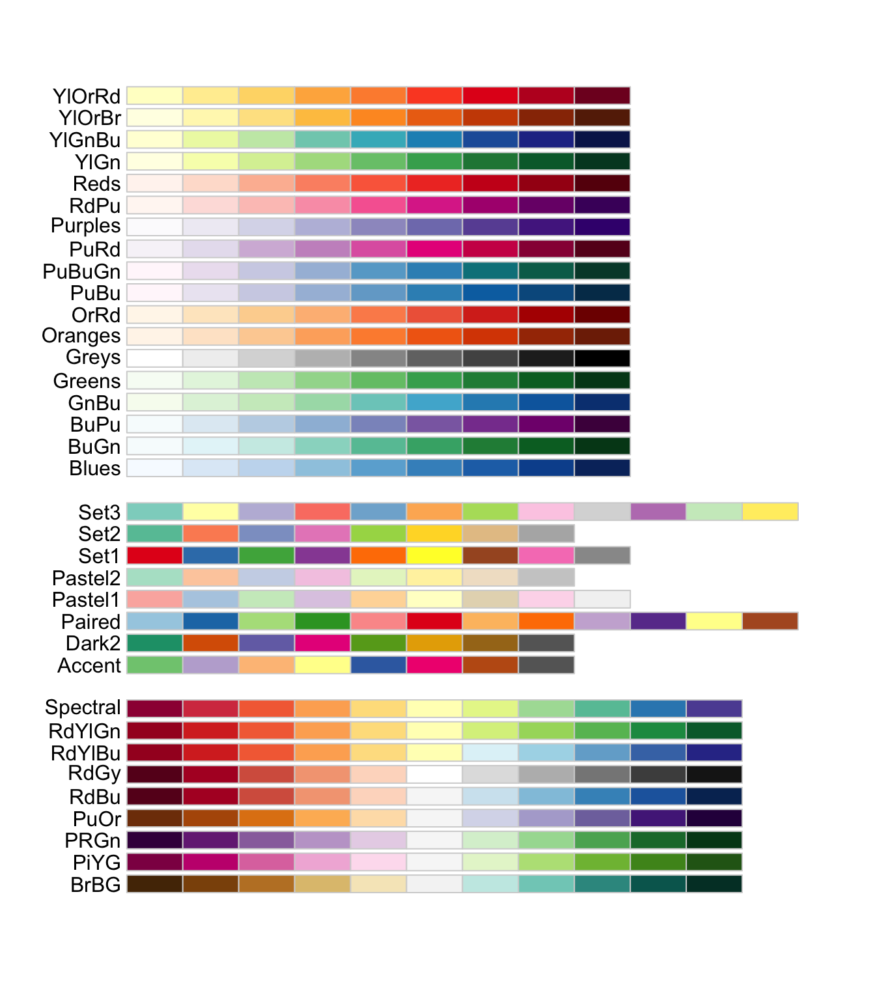

```{r global options, include = FALSE}
knitr::opts_chunk$set(
  warning=FALSE,
  message=FALSE,
  fig.align='center'
)
```

<div class="container">

# Quick start
***
The `RColorBrewer` package in R is an extension of the [ggplot2](https://r-graph-gallery.com/ggplot2-package.html) package, designed to simplify the process of **combining multiple plots** into a single layout.

<div class = "row">

<div class = "col-md-5  col-sm-12 align-self-center">

The library provides a variety of **color palettes** that can be used to customize the appearance of your plots. The figure below showcases all the palettes available in the package.


✍️ **author** &rarr; Erich Neuwirth

📘 **documentation** &rarr; [CRAN](https://cran.r-project.org/web/packages/RColorBrewer/RColorBrewer.pdf)

</div>

<div class = "col-md-7  col-sm-12">



</div>
</div>

# Installation
***
To get started with `RColorBrewer`, you can install it directly from CRAN using the `install.packages` function:

```{r eval=FALSE}
install.packages("RColorBrewer")
```

# Basic usage 
***

There are 3 types of palettes :

- **Sequential palettes** are suited to ordered data that progress from low to high.  Lightness steps dominate the look of these schemes, with light colors for low data values to dark colors for high data values.

- **Diverging palettes** put equal emphasis on mid-range critical values and extremes at both ends of the data range. The critical class or break in the middle of the legend is emphasized with light colors and low and high extremes are emphasized with dark colors that have contrasting hues.

- **Qualitative palettes** do not imply magnitude differences between legend classes, and hues are used to create the primary visual differences between classes.  Qualitative schemes are best suited to representing nominal or categorical data.

```{r}
library(RColorBrewer)
colors = brewer.pal(n = 8, name = "PuOr")

# basic plot
library(ggplot2)
ggplot(mtcars, aes(x = wt, y = mpg, color = factor(cyl))) +
  geom_point(size = 3) +
  scale_color_manual(values = colors) +
  theme_minimal()
```

# Key features
***

## &rarr; Get hex codes

Thanks to the `brewer.pal()` function, you can easily get the hex codes of a palette.

Example:

```{r}
library(RColorBrewer)
brewer.pal(n = 8, name = "Spectral")
```

<br>

## &rarr; Display a palette

The `display.brewer.pal()` function allows you to visualize a palette.

Example:

```{r}
library(RColorBrewer)
display.brewer.pal(n = 8, name = "Spectral")
```

<br>

## &rarr; Use in ggplot2

Since `RColorBrewer` is an extension of `ggplot2`, you can use it to customize the color of your plots.

Here are 3 examples that use 1 sequential palette, 1 diverging palette, and 1 qualitative palette:

```{r, out.width=c('33%', '33%', '33%'), fig.show='hold', out.extra='style="display: inline-block;"'}
library(RColorBrewer)
colors_seq = brewer.pal(n = 8, name = "Blues")
colors_div = brewer.pal(n = 8, name = "RdYlBu")
colors_qual = brewer.pal(n = 8, name = "Set3")

# basic plot
library(ggplot2)
ggplot(mtcars, aes(x = wt, y = mpg, color = factor(cyl))) +
  geom_point(size = 3) +
  scale_color_manual(values = colors_seq) +
  theme_minimal()

ggplot(mtcars, aes(x = wt, y = mpg, color = factor(cyl))) +
  geom_point(size = 3) +
  scale_color_manual(values = colors_div) +
  theme_minimal()

ggplot(mtcars, aes(x = wt, y = mpg, color = factor(cyl))) +
  geom_point(size = 3) +
  scale_color_manual(values = colors_qual) +
  theme_minimal()
```

<br>

# Gallery of RColorBrewer examples
***

The gallery is **filled** with examples that showcase the versatility of the `RColorBrewer` package. Each example is designed to help you understand how to use **custom colors** in your plots.

<section class=bg id=portfolio style=padding-top:10px> <div class=container> <div class=row id=portfolio-items> <div class="portfolio-item col-sm-6 col-md-4"><a class=portfolio-link href=../14-venn-diagramm.html> <div class=portfolio-hover> <div class=portfolio-hover-content> <p>Venn diagram <hr> <p class=explanation_portfolio>How to build a Venn diagram with custom colors </div> </div> </a></div> <div class="portfolio-item col-sm-6 col-md-4"><a class=portfolio-link href=../27-levelplot-with-lattice.html> <div class=portfolio-hover> <div class=portfolio-hover-content> <p>Heatmap <hr> <p class=explanation_portfolio>How to build a heatmap with lattice </div> </div> </a></div> <div class="portfolio-item col-sm-6 col-md-4"><a class=portfolio-link href=../39-pie-plot-with-rcolorbrewer-palette.html> <div class=portfolio-hover> <div class=portfolio-hover-content> <p>Pie plot <hr> <p class=explanation_portfolio>How to build a pie plot with RColorBrewer </div> </div> </a></div> <div class="portfolio-item col-sm-6 col-md-4"> <a class=portfolio-link href=../40-rcolorbrewer-get-a-longer-palette.html> <div class=portfolio-hover> <div class=portfolio-hover-content> <p>Get a longer palette <hr> <p class=explanation_portfolio>Learn how to get a longer palette with RColorBrewer </div> </div> </a></div> <div class="portfolio-item col-sm-6 col-md-4"> <a class=portfolio-link href=../93-parrallel-plot.html> <div class=portfolio-hover> <div class=portfolio-hover-content> <p>Parallel plot <hr> <p class=explanation_portfolio>How to build a parallel plot with ggplot2 </div> </div> </a></div> <div class="portfolio-item col-sm-6 col-md-4"> <a class=portfolio-link href=../97-correlation-ellipses.html> <div class=portfolio-hover> <div class=portfolio-hover-content> <p>Correlation ellipses <hr> <p class=explanation_portfolio>Learn how to build correlation ellipses with ggplot2 </div> </div> </a></div> <div class="portfolio-item col-sm-6 col-md-4"> <a class=portfolio-link href=../99-scatterplot-matrix-car-package.html> <div class=portfolio-hover> <div class=portfolio-hover-content> <p>Scatterplot matrix <hr> <p class=explanation_portfolio>Discover how to build a scatterplot matrix with the car package </div> </div> </a></div> <div class="portfolio-item col-sm-6 col-md-4"> <a class=portfolio-link href=../100-high-density-scatterplot-with-binning.html> <div class=portfolio-hover> <div class=portfolio-hover-content> <p>Density scatterplot <hr> <p class=explanation_portfolio>How to build a high density scatterplot with binning </div> </div> </a></div> <div class="portfolio-item col-sm-6 col-md-4"> <a class=portfolio-link href=../137-spring-shapes-data-art.html> <div class=portfolio-hover> <div class=portfolio-hover-content> <p>Spring shapes <hr> <p class=explanation_portfolio>How to build spring shapes </div> </div> </a></div> <div class="portfolio-item col-sm-6 col-md-4"> <a class=portfolio-link href=../143-spider-chart-with-saveral-individuals.html> <div class=portfolio-hover> <div class=portfolio-hover-content> <p>Spider chart <hr> <p class=explanation_portfolio>How to build a spider chart with several individuals </div> </div> </a></div> <div class="portfolio-item col-sm-6 col-md-4"> <a class=portfolio-link href=../200-change-color-in-lineplot-following-y-value.html> <div class=portfolio-hover> <div class=portfolio-hover-content> <p>Line plot <hr> <p class=explanation_portfolio>Discover how to change color in lineplot following y value </div> </div> </a></div> <div class="portfolio-item col-sm-6 col-md-4"> <a class=portfolio-link href=../211-basic-grouped-or-stacked-barplot.html> <div class=portfolio-hover> <div class=portfolio-hover-content> <p>Stacked barplot <hr> <p class=explanation_portfolio>How to build a basic grouped or stacked barplot </div> </div> </a></div> <div class="portfolio-item col-sm-6 col-md-4"> <a class=portfolio-link href=../249-igraph-network-map-a-color.html> <div class=portfolio-hover> <div class=portfolio-hover-content> <p>Network map <hr> <p class=explanation_portfolio>Map a color on a network map </div> </div> </a></div> <div class="portfolio-item col-sm-6 col-md-4"> <a class=portfolio-link href=../250-correlation-network-with-igraph.html> <div class=portfolio-hover> <div class=portfolio-hover-content> <p>Correlation network <hr> <p class=explanation_portfolio>How to build a correlation network with igraph </div> </div> </a></div> <div class="portfolio-item col-sm-6 col-md-4"> <a class=portfolio-link href=../310-custom-hierarchical-edge-bundling.html> <div class=portfolio-hover> <div class=portfolio-hover-content> <p>Hierarchical edge bundling <hr> <p class=explanation_portfolio>Learn how to build a custom hierarchical edge bundling </div> </div> </a></div> <div class="portfolio-item col-sm-6 col-md-6"> <a class=portfolio-link href=../328-hexbin-map-of-the-usa.html> <div class=portfolio-hover> <div class=portfolio-hover-content> <p>Hexbin map <hr> <p class=explanation_portfolio>Discover how to build a hexbin map of the USA </div> </div> </a></div> <div class="portfolio-item col-sm-6 col-md-6"> <a class=portfolio-link href=../332-hexbin-chloropleth-cartogram.html> <div class=portfolio-hover> <div class=portfolio-hover-content> <p>Chloropleth cartogram <hr> <p class=explanation_portfolio>How to build a hexbin chloropleth cartogram </div> </div> </a></div> </div> </div> </div> </section>

<!-- Close container -->
</div>
