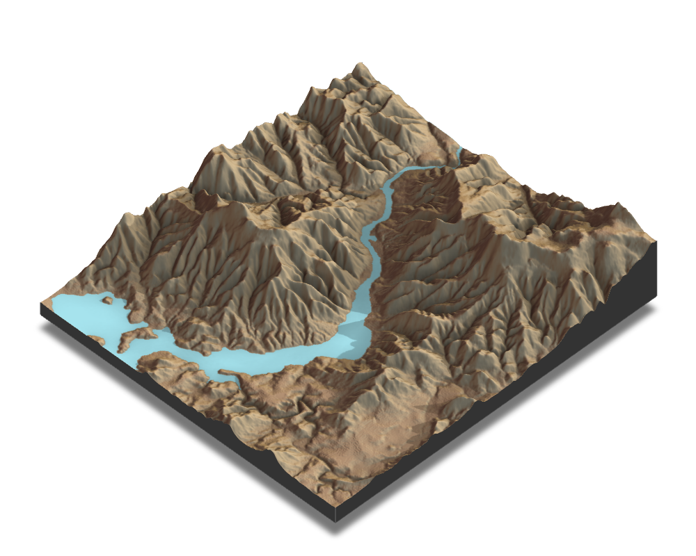
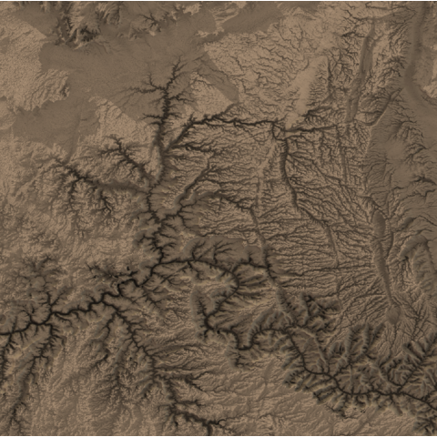

```{r global options, include = FALSE}
knitr::opts_chunk$set(
  warning = FALSE,
  message = FALSE,
  fig.align = "center"
)
```

<div class="container">

# Quick start
***
The `rayshader` package in R allows us to create beautiful, 2D and 3D shaded maps.

<div class = "row">

<div class = "col-md-5  col-sm-12 align-self-center">

`rayshader` offers a robust suite of functions for generating **beautifully shaded maps** in R, allowing for the creation of detailed **3D** visualizations. The package includes tools for rendering 3D **surfaces**, adding **textures**, and incorporating **lighting effects**.

Users can control z-scale, shadow depth, and water layers to **enhance realism**. Additionally, `rayshader` supports external spatial data integration, enabling complex overlays and customizations.

✍️ **author** &rarr; Tyler Morgan-Wall

📘 **documentation** &rarr; [github](https://github.com/tylermorganwall/rayshader)

⭐️ *more than 1000 stars on github*
</div>

<div class = "col-md-7  col-sm-12">

```{r, eval=FALSE, echo=FALSE, out.width = "85%", fig.align='center'}
library(rayshader)
library(terra)
loadzip <- tempfile()
download.file("https://tylermw.com/data/dem_01.tif.zip", loadzip)
localtif <- raster::raster(unzip(loadzip, "dem_01.tif"))
unlink(loadzip)
elevation_matrix <- raster_to_matrix(localtif)

elevation_matrix %>%
  sphere_shade(texture = "desert") %>%
  add_water(detect_water(elevation_matrix), color = "desert") %>%
  add_shadow(ray_shade(elevation_matrix, zscale = 3), 0.5) %>%
  add_shadow(ambient_shade(elevation_matrix), 0) %>%
  plot_3d(elevation_matrix, zscale = 10, fov = 0, theta = 135, zoom = 0.75, phi = 45, windowsize = c(1000, 800))
render_snapshot("../img/graph/rayshader_example.png")
```



</div>
</div>

# Installation
***
To get started with `rayshader`, you can install it directly from CRAN using the `install.packages` function:

```{r eval=FALSE}
install.packages("rayshader")
```

# Data format
***

The `rayshader` package makes it easy quite easy to create shaded maps but requires the data to be in a specific format.

The data should be a **matrix of elevation values**. If you're not used to it, think of matrix as a table where each cell contains a value, like in a dataframe.

You can use the `raster` package to convert raster data to a matrix.

Example:

```{r}
library(rayshader)
library(terra)

# Load a raster file
loadzip <- tempfile()
download.file("https://tylermw.com/data/dem_01.tif.zip", loadzip)
localtif <- raster::raster(unzip(loadzip, "dem_01.tif"))
unlink(loadzip)

# Convert the raster to a matrix
elevation_matrix <- raster_to_matrix(localtif)
```

Once we have the data in the right format, we can start creating shaded maps in just a **few lines of code**.


# Key features
***

## &rarr; Simple 2d maps

`rayshader` allows you to create simple 2D maps.

Example:

```{r}
elevation_matrix %>%
  sphere_shade(texture = "desert") %>%
  plot_map()
```

<br>

## &rarr; Add water

You can add water to your maps using the `detect_water()` and `add_water()` functions.

Example:

```{r}
elevation_matrix %>%
  sphere_shade(texture = "desert") %>%
  add_water(detect_water(elevation_matrix), color = "desert") %>%
  plot_map()
```

<br>

## &rarr; Change the shading and sun position

You can change the shading and sun position using the `add_shadow()`, `ray_shade()`, and `ambient_shade()` functions.

Example:

```{r}
elevation_matrix %>%
  sphere_shade(texture = "desert") %>%
  add_water(detect_water(elevation_matrix), color = "desert") %>%
  add_shadow(ray_shade(elevation_matrix), 0.5) %>%
  add_shadow(ambient_shade(elevation_matrix), 0) %>%
  plot_map()
```

<br>

## &rarr; 3D maps

Using the same data as before, you can create 3D maps with the `plot_3d()` function. This will enhance the visual aspect of your maps and give them a more realistic look.

Example:

```{r, eval=FALSE}
elevation_matrix %>%
  sphere_shade(texture = "desert") %>%
  add_water(detect_water(elevation_matrix), color = "desert") %>%
  add_shadow(ray_shade(elevation_matrix, zscale = 3), 0.5) %>%
  add_shadow(ambient_shade(elevation_matrix), 0) %>%
  plot_3d(elevation_matrix, zscale = 10, fov = 0, theta = 135, zoom = 0.75, phi = 45, windowsize = c(1000, 800))
render_snapshot()
```


# Gallery of rayshader examples
***

The gallery contains a set of examples showcasing the **key features** of `rayshader`, from simple 2D maps to more complex 3D maps.

<section class=bg id=portfolio style=padding-top:10px><div class=container><div class=row id=portfolio-items><div class="col-md-4 col-sm-6 portfolio-item"> <a class="portfolio-link" href="../410-map-2d-with-rayshader.html"> <div class="portfolio-hover"> <div class="portfolio-hover-content"> <p>Default 2D map with rayshader</p> <hr> <p class="explanation_portfolio">How to create a 2D map about the Grand Canyon with rayshader</p> </div> </div>  </a> </div> <div class="col-md-4 col-sm-6 portfolio-item"> <a class="portfolio-link" href="../410-map-2d-with-rayshader.html"> <div class="portfolio-hover"> <div class="portfolio-hover-content"> <p>Custom texture</p> <hr> <p class="explanation_portfolio">Learn how to create your own textures to cutomize your maps</p> </div> </div>  </a> </div> <div class="col-md-4 col-sm-6 portfolio-item"> <a class="portfolio-link" href="../410-map-2d-with-rayshader.html"> <div class="portfolio-hover"> <div class="portfolio-hover-content"> <p>Shade effect</p> <hr> <p class="explanation_portfolio">Add different shade effects for visually appealing charts</p> </div> </div>  </a> </div> <div class="col-md-4 col-sm-6 portfolio-item"> <a class="portfolio-link" href="../411-map-3d-with-rayshader.html"> <div class="portfolio-hover"> <div class="portfolio-hover-content"> <p>Default 3d map</p> <hr> <p class="explanation_portfolio">How to create a 3D map about the Swiss Alps with rayshader</p> </div> </div>  </a> </div> <div class="col-md-4 col-sm-6 portfolio-item"> <a class="portfolio-link" href="../411-map-3d-with-rayshader.html"> <div class="portfolio-hover"> <div class="portfolio-hover-content"> <p>Custom texture</p> <hr> <p class="explanation_portfolio">Learn how to create your own textures to cutomize your maps</p> </div> </div>  </a> </div> <div class="col-md-4 col-sm-6 portfolio-item"> <a class="portfolio-link" href="../411-map-3d-with-rayshader.html"> <div class="portfolio-hover"> <div class="portfolio-hover-content"> <p>Shade effect</p> <hr> <p class="explanation_portfolio">Add different shade effects for visually appealing charts</p> </div> </div>  </a> </div></div></div></div></section>

<!-- Close container -->
</div>
