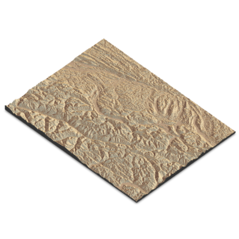
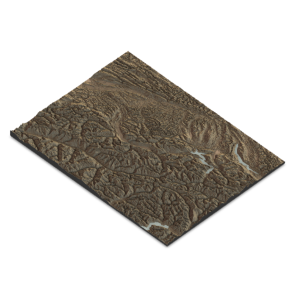

```{r global options, include = FALSE}
knitr::opts_chunk$set(warning = FALSE, message = FALSE)
```

<div class="container">

# Quick start
***

The `rgdal` package in R was a widely used tool for reading and writing spatial data formats. However, it has been retired and is no longer maintained.


`rgdal` provided bindings to the Geospatial Data Abstraction Library (GDAL) for R.

✍️ **authors** &rarr; Roger Bivand, Tim Keitt, Barry Rowlingson

📘 **about** &rarr; [R-Spatial](https://r-spatial.org/r/2022/04/12/evolution.html)


# Alternatives to rgdal
***

With the retirement of `rgdal`, users are encouraged to transition to more modern packages, especially [sf](sf.html).

[sf](sf.html) is a powerful package for working with vector data in R. It provides a simple and consistent interface for reading, writing, and manipulating spatial data.

<a
   class="btn btn-secondary btn-md text-uppercase"
   href="sf.html"
   >Learn more about SF</a
>

# Going further
***

If you want to learn more about **spatial data packages** in R, check out the following posts.

- [**SF**](sf.html): spatial data handling in R

<section class=bg id=portfolio style=padding-top:10px> <div class=container> <div class=row id=portfolio-items> <div class="portfolio-item col-sm-6 col-md-4"><a class=portfolio-link href=../168-load-a-shape-file-into-r.html> <div class=portfolio-hover> <div class=portfolio-hover-content> <p>Basic world map <hr> <p class=explanation_portfolio>Most simple world map with R </div> </div> </a></div> <div class="portfolio-item col-sm-6 col-md-4"><a class=portfolio-link href=../331-basic-cartogram.html> <div class=portfolio-hover> <div class=portfolio-hover-content> <p>Cartogram of Africa <hr> <p class=explanation_portfolio>How to build a cartogram of a specific region </div> </div> </a></div> <div class="portfolio-item col-sm-6 col-md-4"><a class=portfolio-link href=../331-basic-cartogram.html> <div class=portfolio-hover> <div class=portfolio-hover-content> <p>Cartogram of Africa <hr> <p class=explanation_portfolio>How to build a cartogram of a specific region </div> </div> </a></div> <div class="portfolio-item col-sm-6 col-md-4"><a class=portfolio-link href=../169-170-basic-manipulation-of-shapefiles.html> <div class=portfolio-hover> <div class=portfolio-hover-content> <p>Label in each sub region <hr> <p class=explanation_portfolio>Discover how to add a label in selected sub regions </div> </div> </a></div> <div class="portfolio-item col-sm-6 col-md-4"> <a class=portfolio-link href=../328-hexbin-map-of-the-usa.html> <div class=portfolio-hover> <div class=portfolio-hover-content> <p>Hexbin map   <hr> <p class=explanation_portfolio>Learn how to build a hexbin map of the USA </div> </div> </a></div> <div class="portfolio-item col-sm-6 col-md-4"> <a class=portfolio-link href=../328-hexbin-map-of-the-usa.html> <div class=portfolio-hover> <div class=portfolio-hover-content> <p>Hexbin + Choropleth <hr> <p class=explanation_portfolio>How to build a hexbin map with a choropleth map </div> </div> </a></div> <div class="portfolio-item col-sm-6 col-md-6"> <a class=portfolio-link href=../328-hexbin-map-of-the-usa.html> <div class=portfolio-hover> <div class=portfolio-hover-content> <p>Hexbin map <hr> <p class=explanation_portfolio>Advanced example of a hexbin map </div> </div> </a></div> <div class="portfolio-item col-sm-6 col-md-6"> <a class=portfolio-link href=../332-hexbin-chloropleth-cartogram.html> <div class=portfolio-hover> <div class=portfolio-hover-content> <p>Hexbin + Chloropleth + Cartogram <hr> <p class=explanation_portfolio>How to build a hexbin map with a choropleth map AND a cartogram </div> </div> </a></div> <div class="portfolio-item col-sm-6 col-md-4"> <a class=portfolio-link href=../web-choropleth-map-lego-style.html> <div class=portfolio-hover> <div class=portfolio-hover-content> <p>Choropleth map <hr> <p class=explanation_portfolio>Discover how to build a choropleth map with a lego style </div> </div> </a></div> <div class="portfolio-item col-sm-6 col-md-4"> <a class=portfolio-link href=../web-dorling-cartogram-with-R.html> <div class=portfolio-hover> <div class=portfolio-hover-content> <p>Bubble map   <hr> <p class=explanation_portfolio>Discover to build a bubble map with R </div> </div> </a></div> <div class="portfolio-item col-sm-6 col-md-8"> <a class=portfolio-link href=../web-valued-dots-map-bertin.html> <div class=portfolio-hover> <div class=portfolio-hover-content> <p>Dot map   <hr> <p class=explanation_portfolio>France map in the style of Jacques Bertin </div> </div> </a></div> </div> </div> </div> </section>

- [**TMAP**](tmap.html): modern maps with a light syntax

<section class=bg id=portfolio style=padding-top:10px> <div class=container> <div class=row id=portfolio-items> <div class="portfolio-item col-sm-6 col-md-4"><a class=portfolio-link href=../417-advanced-tmap-usage.html> <div class=portfolio-hover> <div class=portfolio-hover-content> <p>Facetted map with tmap <hr> <p class=explanation_portfolio>Learn how to create facetted map with tmap axis. </div> </div> </a> </div> <div class="portfolio-item col-sm-6 col-md-4"><a class=portfolio-link href=../417-advanced-tmap-usage.html> <div class=portfolio-hover> <div class=portfolio-hover-content> <p>Combine layout in tmap <hr> <p class=explanation_portfolio>Learn how to combine choropleth and bubble map with tmap axis. </div> </div> </a> </div> <div class="portfolio-item col-sm-6 col-md-4"><a class=portfolio-link href=../417-advanced-tmap-usage.html> <div class=portfolio-hover> <div class=portfolio-hover-content> <p>Change projection <hr> <p class=explanation_portfolio>How to change your map projection using tmap axis. </div> </div> </a> </div> </div> </div> </section>

- [**LEAFLET**](leaflet.html): interactive maps in R

<section class=bg id=portfolio style=padding-top:10px> <div class=container> <div class=row id=portfolio-items> <div class="col-md-4 col-sm-6 portfolio-item"> <a class="portfolio-link" href="../179-show-a-map-with-leaflet-r.html"> <div class="portfolio-hover"> <div class="portfolio-hover-content"> <p>Most basic</p> <hr> <p class="explanation_portfolio">The most basic background map you can do with R and the leaflet package. Default options only.</p> </div> </div>  </a> </div> <div class="col-md-4 col-sm-6 portfolio-item"> <a class="portfolio-link" href="../179-show-a-map-with-leaflet-r.html"> <div class="portfolio-hover"> <div class="portfolio-hover-content"> <p>Zoom and Location</p> <hr> <p class="explanation_portfolio">Learn how to zoom on a specific part of the map with the setView function.</p> </div> </div>  </a> </div> <div class="col-md-4 col-sm-6 portfolio-item"> <a class="portfolio-link" href="../182-add-circles-rectangles-on-leaflet-map.html"> <div class="portfolio-hover"> <div class="portfolio-hover-content"> <p>Add circles</p> <hr> <p class="explanation_portfolio">Add circles on a Leaflet map</p> </div> </div>  </a> </div> <div class="col-md-4 col-sm-6 portfolio-item"> <a class="portfolio-link" href="../182-add-circles-rectangles-on-leaflet-map.html"> <div class="portfolio-hover"> <div class="portfolio-hover-content"> <p>Circle size</p> <hr> <p class="explanation_portfolio">Change size of the circles according to a variable</p> </div> </div>  </a> </div> <div class="col-md-4 col-sm-6 portfolio-item"> <a class="portfolio-link" href="../182-add-circles-rectangles-on-leaflet-map.html"> <div class="portfolio-hover"> <div class="portfolio-hover-content"> <p>Rectangle</p> <hr> <p class="explanation_portfolio">Learn how to add rectangles on a leaflet map</p> </div> </div>  </a> </div> <div class="col-md-4 col-sm-6 portfolio-item"> <a class="portfolio-link" href="../180-change-background-in-leaflet-map.html"> <div class="portfolio-hover"> <div class="portfolio-hover-content"> <p>Change tile</p> <hr> <p class="explanation_portfolio">Several background tiles are offered by leaflet. Learn how to load them, and check the possibilities.</p> </div> </div>  </a> </div> </div> </div> </section>

- [**RAYSHADER**](rayshader.html): 3D beautiful maps in R

<section class=bg id=portfolio style=padding-top:10px><div class=container><div class=row id=portfolio-items><div class="col-md-4 col-sm-6 portfolio-item"> <a class="portfolio-link" href="../410-map-2d-with-rayshader.html"> <div class="portfolio-hover"> <div class="portfolio-hover-content"> <p>Default 2D map with rayshader</p> <hr> <p class="explanation_portfolio">How to create a 2D map about the Grand Canyon with rayshader</p> </div> </div>  </a> </div> <div class="col-md-4 col-sm-6 portfolio-item"> <a class="portfolio-link" href="../410-map-2d-with-rayshader.html"> <div class="portfolio-hover"> <div class="portfolio-hover-content"> <p>Custom texture</p> <hr> <p class="explanation_portfolio">Learn how to create your own textures to cutomize your maps</p> </div> </div>  </a> </div> <div class="col-md-4 col-sm-6 portfolio-item"> <a class="portfolio-link" href="../410-map-2d-with-rayshader.html"> <div class="portfolio-hover"> <div class="portfolio-hover-content"> <p>Shade effect</p> <hr> <p class="explanation_portfolio">Add different shade effects for visually appealing charts</p> </div> </div>  </a> </div> <div class="col-md-4 col-sm-6 portfolio-item"> <a class="portfolio-link" href="../411-map-3d-with-rayshader.html"> <div class="portfolio-hover"> <div class="portfolio-hover-content"> <p>Default 3d map</p> <hr> <p class="explanation_portfolio">How to create a 3D map about the Swiss Alps with rayshader</p> </div> </div>  </a> </div> <div class="col-md-4 col-sm-6 portfolio-item"> <a class="portfolio-link" href="../411-map-3d-with-rayshader.html"> <div class="portfolio-hover"> <div class="portfolio-hover-content"> <p>Custom texture</p> <hr> <p class="explanation_portfolio">Learn how to create your own textures to cutomize your maps</p> </div> </div>  </a> </div> <div class="col-md-4 col-sm-6 portfolio-item"> <a class="portfolio-link" href="../411-map-3d-with-rayshader.html"> <div class="portfolio-hover"> <div class="portfolio-hover-content"> <p>Shade effect</p> <hr> <p class="explanation_portfolio">Add different shade effects for visually appealing charts</p> </div> </div>  </a> </div></div></div></div></section>

<!-- Close container -->
</div>
