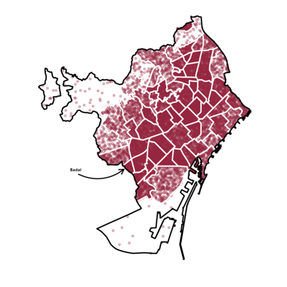
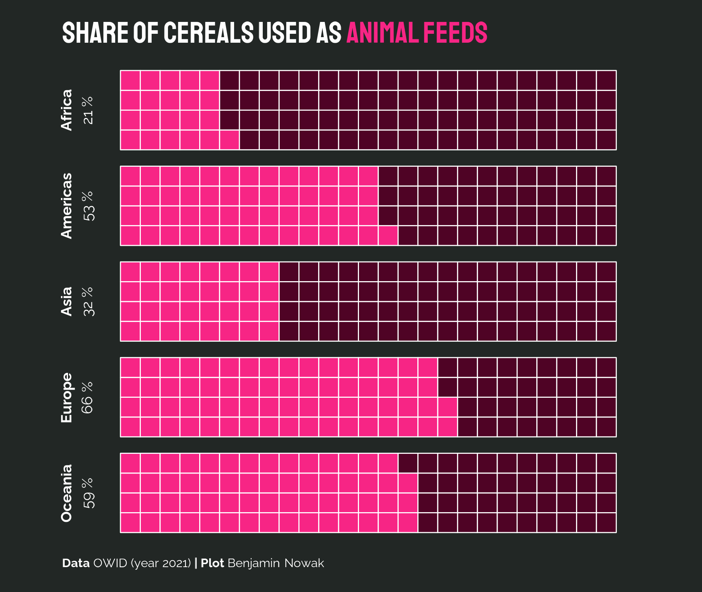

```{r global options, include = FALSE}
knitr::opts_chunk$set(warning = FALSE, message = FALSE, fig.align = "center", fig.showtext = TRUE)
```

<div class="container">

# Quick start
***
The `showtext` package in R allows you to easily use custom fonts in R graphics, including plots created with base R, [ggplot2](https://r-graph-gallery.com/ggplot2-package.html), and other graphics systems.

<div class = "row">

<div class = "col-md-5  col-sm-12 align-self-center">

It provides a simple interface to use system fonts and web fonts in R plots, making it easy to create publication-quality graphs with custom typography.

✍️ **author** &rarr; Yixuan Qiu

📘 **documentation** &rarr; [CRAN](https://cran.r-project.org/web/packages/showtext/vignettes/introduction.html)

⭐️ *more than 500 stars on github*
</div>

<div class = "col-md-7  col-sm-12">

```{r, echo=FALSE, out.width = "85%", fig.align='center'}
library(showtext)
library(ggplot2)

font_add_google("Pacifico", "pacifico")
showtext_auto()

ggplot(mtcars, aes(wt, mpg)) +
   geom_point() +
   labs(title = "Custom Font Example") +
   theme(text = element_text(family = "pacifico", size = 16))
```

</div>
</div>

# Installation
***
To get started with `showtext`, you can install it directly from CRAN using the `install.packages` function:

```{r eval=FALSE}
install.packages("showtext")
```

# Basic usage 
***

The `showtext` package allows you to use custom fonts in your R graphics by loading font files and enabling showtext rendering.

Here's a basic example:

```{r}
library(showtext)
font_add_google("Pacifico", "pacifico")
showtext_auto()

plot(1:10, main = "Custom Font Plot", family = "pacifico")
```

# Key features
***

<br>

## &rarr; Loading Fonts

`showtext` can load fonts from various sources, including system fonts, font files, and Google Fonts.

- `font_add_google()`: simplifies adding Google Fonts by fetching and registering fonts directly from the Google Fonts repository using just the font family name.

```{r}
font_add_google("Roboto", "roboto")
```

<br>

## &rarr; Automatic Font Rendering

The `showtext_auto()` function enables automatic font rendering for **all graphics devices**.

```{r}
showtext_auto()
```

<br>

## &rarr; Supporting Various Graphics Systems

`showtext` works with base R graphics, **ggplot2**, and other graphics systems.


```{r}
ggplot(mtcars, aes(wt, mpg)) +
   geom_point() +
   labs(title = "Custom Font in ggplot2") +
   theme(text = element_text(family = "roboto", size = 16))
```

<br>

## &rarr; Unicode Support

`showtext` provides full Unicode support, allowing you to use **non-Latin characters** and **symbols** easily.

Example:

```{r}
font_add_google("Noto Sans JP", "notosans")
plot(1:10, main = "日本語のタイトル", family = "notosans")
```


# Gallery of showtext examples
***

<section class=bg id=portfolio style=padding-top:10px> <div class=container> <div id="portfolio-items" class="row"> <div class="col-md-4 col-sm-6 portfolio-item"> <a class="portfolio-link" href="../web-area-chart-with-small-multiple.html"> <div class="portfolio-hover"> <div class="portfolio-hover-content"> <p>Small multiple area chart</p> <hr> <p class="explanation_portfolio">A small multiple is a series of small similar graphs or charts, allowing them to be easily compared. Here is an example with an area chart.</p> </div> </div>  </a> </div> <div class="col-md-4 col-sm-6 portfolio-item"> <a class="portfolio-link" href="../web-density-plot-map.html"> <div class="portfolio-hover"> <div class="portfolio-hover-content"> <p>Density plot map</p> <hr> <p class="explanation_portfolio">A density plot map is a map where the density of a variable is represented with a color scale.</p> </div> </div>  </a> </div> <div class="col-md-4 col-sm-6 portfolio-item"> <a class="portfolio-link" href="../web-double-ridgeline-plot.html"> <div class="portfolio-hover"> <div class="portfolio-hover-content"> <p>Double ridgeline plot</p> <hr> <p class="explanation_portfolio">A double ridgeline plot is a combination of two ridgeline plots, next to each other.</p> </div> </div>  </a> </div> <div class="col-md-4 col-sm-6 portfolio-item"> <a class="portfolio-link" href="../web-interactive-table-with-images-charts-and-more.html"> <div class="portfolio-hover"> <div class="portfolio-hover-content"> <p>Interactive table</p> <hr> <p class="explanation_portfolio">An interactive table is a table where the user can interact with the data, for example by filtering or sorting it.</p> </div> </div>  </a> </div> <div class="col-md-4 col-sm-6 portfolio-item"> <a class="portfolio-link" href="../web-line-chart-with-labels-at-end-of-line.html"> <div class="portfolio-hover"> <div class="portfolio-hover-content"> <p>Line chart</p> <hr> <p class="explanation_portfolio">A line chart with labels at the end of each line.</p> </div> </div>  </a> </div> <div class="col-md-4 col-sm-6 portfolio-item"> <a class="portfolio-link" href="../web-lollipop-plot-with-R-the-office.html"> <div class="portfolio-hover"> <div class="portfolio-hover-content"> <p>Lollipop plot</p> <hr> <p class="explanation_portfolio">A lollipop plot is a combination of a bar chart and a dot plot, where the length of the bar represents the value of the variable.</p> </div> </div>  </a> </div> <div class="col-md-4 col-sm-6 portfolio-item"> <a class="portfolio-link" href="../web-radar-chart-with-R.html"> <div class="portfolio-hover"> <div class="portfolio-hover-content"> <p>Radial chart</p> <hr> <p class="explanation_portfolio">A radar chart is a graphical method of displaying multivariate data in the form of a two-dimensional chart of three or more quantitative variables represented on axes starting from the same point.</p> </div> </div>  </a> </div> <div class="col-md-4 col-sm-6 portfolio-item"> <a class="portfolio-link" href="../web-stacked-area-chart-inline-labels.html"> <div class="portfolio-hover"> <div class="portfolio-hover-content"> <p>Stacked area chart</p> <hr> <p class="explanation_portfolio">A stacked area chart is a chart that uses the area to display the evolution of a variable over time.</p> </div> </div>  </a> </div> <div class="col-md-4 col-sm-6 portfolio-item"> <a class="portfolio-link" href="../web-triple-map-into-a-single-chart.html"> <div class="portfolio-hover"> <div class="portfolio-hover-content"> <p>Triple map into a single chart</p> <hr> <p class="explanation_portfolio">Learn how to combine three maps into a single chart.</p> </div> </div>  </a> </div> <div class="col-md-4 col-sm-6 portfolio-item"> <a class="portfolio-link" href="../web-waffle-chart-share.html"> <div class="portfolio-hover"> <div class="portfolio-hover-content"> <p>Waffle chart</p> <hr> <p class="explanation_portfolio">A waffle chart is a chart that uses small squares to represent the parts of a whole.</p> </div> </div>  </a> </div> <div class="col-md-4 col-sm-6 portfolio-item"> <a class="portfolio-link" href="../web-waffle-for-time-evolution.html"> <div class="portfolio-hover"> <div class="portfolio-hover-content"> <p>Waffle for time evolution</p> <hr> <p class="explanation_portfolio">Discover how you can use a waffle chart to represent the evolution of a variable over time.</p> </div> </div>  </a> </div> </div> </div> </section>

<!-- Close container -->
</div>
