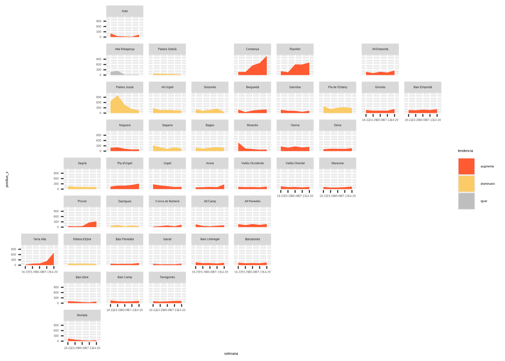
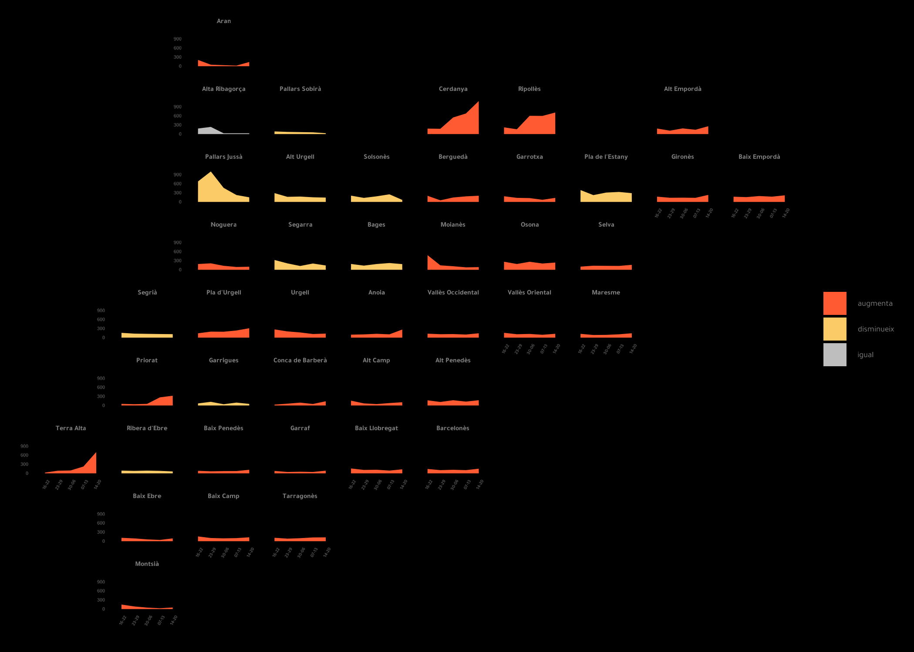
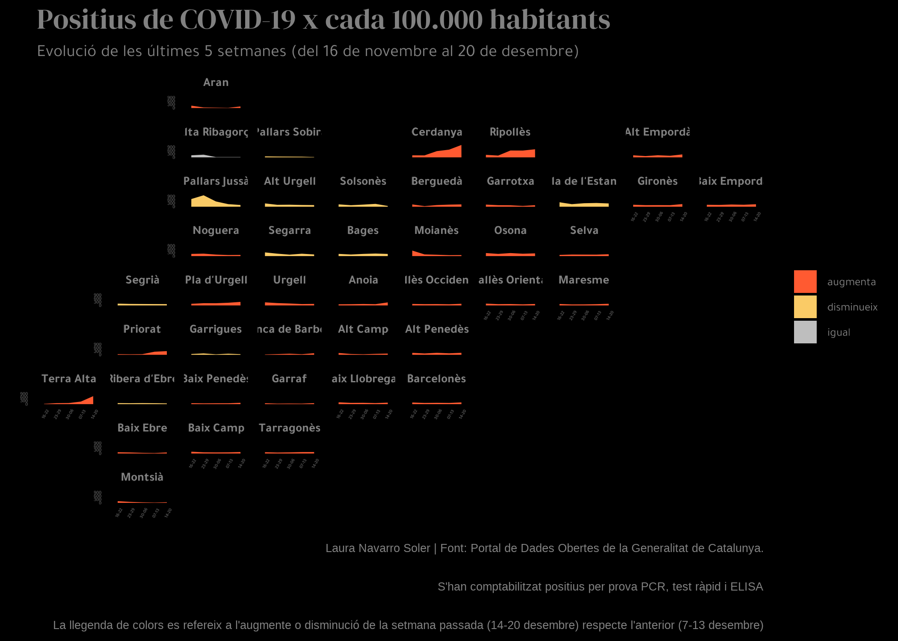

```{r global options, include = FALSE}
knitr::opts_chunk$set(warning = FALSE, message = FALSE)
```

<div class="container">


# Packages
***

In order to create this chart, we need to load the **following packages**, as well as some **fonts**:

```{r thecode2, echo=TRUE, out.width = "100%", fig.height=7}
library(tidyverse)
library(ggplot2)
library(reshape2)
library(showtext)

# For creating a custom grid, visit this site: https://digital.ebp.ch/2021/03/02/tilemaps-in-r/
library(geofacet)

# Loading fonts
font_add_google("DM Serif Display", "abril")
font_add_google("Tajawal", "tawa")
showtext_auto()
```


# Dataset
***

The data consists of a **custom grid** representing the regions of Catalonia, stored in a data frame called `comarques`. Each region is identified by a **unique code and name**, and has corresponding row and column coordinates.

Additionally, a CSV file containing data for December is loaded into a data frame called `datos`. The `setmana` column in the `datos` data frame is converted to a factor with levels representing the weeks of the month.

```{r}
# Creating the custom grid ()
comarques <- data.frame(
  code = c("AN", "CE", "AR", "PS", "RI", "AE", "PE", "GA", "BE", "AU", "PJ", "SO", "GI", "BE", "OS", "NO", "BA", "SE", "MO", "SE", "VO", "AN", "SA", "PU", "UR", "VR", "MA", "AC", "CB", "GG", "PR", "AP", "BA", "GA", "RE", "BP", "TA", "BL", "BE", "BC", "TA", "MO"),
  name = c("Aran", "Cerdanya", "Alta Ribagorça", "Pallars Sobirà", "Ripollès", "Alt Empordà", "Pla de l'Estany", "Garrotxa", "Berguedà", "Alt Urgell", "Pallars Jussà", "Solsonès", "Gironès", "Baix Empordà", "Osona", "Noguera", "Bages", "Segarra", "Moianès", "Selva", "Vallès Occidental", "Anoia", "Segrià", "Pla d'Urgell", "Urgell", "Vallès Oriental", "Maresme", "Alt Camp", "Conca de Barberà", "Garrigues", "Priorat", "Alt Penedès", "Barcelonès", "Garraf", "Ribera d'Ebre", "Baix Penedès", "Terra Alta", "Baix Llobregat", "Baix Ebre", "Baix Camp", "Tarragonès", "Montsià"),
  row = c(1, 2, 2, 2, 2, 2, 3, 3, 3, 3, 3, 3, 3, 3, 4, 4, 4, 4, 4, 4, 5, 5, 5, 5, 5, 5, 5, 6, 6, 6, 6, 6, 7, 7, 7, 7, 7, 7, 8, 8, 8, 9),
  col = c(3, 6, 3, 4, 7, 9, 8, 7, 6, 4, 3, 5, 9, 10, 7, 3, 5, 4, 6, 8, 6, 5, 2, 3, 4, 7, 8, 5, 4, 3, 2, 6, 6, 4, 2, 3, 1, 5, 2, 3, 4, 2),
  stringsAsFactors = FALSE
)

datos <- read.csv("https://raw.githubusercontent.com/lau-cloud/geo_data/main/grid_catalonia/setmanes_desembre.csv", encoding = "UTF-8")
datos$setmana <- factor(datos$setmana, levels = c("16-22", "23-29", "30-06", "07-13", "14-20"))
```

# Simple density plot
***

The code creates a geographical **faceted area plot**, where each facet represents a **unique value** in the name variable. The x-axis represents `setmana`, the y-axis represents `positius_x`, and the fill color of the area under the line is determined by tendencia. The fill colors are manually set to `"#FF5A31"`, `"#FACB66"`, and `"grey"`.

```{r, fig.show='hide'}
ggplot(datos, aes(x = setmana, y = positius_x, group = name, fill = tendencia)) +
  geom_area() +
  scale_fill_manual(values = c("#FF5A31", "#FACB66", "grey")) +
  facet_geo(~name, grid = comarques, label = "name")

ggsave("img/graph/area-small-multiple-1.png")
```

<center>
  
</center>

# Improve theme and remove unused labels
***

The next step is to **customize the theme** of the plot using the `theme()` function, especially to turn this chart into a **dark theme** one.

```{r, fig.show='hide'}
ggplot(datos, aes(x = setmana, y = positius_x, group = name, fill = tendencia)) +
  geom_area() +
  scale_fill_manual(values = c("#FF5A31", "#FACB66", "grey")) +
  facet_geo(~name, grid = comarques, label = "name") +
  theme_minimal() +
  theme(
    panel.grid.minor = element_blank(),
    plot.background = element_rect(fill = "black"),
    panel.background = element_rect(fill = "black"),
    panel.grid.major.x = element_blank(),
    panel.grid.major.y = element_blank(),
    plot.title = element_text(color = "#818181", size = 26, family = "abril"),
    plot.subtitle = element_text(color = "#818181", size = 18, family = "tawa"),
    plot.caption = element_text(color = "#818181", size = 10),
    strip.text.x = element_text(color = "#818181", size = 12, face = "bold", family = "tawa"),
    legend.position.inside = c(0.8, 0.2),
    axis.text.x = element_text(size = 8, face = "bold", angle = 60, family = "tawa"),
    axis.text.y = element_text(size = 8, face = "bold"),
    legend.text = element_text(color = "#818181", size = 14, family = "tawa"),
    legend.key.size = unit(0.5, "cm"),
    legend.spacing.y = unit(.5, "char")
  )
ggsave("img/graph/area-small-multiple-2.png")
```

<center>
  
</center>

# Final plot
***

The final step is to add **title**, **subtitle** and **caption** to our chart, and we do it thanks to the `labs()` function:

```{r, fig.show='hide'}
ggplot(datos, aes(x = setmana, y = positius_x, group = name, fill = tendencia)) +
  geom_area() +
  scale_fill_manual(values = c("#FF5A31", "#FACB66", "grey")) +
  facet_geo(~name, grid = comarques, label = "name") +
  theme_minimal() +
  labs(
    x = "setmana", y = "positius x 100.000 habitants",
    title = "Positius de COVID-19 x cada 100.000 habitants",
    subtitle = "Evolució de les últimes 5 setmanes (del 16 de novembre al 20 de desembre)",
    caption = "Laura Navarro Soler | Font: Portal de Dades Obertes de la Generalitat de Catalunya.\n S'han comptabilitzat positius per prova PCR, test ràpid i ELISA \n La llegenda de colors es refereix a l'augmente o disminució de la setmana passada (14-20 desembre) respecte l'anterior (7-13 desembre)"
  ) +
  theme(
    panel.grid.minor = element_blank(),
    plot.background = element_rect(fill = "black"),
    panel.background = element_rect(fill = "black"),
    panel.grid.major.x = element_blank(),
    panel.grid.major.y = element_blank(),
    plot.title = element_text(color = "#818181", size = 26, family = "abril"),
    plot.subtitle = element_text(color = "#818181", size = 18, family = "tawa"),
    plot.caption = element_text(color = "#818181", size = 10),
    strip.text.x = element_text(color = "#818181", size = 12, face = "bold", family = "tawa"),
    legend.position.inside = c(0.8, 0.2),
    axis.text.x = element_text(size = 8, face = "bold", angle = 60, family = "tawa"),
    axis.text.y = element_text(size = 8, face = "bold"),
    legend.text = element_text(color = "#818181", size = 14, family = "tawa"),
    legend.key.size = unit(0.5, "cm"),
    legend.spacing.y = unit(.5, "char")
  )
ggsave("img/graph/area-small-multiple-3.png")
```

<center>
  
</center>

# Going further
***

You might be interested in:

- this beautiful [ridgeline plot](web-ridgeline-plot-with-inside-plot-and-annotations.html) about rental prices
- how to create a [small multiple line chart](web-line-chart-small-multiple-all-group-greyed-out.html)
- how to mix [time series and facetting](web-time-series-and-facetting.html)

<!-- Close container -->
</div>


```{r, echo=FALSE}
htmltools::includeHTML("htmlChunkRelatedEvolution.html")
```
