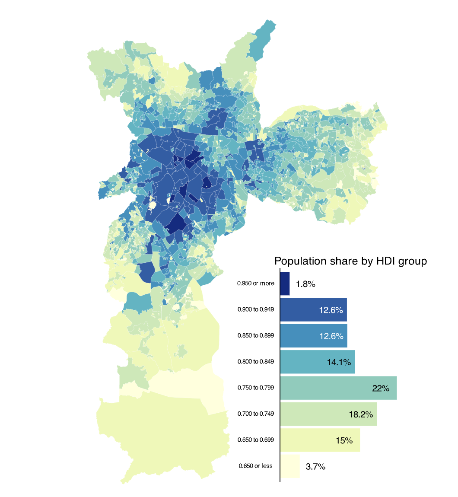

```{r global options, include = FALSE}
knitr::opts_chunk$set(
  warning = FALSE,
  message = FALSE
  )
```

<div class="container">

# About
***

This visualization shows the **Human Development Index** (HDI) at the subregional level in Sao Paulo, Brazil's largest city. The values follow the standard United Nations's HDI: values are in the **0 to 1 range**. The visualization combines a [choropleth map](choropleth-map.html) with a bar chart using the [patchwork](package/patchwork.html) package.

This is the the work of [Vinicius Oike Reginatto](https://restateinsight.com/). Thanks to him for accepting sharing his work here! 🙏

As a teaser, here is the map we'll learn how to build:

<center>
{width=95%}
</center>

# Data and Libraries
***
To follow this tutorial you will need the following packages.

```{r libraries}
library(ggplot2)
library(ggthemes)
library(patchwork)
library(dplyr)
library(readr)
library(sf)
```

The HDI estimates are from the [Atlas of Human Development in Brazil](http://www.atlasbrasil.org.br) and to make this tutorial easier to follow I cleaned the data and made it available on my GitHub. To import the data:

```{r import-data}
atlas <- readr::read_rds(
  "https://github.com/viniciusoike/restateinsight/raw/main/static/data/atlas_sp_hdi.rds"
  )
```

# Basic Map
***

At its core, this visualization is a [choropleth map](choropleth-map.html) that shows the spatial distribution of the Human Development Index (HDI) in São Paulo. The code below uses `geom_sf` to make the map. The additional argument `lwd` makes the lines of each border thinner and `color` changes the color of the line.

Each **polygon** represents a "Human Development Unit" and can be interpreted like a small neighborhood.

```{r base-choropleth}
#| out-width: "90%"
ggplot(atlas) +
  geom_sf(aes(fill = HDI), lwd = 0.05, color = "white")
```

# Using bins
***

We use bins to group the **continuous variable** HDI. This makes it easier to visualize the data and to find **spatial clusters**. There are many ways to do this but here we use the `scale_fill_fermenter` function directly. This is a quick and easy approach to binning a continuous variable. This function also makes a - in my opinion - nicer looking color legend.

The color palettes from `RColorBrewer` work very well for maps and we use the `YlGnBu` palette. We specifiy the **breaks of the intervals** mannually using the `breaks` argument.

```{r binned-choropleth}
#| out-width: "90%"
ggplot(atlas) +
  geom_sf(aes(fill = HDI), lwd = 0.05, color = "white") +
  scale_fill_fermenter(
    name = "",
    breaks = seq(0.65, 0.95, 0.05),
    direction = 1,
    palette = "YlGnBu"
  )
```


# Final Map
***

The finished version of the map includes simple labels and uses `theme_map()` from the `ggthemes` package. The arguments inside the `theme` function mostly change the **size and the alignment** of the text labels. For your final plot you'll most likely want to change the `legend.key.size` and `plot.title` size arguments.

```{r final-choropleth}
#| out-width: "100%"
#| out-height: 900px
#| fig-width: 9
#| fig-height: 11
#| fig-format: svg
pmap <- ggplot(atlas) +
  geom_sf(aes(fill = HDI), lwd = 0.05, color = "white") +
  scale_fill_fermenter(
    name = "",
    breaks = seq(0.65, 0.95, 0.05),
    direction = 1,
    palette = "YlGnBu"
  ) +
  labs(
    title = "HDI in Sao Paulo, BR (2010)",
    subtitle = "Microregion HDI in Sao Paulo",
    caption = "Source: Atlas Brasil"
  ) +
  theme_map() +
  theme(
    # Legend
    legend.position = "top",
    legend.justification = 0.5,
    legend.key.size = unit(1.25, "cm"),
    legend.key.width = unit(1.75, "cm"),
    legend.text = element_text(size = 12),
    legend.margin = margin(),
    # Increase size and horizontal alignment of the both the title and subtitle
    plot.title = element_text(size = 28, hjust = 0.5),
    plot.subtitle = element_text(hjust = 0.5)
  )

pmap
```


# The Bar Chart
***

To make the [bar chart](barplot.html) we need to transform the data. We want to calculate the share of the total population that lives within each HDI group.

To make the same groups as those created by `scale_fill_fermenter` we use `findInterval` using the **same breaks** and **right-closed intervals**. To find this we group by `group_hdi`, sum the `pop` (population) of these regions, and compute the percent share within each group.

This bar chart serves two goals:
- first, it shows the distribution of the population across all HDI groups
- second, it compensates for *map area bias*, a common pitfall of choropleths. Map area bias refers to the natural tendency to attribute greater weight/importance to larger areas.

Looking at the [map](map.html), we see very large areas in the southernmost part of the city that have low values of HDI. These areas however **are not densely populated** and account for a relatively small share of the city's population.

```{r base-bar-chart}
# Calculate population share in each HDI group
pop_hdi <- atlas |> 
  st_drop_geometry() |> 
  mutate(
    group_hdi = findInterval(HDI, seq(0.65, 0.95, 0.05), left.open = FALSE),
    group_hdi = factor(group_hdi)
  ) |> 
  group_by(group_hdi) |> 
  summarise(score = sum(pop, na.rm = TRUE)) |> 
  ungroup() |> 
  mutate(share = score / sum(score) * 100) |> 
  na.omit()

ggplot(pop_hdi, aes(group_hdi, share, fill = group_hdi)) +
  geom_col()
```


# Using text labels
***

Instead of using axis labels we plot the value of each group directly **on top of each bar**. To improve readability we make the color of the text labels variable (black or white) and also nudge the label of the first and last group horizontally.

Getting the right amount of horizontal nudge requires some **trial and error** and also depends on the size of your final visualization. In your own chart, you'll most likely change the `share + 3`/`share - 3` and the `size` argument in `geom_text`.

```{r bar-chart-labels}
# Create a variable to store the position of the text label
pop_hdi <- pop_hdi |> 
  mutate(
    y_text = if_else(group_hdi %in% c(0, 7), share + 3, share - 3),
    label = paste0(round(share, 1), "%")
  )

ggplot(pop_hdi, aes(group_hdi, share, fill = group_hdi)) +
  geom_col() +
  geom_hline(yintercept = 0) +
  # Text labels
  geom_text(
    aes(y = y_text, label = label, color = group_hdi),
    size = 3
  ) +
  coord_flip() +
  # Use the same color palette as the map
  scale_fill_brewer(palette = "YlGnBu") +
  # Swap between black and white text
  scale_color_manual(values = c(rep("black", 5), rep("white", 2), "black")) +
  # Hide color legend
  guides(fill = "none", color = "none")
```


# Final Bar Chart
***

We use a **custom label** for the final version of this plot.

```{r bar-chart-final}
# Labels for the color legend
x_labels <- c(
  "0.650 or less", "0.650 to 0.699", "0.700 to 0.749", "0.750 to 0.799",
  "0.800 to 0.849", "0.850 to 0.899", "0.900 to 0.949", "0.950 or more"
  )

pcol <- ggplot(pop_hdi, aes(group_hdi, share, fill = group_hdi)) +
  geom_col() +
  geom_hline(yintercept = 0) +
  geom_text(
    aes(y = y_text, label = label, color = group_hdi),
    size = 4
  ) +
  coord_flip() +
  scale_x_discrete(labels = x_labels) +
  scale_fill_brewer(palette = "YlGnBu") +
  scale_color_manual(values = c(rep("black", 5), rep("white", 2), "black")) +
  guides(fill = "none", color = "none") +
  labs(
    title = "Population share by HDI group",
    x = NULL,
    y = NULL
  ) +
  theme_void() +
  theme(
    panel.grid = element_blank(),
    plot.title = element_text(size = 14),
    axis.text.y = element_text(size = 8),
    axis.text.x = element_blank()
  )

pcol
```

# The final plot
***

To join both plots we use the `inset_element` function from the [patchwork](package/patchwork.html) package. Use the arguments inside this function to customize the display size of the bar chart.

In this final visualization we can see that nearly 40\% of the city's population lives in regions with an HDI range of 0.700-0.799. These areas are primarily located in the peripheral parts of the city, including the southern, eastern, and northern sections. In contrast, the central part of the city, which has the highest HDI areas, accounts for less than 15\% of the total population.

```{r final-viz}
#| out-width: "100%"
#| out-height: 900px
#| fig-width: 9
#| fig-height: 11
#| fig-format: svg
p_hdi_atlas <- 
  pmap + inset_element(pcol, left = 0.50, bottom = 0.05, right = 1, top = 0.5)

p_hdi_atlas
```

As stated previously, the combination of a bar chart (or histogram) with a choropleth makes for a powerful and insightful combination. Happy mapping!

**Author**: [Vinicius Oike Reginatto](https://restateinsight.com/aboutme)

**Data**: [Atlas of Human Development in Brazil](http://www.atlasbrasil.org.br)


# Going Further
***

You might be interested in:

- creating a [map in the style of Jacques Bertin](web-valued-dots-map-bertin.html)
- how to combine a [cartogram with a bubble map](web-dorling-cartogram-with-R.html)
- this other [choropleth map](327-chloropleth-map-from-geojson-with-ggplot2.html) about French restaurants


<!-- Close container -->
</div>

```{r, echo=FALSE}
# Correlation | Ranking | Evolution.. 
htmltools::includeHTML("htmlChunkRelatedMap.html")
```