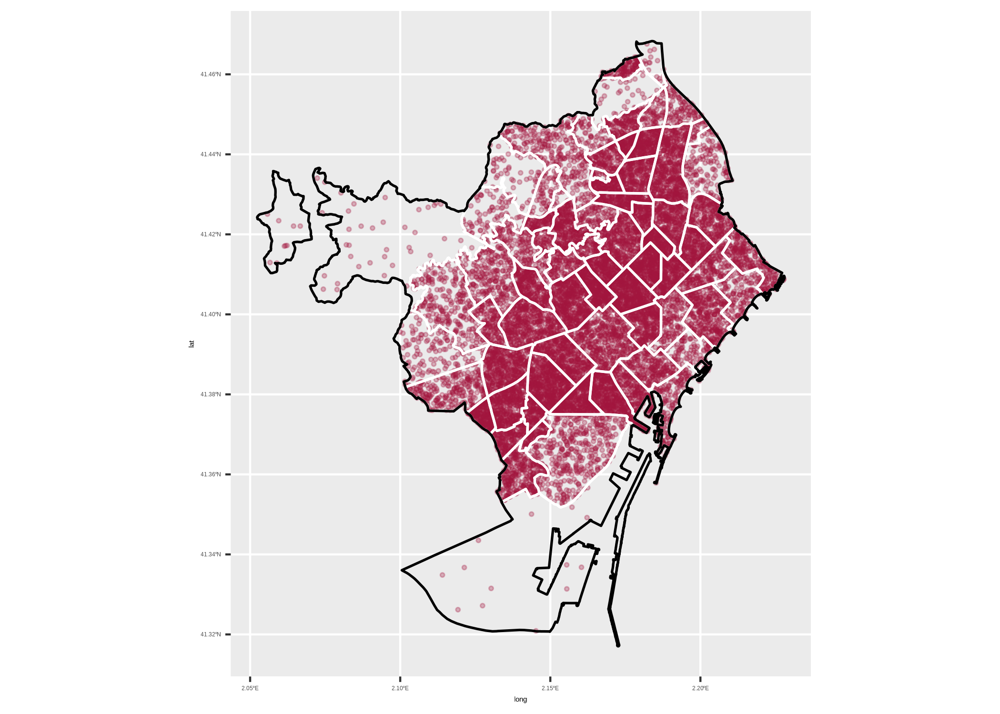
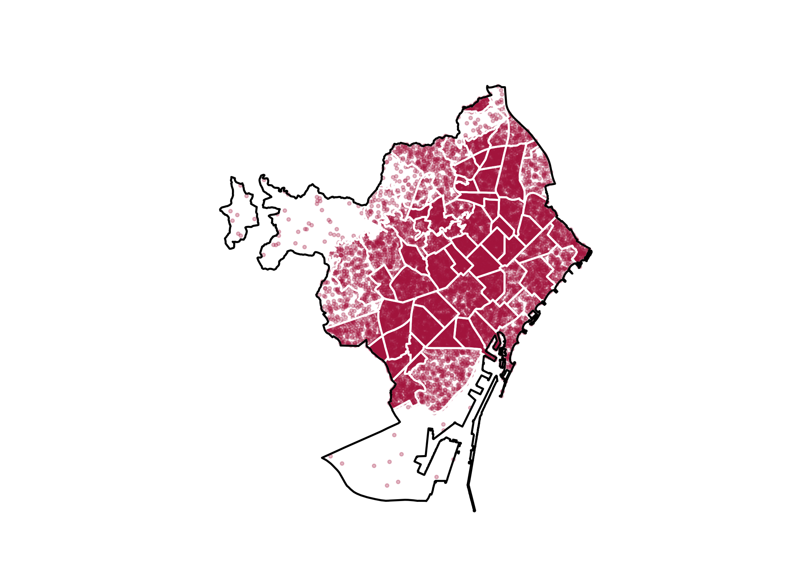
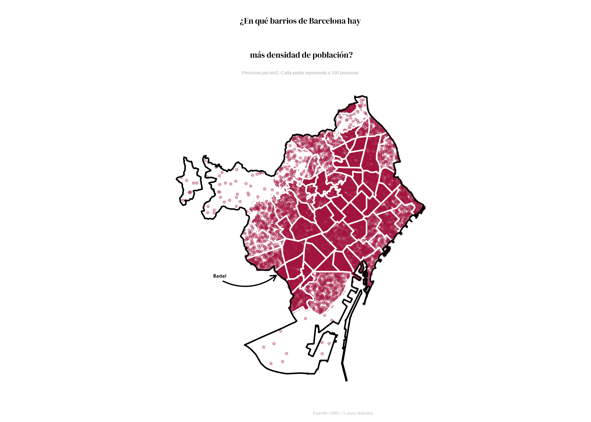

```{r global options, include = FALSE}
knitr::opts_chunk$set(warning = FALSE, message = FALSE)
```

<div class="container">


# Packages
***

In order to create this chart, we need to load the **following packages**, as well as some **fonts**:

```{r thecode2, echo=TRUE, out.width = "100%", fig.height=7}
library(tidyverse)
library(sf)
library(classInt)
library(cartogram)
library(showtext)

# Loading fonts
font_add_google("DM Serif Display", "abril")
font_add_google("Tajawal", "tawa")
showtext_auto()
```


# Dataset
***

The data consists of two **geojson files**: one containing the neighborhoods of Barcelona and the other containing the city's boundary. Additionally, a CSV file containing population data for each neighborhood is loaded.

The neighborhood and population data are merged into a single data frame, and the total population is divided by 100 to represent each dot as 100 people. A custom function called `get_dot_density()` is applied to generate random sample points within each neighborhood based on its population, resulting in a data frame of longitude and latitude coordinates for each dot.

```{r}
# Loading geojson of Barcelona's neighborhoods
barris <- st_read("https://raw.githubusercontent.com/lau-cloud/30DayChartChallenge2024/main/10_physical/0301040100_Barris_UNITATS_ADM.json",
  stringsAsFactors = FALSE,
  as_tibble = TRUE
)

# Loading geojson of Barcelona's boundary
perfil <- st_read("https://raw.githubusercontent.com/lau-cloud/30DayChartChallenge2024/main/10_physical/0301040100_TermeMunicipal_UNITATS_ADM.json",
  stringsAsFactors = FALSE,
  as_tibble = TRUE
)

pop_barris <- read.csv("https://raw.githubusercontent.com/lau-cloud/30DayChartChallenge2024/main/10_physical/10_physical.csv")
names(barris)[29] <- "barri"
df <- barris |>
  left_join(pop_barris, by = "barri")

# Dividing number by 100 (each dot is 100 people)
df_100 <- df |>
  mutate(total_100 = total / 100)

# Applying Milos function
get_dot_density <- function() {
  num_dots <- ceiling(dplyr::select(as.data.frame(df_100), total_100))
  deu_dots <- map_df(
    names(num_dots),
    ~ sf::st_sample(df_100, size = num_dots[, .x], type = "random") |>
      sf::st_cast("POINT") |>
      sf::st_coordinates() |>
      as_tibble() |>
      setNames(c("long", "lat"))
  )
  return(deu_dots)
}

deu_dots <- get_dot_density()
```

# Simple density plot
***

We start by creating a simple density plot without much customization. It mainly relies on the `geom_sf()` function from the [sf package](package/sf.html)

```{r, fig.show='hide'}
ggplot(deu_dots) +
  geom_point(
    data = deu_dots, aes(x = long, y = lat),
    color = "#A0153E", size = .7, alpha = .3
  ) +
  geom_sf(
    data = barris, fill = "transparent",
    color = "white", linewidth = .6
  ) +
  geom_sf(data = perfil, fill = "transparent", color = "black", linewidth = 0.6)

ggsave("img/graph/density-plot-1.png")
```

<center>
  
</center>

# Improve theme and remove unused labels
***

Now we have our core of the chart, we can improve it:

- use the `theme_minimal()`
- remove most **labels**

```{r, fig.show='hide'}
ggplot(deu_dots) +
  geom_point(
    data = deu_dots, aes(x = long, y = lat),
    color = "#A0153E", size = .7, alpha = .3
  ) +
  geom_sf(
    data = barris, fill = "transparent",
    color = "white", linewidth = .6
  ) +
  labs(
    y = "",
    subtitle = "",
    x = "",
    title = "",
    caption = ""
  ) +
  theme_minimal() +
  geom_sf(data = perfil, fill = "transparent", color = "black", linewidth = 0.6) +
  theme(
    panel.grid = element_blank(),
    axis.text = element_blank(),
    plot.title = element_text(
      hjust = 0.5, family = "abril", size = 22,
      lineheight = 1.1,
      margin = margin(10, 0, 10, 0)
    ),
    plot.subtitle = element_text(
      hjust = 0.5,
      size = 12, color = "darkgrey"
    ),
    plot.caption = element_text(color = "grey", hjust = 0.7, size = 12)
  )
ggsave("img/graph/density-plot-2.png")
```

<center>
  
</center>

# Final plot
***

Then we add the title, subtitle and an arrow to highlight **Badal** with the `annotate()` function:

```{r, fig.show='hide'}
ggplot(deu_dots) +
  geom_point(
    data = deu_dots, aes(x = long, y = lat),
    color = "#A0153E", size = .7, alpha = .3
  ) +
  labs(
    y = "",
    subtitle = "",
    x = "",
    title = "",
    caption = ""
  ) +
  geom_sf(
    data = barris, fill = "transparent",
    color = "white", linewidth = .6
  ) +
  theme_minimal() +
  geom_sf(data = perfil, fill = "transparent", color = "black", linewidth = 0.6) +
  labs(
    fill = NULL, colour = NULL,
    title = "¿En qué barrios de Barcelona hay más densidad de población?",
    subtitle = "Personas por km2. Cada punto representa a 100 personas",
    caption = "Fuente: OMD. / Laura Navarro"
  ) +
  theme(
    panel.grid = element_blank(),
    axis.text = element_blank(),
    plot.title = element_text(
      hjust = 0.5, family = "abril", size = 50,
      lineheight = 1.1,
      margin = margin(10, 0, 10, 0)
    ),
    plot.subtitle = element_text(
      hjust = 0.5,
      size = 20, color = "darkgrey"
    ),
    plot.caption = element_text(color = "grey", hjust = 0.7, size = 20)
  ) +
  annotate("text",
    x = c(2.083), y = c(41.3728),
    label = c("Badal"), color = "black",
    size = 8, family = "tawa", hjust = 0.5, fontface = "bold"
  ) +
  annotate(
    geom = "curve", x = 2.085, y = 41.37, xend = 2.123, yend = 41.373,
    curvature = .3, arrow = arrow(length = unit(2, "mm"))
  )
ggsave("img/graph/density-plot-3.png")
```

<center>
  
</center>


# Going further
***

You might be interested in:

- this beautiful [choropleth map](web-choropleth-barchart-map.html) about Brazil
- how to create a [dorling cartogram](web-dorling-cartogram-with-R.html), a variation of the bubble map
- how to create a [density map in the style of Jacques Bertin](web-valued-dots-map-bertin.html)

<!-- Close container -->
</div>


```{r, echo=FALSE}
htmltools::includeHTML("htmlChunkRelatedMap.html")
```
