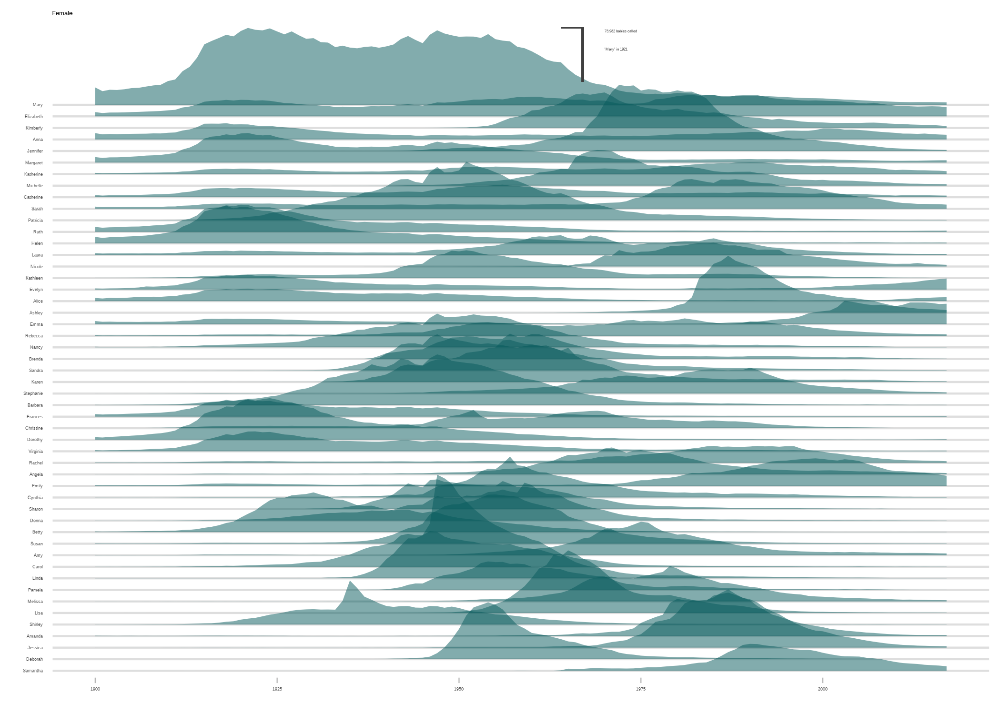
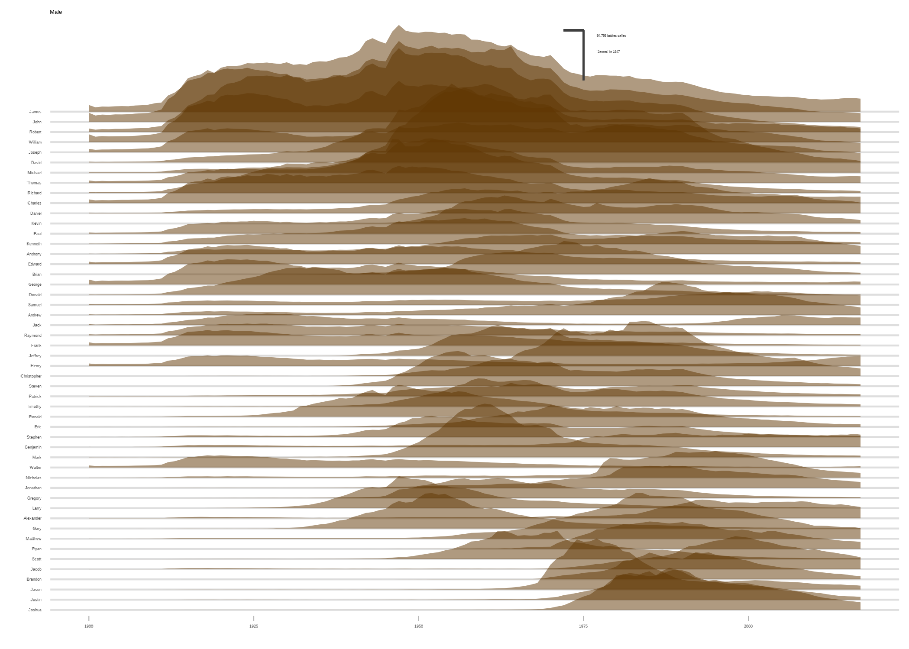
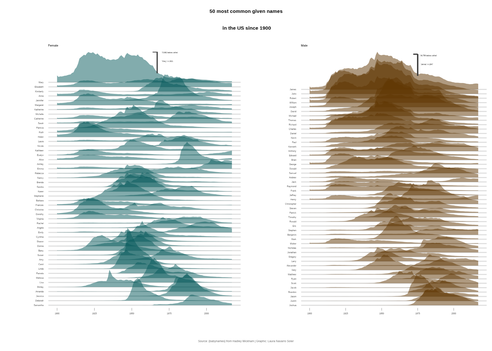

```{r global options, include = FALSE}
knitr::opts_chunk$set(warning = FALSE, message = FALSE)
```

<div class="container">


# Packages
***

In order to create this chart, we need to load the **following packages**, as well as some **fonts**:

```{r thecode2, echo=TRUE, out.width = "100%", fig.height=7}
extrafont::loadfonts()
library(tidyverse)
library(ggridges)
library(viridis)
library(extrafont)
library(cowplot)
library(showtext)

# Loading fonts
font_add_google("DM Serif Display", "abril")
font_add_google("Tajawal", "tawa")
showtext_auto()

# Set theme
theme_set(theme_light())
```


# Dataset
***

The data consists of a CSV file containing baby names, which is loaded into a data frame called `babynames`. The data is then filtered to find the 50 most popular female and male names of all time, and the results are stored in the `top_female` and `top_male` vectors, respectively.

The `babynames` data frame is then filtered again to include only the **top 50 female and male** names for each year, and the results are stored in the `female_names` and `male_names` data frames. The `name` column in both data frames is converted to a factor with levels based on the order of popularity.

The `female_names` and `male_names` data frames are **grouped by year and name**, and the total number of occurrences for each name is summarized in the `n` column.

```{r}
# Loading data
babynames <- readr::read_csv("https://raw.githubusercontent.com/rfordatascience/tidytuesday/master/data/2022/2022-03-22/babynames.csv")

# 50 most popular female names over all time
top_female <- babynames |>
  filter(sex == "F") |>
  group_by(name) |>
  summarise(total = sum(n)) |>
  slice_max(total, n = 50) |>
  mutate(
    rank = 1:50,
    name = forcats::fct_reorder(name, -total)
  ) |>
  pull(name)

# 50 most popular male names over all time
top_male <- babynames |>
  filter(sex == "M") |>
  group_by(name) |>
  summarise(total = sum(n)) |>
  slice_max(total, n = 50) |>
  mutate(
    rank = 1:50,
    name = forcats::fct_reorder(name, -total)
  ) |>
  pull(name)

# filter female names data
female_names <- babynames |>
  filter(
    sex == "F",
    name %in% top_female
  ) |>
  mutate(name = factor(name, levels = levels(top_female))) |>
  group_by(year, name) |>
  summarise(n = sum(n))

# filter top males
male_names <- babynames |>
  filter(
    sex == "M",
    name %in% top_male
  ) |>
  mutate(name = factor(name, levels = levels(top_male))) |>
  group_by(year, name) |>
  summarise(n = sum(n))
```

# Ridgeline with female names
***

We start by creating a single ridgeline plot using **only female names**.

The [ridgeline plot](ridgeline-plot.html) is made via the `geom_ridgeline()` function from the [ggridges package](ridgeline-plot.html).

```{r, fig.show='hide'}
plot1 <- ggplot(female_names, aes(year,
  y = fct_reorder(name, n), height = n / 50000,
  group = name, scale = 2
)) +
  geom_ridgeline(
    alpha = 0.5, scale = 4.5, linewidth = 0,
    fill = "#05595B", color = "white"
  ) +
  xlim(1900, NA) +
  labs(title = "Female", y = "", x = "") +
  theme(
    plot.title = element_text(hjust = 0, family = "Bahnschrift", size = 10),
    axis.ticks.y = element_blank(),
    axis.text = element_text(family = "Bahnschrift", size = 7),
    panel.grid.major.x = element_blank(),
    panel.grid.minor.x = element_blank(),
    panel.grid.major.y = element_line(size = 0.5),
    panel.border = element_blank()
  ) +
  geom_segment(aes(x = 1967, xend = 1967, y = 56.7, yend = 52), color = "#404040") +
  geom_segment(aes(x = 1967, xend = 1964, y = 56.7, yend = 56.7), color = "#404040") +
  annotate(
    geom = "text", x = 1970, y = 55.6, label = "73,982 babies called\n'Mary' in 1921", hjust = "left",
    size = 2.2, color = "#404040", family = "Bahnschrift"
  )

plot1
ggsave("img/graph/ridgeline-1.png")
```

<center>
  
</center>

# Ridgeline with male names
***

Now we create the same chart but using the **male names only**. The code is pretty much the same as above:

```{r, fig.show='hide'}
plot2 <- ggplot(male_names, aes(year,
  y = fct_reorder(name, n), height = n / 50000,
  group = name, scale = 2
)) +
  geom_ridgeline(
    alpha = 0.5, scale = 4.5, linewidth = 0,
    fill = "#603601", color = "white"
  ) +
  xlim(1900, NA) +
  labs(title = "Male", y = "", x = "") +
  theme(
    plot.title = element_text(hjust = 0, family = "Bahnschrift", size = 10),
    axis.ticks.y = element_blank(),
    axis.text = element_text(family = "Bahnschrift", size = 7),
    panel.grid.major.x = element_blank(),
    panel.grid.minor.x = element_blank(),
    panel.grid.major.y = element_line(size = 0.5),
    panel.border = element_blank(),
    panel.background = element_rect(fill = "white"),
    plot.background = element_rect(fill = "white")
  ) +
  geom_segment(aes(x = 1975, xend = 1975, y = 58, yend = 53.1), color = "#404040") +
  geom_segment(aes(x = 1975, xend = 1972, y = 58, yend = 58), color = "#404040") +
  annotate(
    geom = "text", x = 1977, y = 56.7, label = "94,756 babies called\n'James' in 1947", hjust = "left",
    size = 2.2, color = "#404040", family = "Bahnschrift"
  )

plot2
ggsave("img/graph/ridgeline-2.png")
```

<center>
  
</center>

# Combine plots
***

Now that we have the charts that we needed, we can **concatenate** them into a single one thanks to the `plot_grid()` function:

```{r, fig.show='hide'}
title_theme <- ggdraw() +
  draw_label("50 most common given names\n in the US since 1900",
    fontfamily = "Gadugi",
    fontface = "bold",
    size = 16,
    hjust = 0.5
  )

# caption
caption <- ggdraw() +
  draw_label("Source: {babynames} from Hadley Wickham | Graphic: Laura Navarro Soler",
    fontfamily = "Bahnschrift",
    size = 9,
    hjust = 0.5,
    color = "#6B6B6B"
  )

gridofplots <- plot_grid(plot1, plot2, nrow = 1)
plot_grid(title_theme,
  gridofplots,
  caption,
  ncol = 1, rel_heights = c(0.2, 1.5, 0.1)
)

ggsave("img/graph/ridgeline-3.png")
```

<center>
  
</center>

# Going further
***

You might be interested in:

- this beautiful [ridgeline plot](web-ridgeline-plot-with-inside-plot-and-annotations.html) about rental prices
- how to create a [small multiple line chart](web-line-chart-small-multiple-all-group-greyed-out.html)
- how to mix [time series and facetting](web-time-series-and-facetting.html)

<!-- Close container -->
</div>


```{r, echo=FALSE}
htmltools::includeHTML("htmlChunkRelatedDistribution.html")
```
