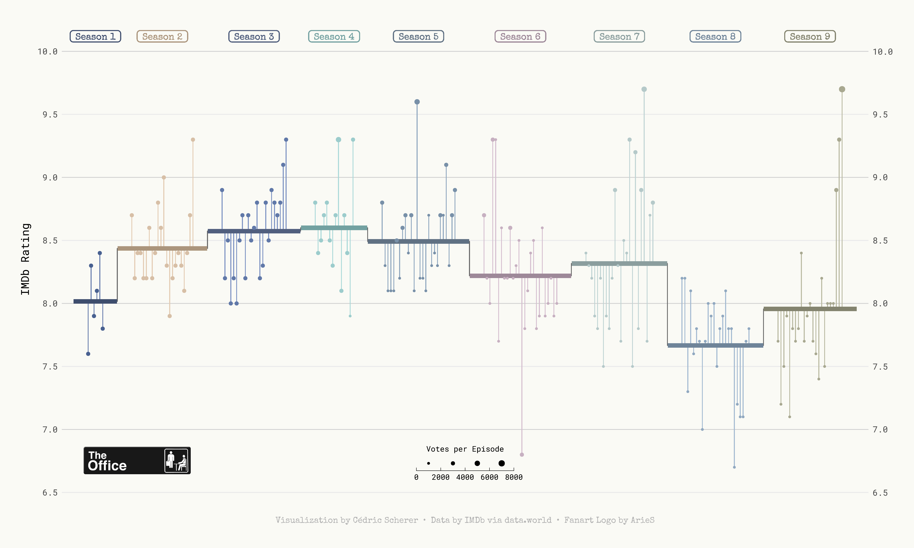

```{r global options, include=FALSE}
knitr::opts_chunk$set(warning = FALSE, message = FALSE)
```

<div class="container" style="padding-top: 100px">


# About
***

This page showcases the work of [Cedric Sherer](https://www.cedricscherer.com),
built for the [TidyTuesday](https://github.com/rfordatascience/tidytuesday) 
initiative. You can find the original code on his Github repository 
[here](https://github.com/z3tt/TidyTuesday/blob/master/R/2020_12_TheOffice.Rmd). 
This article has been contributed by [Tomas Capretto](https://twitter.com/CaprettoTomas). 
Thanks to Cedric for accepting sharing his work here! 🙏🙏

<br>

## Package and Theme
***

As always several packages are needed in order to build the figure. In this 
occasion, we also import some fonts from Google via the `font_add_google()`
function. We finally call `showtext_auto()` to indicate that
[showtext](https://cran.rstudio.com/web/packages/showtext/vignettes/introduction.html)
is used to draw text in our plots.

```{r, warning=FALSE}
# Load packages
library(tidyverse)
library(cowplot)
library(showtext)

# Add fonts from Google.
font_add_google("Roboto Mono", "Roboto Mono")
font_add_google("Open Sans", "Open Sans")
font_add_google("Special Elite", "Special Elite")

# Set ggplot theme
theme_set(theme_minimal(base_family = "Roboto Mono"))
theme_update(
  plot.background = element_rect(fill = "#fafaf5", color = "#fafaf5"),
  panel.background = element_rect(fill = NA, color = NA),
  panel.border = element_rect(fill = NA, color = NA),
  panel.grid.major.x = element_blank(),
  panel.grid.minor = element_blank(),
  axis.text.x = element_blank(),
  axis.text.y = element_text(size = 10),
  axis.ticks = element_blank(),
  axis.title.y = element_text(size = 13, margin = margin(r = 10)),
  legend.title = element_text(size = 9),
  plot.caption = element_text(
    family = "Special Elite",
    size = 10,
    color = "grey70",
    face = "bold",
    hjust = .5,
    margin = margin(5, 0, 20, 0)
  ),
  plot.margin = margin(10, 25, 10, 25)
)

# Turn on showtext
showtext_auto()
```

<br>

# Load and prepare the dataset
***

Today we are creating a highly customized lollipop chart to visualize IMDB ratings
for each episode of the television show The Office (US). The data originally comes from
the [`schrute` R package](https://bradlindblad.github.io/schrute/index.html)
and [data.world](https://data.world/anujjain7/the-office-imdb-ratings-dataset), but
we are using the version released for the [TidyTuesday](https://github.com/rfordatascience/tidytuesday) 
initiative on the week of 2020-03-17. You can find the original announcement and
more information about the data [here](https://github.com/rfordatascience/tidytuesday/tree/master/data/2020/2020-03-17).

First, we read the data set and take a look at the first few rows to get familiar 
with the data.

```{r}
df_office <- readr::read_csv('https://raw.githubusercontent.com/rfordatascience/tidytuesday/master/data/2020/2020-03-17/office_ratings.csv')
head(df_office)
```

<br>

From all the columns included in the data, we use the season (`season`), the
episode number (`episode`), the IMDB rating (`imdb_rating`), and the number 
of votes used for each rating (`total_votes`).

We start by computing the average rating per season. Observations are arranged 
by `season` and `episode` to make sure `row_number()` represents the episode 
number irrespective of the season. `season` is mutated into a factor type so 
`ggplot2` recognizes it as a discrete variable instead of numeric.

```{r}
df_office_avg <-
  df_office %>% 
  arrange(season, episode) %>% 
  mutate(episode_id = row_number()) %>% 
  group_by(season) %>% 
  mutate(
    avg = mean(imdb_rating),
    episode_mod = episode_id + (9 * season),
    mid = mean(episode_mod)
  ) %>% 
  ungroup() %>% 
  mutate(season = factor(season))
```

<br>

Now we construct the data frame used to plot the horizontal lines with
the mean rating per season, given by `start_x` and `end_x`. This data frame also 
includes the values we need to add the line connecting mean ratings for 
contiguous seasons in `x` and `y`. 

```{r}
df_lines <-
  df_office_avg %>% 
  group_by(season) %>% 
  summarize(
    start_x = min(episode_mod) - 5,
    end_x = max(episode_mod) + 5,
    y = unique(avg)
  ) %>% 
  pivot_longer(
    cols = c(start_x, end_x),
    names_to = "type",
    values_to = "x"
  ) %>% 
  mutate(
    x_group = if_else(type == "start_x", x + .1, x - .1),
    x_group = if_else(type == "start_x" & x == min(x), x_group - .1, x_group),
    x_group = if_else(type == "end_x" & x == max(x), x_group + .1, x_group)
  )
```


<br>

## Plot
***

Let's build the chart. We are doing it in a step-by-step fashion, adding comments
to explain what we are adding each time.

```{r}
# First, horizontal lines that are used as scale reference. 
# They are added first to ensure they stay in the background.
p <- df_office_avg %>% 
  ggplot(aes(episode_mod, imdb_rating)) +
    geom_hline(
      data = tibble(y = 7:10),
      aes(yintercept = y),
      color = "grey82",
      size = .5
    )

# Add vertical segments. 
# These represent the deviation of episode's rating from the mean rating of 
# the season they appeared.
p <- p + 
  geom_segment(
    aes(
      xend = episode_mod,
      yend = avg, 
      color = season, 
      color = after_scale(colorspace::lighten(color, .2))
    )
  )

# Add lines and dots.
# These represent the mean rating per season. 
# The dots mark each episode's rating, with its size given by the number of votes.
p <- p + 
  geom_line(
    data = df_lines,
    aes(x, y),
    color = "grey40"
  ) +
  geom_line(
    data = df_lines,
    aes(
      x_group, 
      y, 
      color = season, 
      color = after_scale(colorspace::darken(color, .2))
    ),
    size = 2.5
  ) + 
  geom_point(
    aes(size = total_votes, color = season)
  ) 
```

<br>

And so far, the plot looks as follows

```{r, include=FALSE}
# First, save as pdf, as original author does.
basename = "lollipop-plot-with-R-the-office-preview"
path_pdf = here::here("img", paste0(basename, ".pdf"))
path_png = here::here("img", paste0(basename, ".png"))

# Save as pdf
ggsave(path_pdf, width = 15, height = 9, device = cairo_pdf)

# Convert pdf to png using
pdftools::pdf_convert(path_pdf, format = "png", dpi = 300, filenames = path_png)
```

<center>
{width=90%}
</center>

<br>

It is worth remarking how the apparently disconnected grey vertical lines are 
added. Actually, it is only one gray line whose value represents the mean rating.
In the end, it looks like several disconnected vertical lines because of the 
jumps between mean ratings of different seasons and the thicker lines covering 
it in the sections where it is horizontal.

```{r}
# Add labels on top.
# They indicate the season and free us from using a legend.
p <- p + 
  geom_label(
    aes(
      mid, 
      10.12, # vertical position of labels
      label = glue::glue(" Season {season} "),
      color = season, 
      color = after_scale(colorspace::darken(color, .2))
    ),
    fill = NA,
    family = "Special Elite",
    fontface = "bold",
    label.padding = unit(.2, "lines"),
    label.r = unit(.25, "lines"), # radius of the rounder corners.
    label.size = .5
  ) 

# Scale and labels customization.
# Override default colors with a much better looking palette.
p <- p + 
    scale_x_continuous(expand = c(.015, .015)) +
    scale_y_continuous(
      expand = c(.03, .03),
      limits = c(6.5, 10.2),
      breaks = seq(6.5, 10, by = .5),
      sec.axis = dup_axis(name = NULL)
    ) +
    scale_color_manual(
      values = c("#486090", "#D7BFA6", "#6078A8", "#9CCCCC", "#7890A8", 
                 "#C7B0C1", "#B5C9C9", "#90A8C0", "#A8A890"),
      guide = FALSE # don't show guide for the color scale.
    ) +
    scale_size_binned(name = "Votes per Episode", range = c(.3, 3)) +
    labs(
      x = NULL, 
      y = "IMDb Rating",
      caption = "Visualization by Cédric Scherer  •  Data by IMDb via data.world  •  Fanart Logo by ArieS"
    ) +
    guides(
      size = guide_bins(
        show.limits = TRUE,
        direction = "horizontal",
        title.position = "top",
        title.hjust = .5
      )
    ) +
    theme(
      legend.position = c(.5, .085), 
      legend.key.width = unit(2, "lines")
    )
```

<br>

We are almost there! The last step is to add The Office logo and save the plot.

```{r}
# The logo is located in the folder 'img' in the root of our project. 
# x and y coords run from 0 to 1, where (0, 0) is lower left corner of the canvas.
logo <- magick::image_read(here::here("img", "the-office.png"))
p <- ggdraw(p) +
  draw_image(logo, x = -.35, y = -.34, scale = .12)
```


```{r, eval=FALSE}
ggsave(here::here("img", "lollipop-plot-with-R-the-office.pdf"), 
       width = 15, height = 9, device = cairo_pdf)
```

```{r, include=FALSE}
basename <- "lollipop-plot-with-R-the-office"
path_pdf <- here::here("img", paste0(basename, ".pdf"))
path_png <- here::here("img", paste0(basename, ".png"))

ggsave(path_pdf, width = 15, height = 9, device = cairo_pdf)

pdftools::pdf_convert(path_pdf, format = "png", dpi = 300, filenames = path_png)
```

<center>
{width=90%}
</center>

<br>

## Bonus track
***

Both in the original work by Cedric and here, we save the plot as a .pdf file. 
However, what you are seeing on this webpage is actually a .png file. 
Here's how we convert the .pdf plot into a .png file while maintaining its aspect 
and quality thanks to the great [`pdftools`](https://docs.ropensci.org/pdftools/) 
package.


```{r, eval=FALSE}
# Recall we saved our plot as 'lollipop-plot-with-R-the-office.pdf' in 'img'
basename <- "lollipop-plot-with-R-the-office"
path_pdf <- here::here("img", paste0(basename, ".pdf"))

# We create a new .png file with the same base name
path_png <- here::here("img", paste0(basename, ".png"))

# Convert pdf to png using `pdf_convert()`.
# We use dpi = 300 because it is the default value when we used `ggsave()`.
pdftools::pdf_convert(pdf = path_pdf, format = "png", dpi = 300, filenames = path_png)
```

<!-- Close container -->
</div>


```{r, echo=FALSE}
# Correlation | Ranking | Evolution.. 
htmltools::includeHTML("htmlChunkRelatedRanking.html")
```
