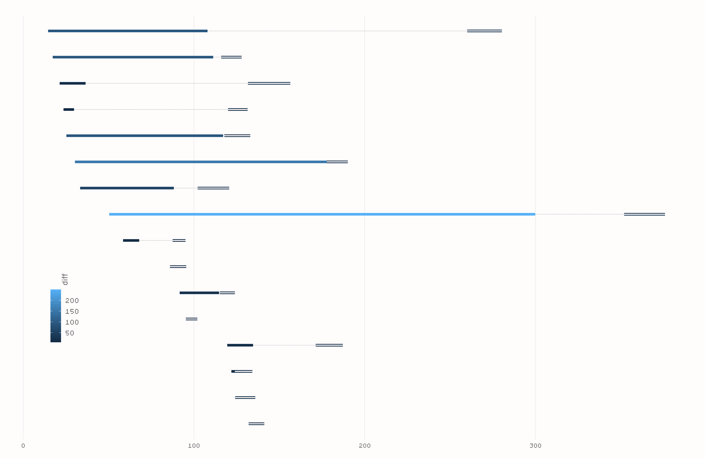
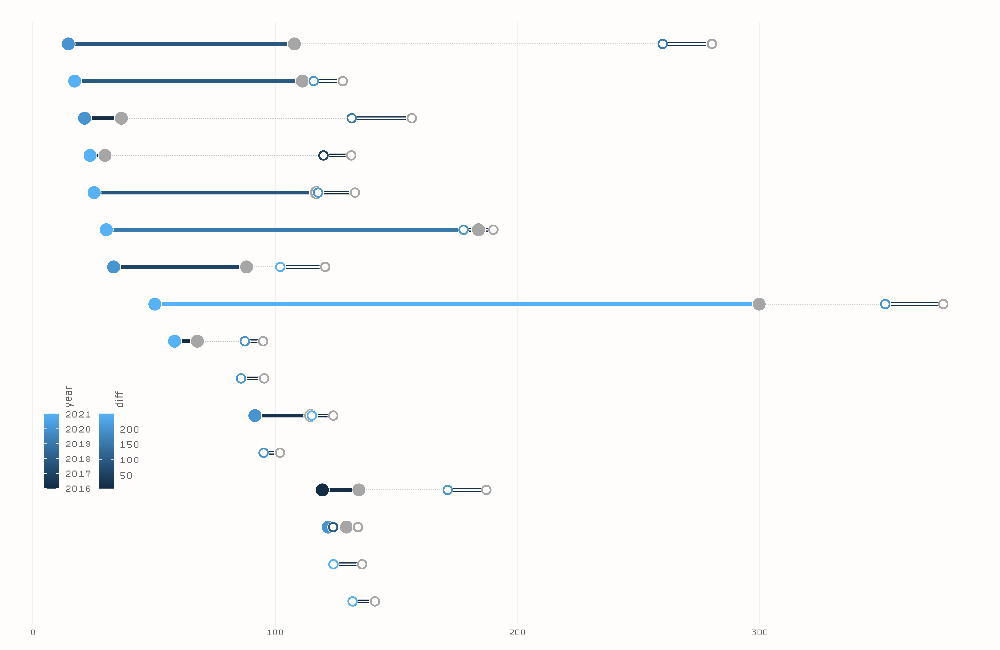
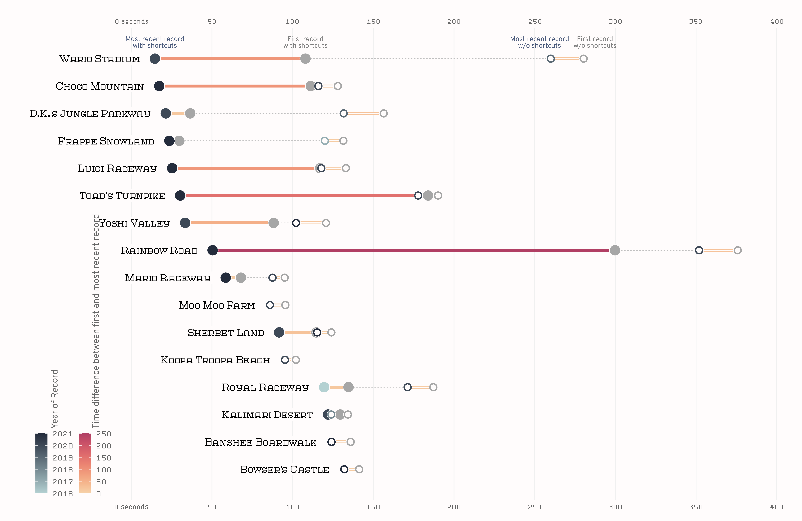
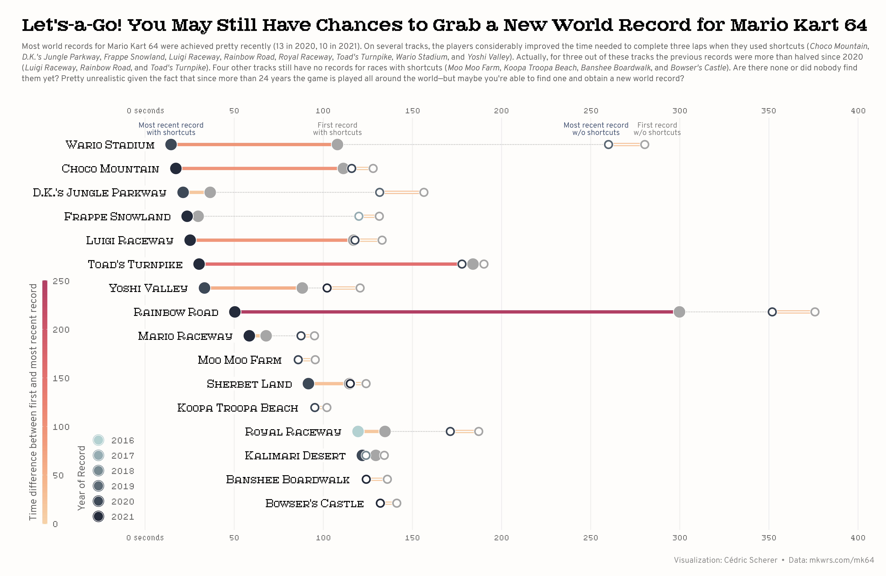

```{r global options, include = FALSE}
knitr::opts_chunk$set(warning=FALSE, message=FALSE, dev = "ragg_png", 
                      res = 500, retina = 1)
```

<div class="container" style="padding-top: 100px">


# About
***

This page showcases the work of [Cedric Sherer](https://www.cedricscherer.com), 
built for the [TidyTuesday](https://github.com/rfordatascience/tidytuesday) 
initiative. You can find the original code on his github repository 
[here](https://github.com/z3tt/TidyTuesday/blob/master/R/2021_22_MarioKart.Rmd). 
Thanks to him for accepting sharinig his work here! 🙏🙏

<br>


## Package and Theme
***

As always several packages are needed in order to build the figure.

```{r, warning=FALSE}
# Load packages
library(tidyverse)
library(ggtext)
library(ragg)

# Set ggplot theme
theme_set(theme_minimal(base_family = "Atlantis", base_size = 13))
theme_update(
  plot.margin = margin(25, 15, 15, 25),
  plot.background = element_rect(color = "#FFFCFC", fill = "#FFFCFC"),
  panel.grid.major.x = element_line(color = "grey94"),
  panel.grid.major.y = element_blank(),
  panel.grid.minor = element_blank(),
  axis.text = element_text(family = "Hydrophilia Iced"),
  axis.text.x = element_text(color = "grey40"),
  axis.text.y = element_blank(),
  axis.title = element_blank(),
  axis.ticks = element_blank(),
  legend.position = c(.07, .31), 
  legend.title = element_text(
    color = "grey40", 
    family = "Overpass", 
    angle = 90, 
    hjust = .5
  ),
  legend.text = element_text(
    color = "grey40", 
    family = "Hydrophilia Iced", 
    size = 12
  ),
  legend.box = "horizontal",
  legend.box.just = "bottom",
  legend.margin = margin(0, 0, 0, 0),
  legend.spacing = unit(.6, "lines"),
  plot.title = element_text(
    family = "Atlantis Headline", 
    face = "bold", 
    size = 17.45
  ),
  plot.subtitle = element_textbox_simple(
    family = "Overpass", 
    color = "grey40", 
    size = 10.8,
    lineheight = 1.3, 
    margin = margin(t = 5, b = 30)
  ),
  plot.caption = element_text(
    family = "Overpass", 
    color = "grey55", 
    size = 10.5, 
    margin = margin(t = 20, b = 0, r = 15)
  )
)
```


<br>

# Load and prepare the dataset
***

Today we are going to visualize world records for the Mario Kart 64 game. The 
game consists of 16 individual tracks and world records can be achieved for 
the fastest *single lap* or the fastest completed race (**three laps**).
Also, through the years, players discovered **shortcuts** in many of the tracks. 
Fortunately, shortcut and non-shortcut world records are listed separately.

Our chart consists of a double-dumbbell plot where we visualize world record 
times on Mario Kart 64 with and without shortcuts. The original source of the 
data is [https://mkwrs.com/](https://mkwrs.com/), which holds time trial world 
records for all of the Mario Kart games, but we are using the version released for the [TidyTuesday](https://github.com/rfordatascience/tidytuesday) 
initiative on the week of 2021-05-25. You can find the original announcement and
more information about the data [here](https://github.com/rfordatascience/tidytuesday/tree/master/data/2021/2021-05-25).

```{r}
df_records <- readr::read_csv('https://raw.githubusercontent.com/rfordatascience/tidytuesday/master/data/2021/2021-05-25/records.csv')
```

<br>

From all the columns in the data, we only use `track`, `type`, `shortcut`, `date`, 
and `time`. `track` indicates the name of the track, `type` tells us whether 
the record is for single lap or a complete race, `shortcut` is a yes/no variable 
that identifies records where a shortcut was used, `date` represents the date 
where the record was achieved, and `time` indicates how many seconds it took to 
complete the track. 

On this occasion, we only keep records for complete races. We start by 
creating `df_rank`, a data frame that keeps current world records for every 
track. The two last `arrange()` and `mutate()` lines are used to convert `track` 
into an ordered factor where the order is given by the time it took to complete
the race. It will be useful when sorting tracks on the plot. 

We also create `df_records_three` which holds all the records, no matter they 
were beaten or not. It is used to derive other data frames that are used in our 
chart.

```{r}
df_rank <- 
  df_records %>% 
  filter(type == "Three Lap") %>%  
  group_by(track) %>% 
  filter(time == min(time)) %>% 
  ungroup %>% 
  arrange(-time) %>% 
  mutate(track = fct_inorder(track, time))

df_records_three <-
  df_records %>% 
  filter(type == "Three Lap") %>% 
  mutate(year = lubridate::year(date)) %>% 
  mutate(track = factor(track, levels = levels(df_rank$track)))
```

<br>

The first data frame derived is `df_connect`. This one is used to add a dotted
line that connects record times with and without shortcuts.

```{r}
df_connect <- 
  df_records_three %>% 
  group_by(track, type, shortcut) %>% 
  summarize(no = min(time), yes = max(time)) %>% 
  pivot_longer(
    cols = -c(track, type, shortcut),
    names_to = "record", 
    values_to = "time"
  ) %>% 
  filter((shortcut == "No" & record == "no") | (shortcut == "Yes" & record == "yes")) %>% 
  pivot_wider(id_cols = c(track), values_from = time, names_from = record)
```

<br>

Then we have `df_longdist` and `df_shortcut`. Without getting much into the 
details of the data manipulation, we note that each data frame consists of five 
columns: `track`, `year`, `max`, `min` and `diff`. `year` refers to the year 
where the current record was achieved, `max` is the completetion time for the 
first record and `min` is the time for the current record. `diff` is simply the 
difference between `max` and `min`, i.e. a measurement of how much the first 
record was improved. `df_shortcut` and `df_longdist` refer to records with and
without shortcuts, respectively.

```{r}
df_longdist <- 
  df_records_three %>% 
  filter(shortcut == "No") %>% 
  group_by(track) %>% 
  filter(time == min(time) | time == max(time)) %>% 
  mutate(group = if_else(time == min(time), "min", "max")) %>% 
  group_by(track, group) %>%
  arrange(time) %>% 
  slice(1) %>% 
  group_by(track) %>% 
  mutate(year = max(year)) %>% 
  pivot_wider(id_cols = c(track, year), values_from = time, names_from = group) %>% 
  mutate(diff = max - min) 

df_shortcut <- 
  df_records_three %>% 
  filter(shortcut == "Yes") %>% 
  group_by(track) %>% 
  filter(time == min(time) | time == max(time)) %>% 
  mutate(group = if_else(time == min(time), "min", "max")) %>% 
  group_by(track, group) %>%
  arrange(time) %>% 
  slice(1) %>% 
  group_by(track) %>% 
  mutate(year = max(year)) %>% 
  pivot_wider(id_cols = c(track, year), values_from = time, names_from = group) %>% 
  mutate(diff = max - min)
```


<br>

## Plot
***

In this case, our lollipop plot consists of several overlapped geoms.
As always there's intentional overlap in a plot, we add what we want to remain 
on the background first.

```{r}
p <- df_shortcut %>% 
  ggplot(aes(min, track)) +
  # Dotted line connection shortcut yes/no
  geom_linerange(
    data = df_connect, 
    aes(xmin = yes, xmax = no, y = track), 
    inherit.aes = FALSE, 
    color = "grey75", 
    linetype = "11" # dotted line
  ) +
  # Segment when shortcut==yes
  geom_linerange(aes(xmin = min, xmax = max, color = diff), size = 2) +
  # Segment when shortcut==no. Overlapped lineranges.
  geom_linerange(data = df_longdist, aes(xmin = min, xmax = max, color = diff), size = 2) +
  geom_linerange(data = df_longdist, aes(xmin = min, xmax = max), color = "#FFFCFC", size = .8)
```

```{r, include=FALSE}
ggsave(
  here::here("img", "lollipop-plot-with-r-mario-kart-64-world-records-preview1.png"),
  width = 7990, height = 5200, res = 500, device = agg_png, limitsize = FALSE
)
```

<center>
{width=90%}
</center>
<br>

While the plot doesn't tell us much yet, this preview lets us see the 
contribution of the overlapped line ranges for records without shortcuts. 
Something similar is done in the next chunk to obtain dots with a center of a different color.

```{r}
p <- p +
  # Point when shortcut==yes – first record
  geom_point(aes(x = max), size = 7, color = "#FFFCFC", fill = "grey65", shape = 21, stroke = .7) +
  # Point when shortcut==yes – latest record. 
  geom_point(aes(fill = year), size = 7, color = "#FFFCFC", shape = 21, stroke = .7) +
  # Point when shortcut==no – first record. 
  geom_point(data = df_longdist, aes(fill = year), size = 5.6, shape = 21, 
             color = "#FFFCFC", stroke = .5) +
  geom_point(data = df_longdist, size = 3, color = "#FFFCFC") +
  # Point when shortcut==no – latest record
  geom_point(data = df_longdist, aes(x = max), size = 5.6, shape = 21, 
             fill = "grey65", color = "#FFFCFC", stroke = .5) +
  geom_point(data = df_longdist, aes(x = max), size = 3, color = "#FFFCFC")
```

```{r, include=FALSE}
ggsave(
  here::here("img", "lollipop-plot-with-r-mario-kart-64-world-records-preview2.png"),
  width = 7990, height = 5200, res = 500, device = agg_png, limitsize = FALSE
)
```

<center>
{width=90%}
</center>
<br>

And we now see that that records with shortcuts are represented by geoms with 
white centers. Let's keep improving the appearence of the chart. Now it's the 
turn to customize labels, legends and add some informative text.

Add the track labels with `geom_label()`. We need to make two calls because some 
tracks don't have any record without shortcuts and so their names are taken from 
the `df_longdist` data frame. Next, `geom_text()` is used  four times to
label the four different types of dots and tell the reader what they meaning.
This is a very nice approach to include information on a plot without a legend.


```{r}
p <- p + 
  ## labels tracks
  geom_label(aes(label = track), family = "Atlantis", size = 6.6, hjust = 1, nudge_x = -7,
             label.size = 0, fill = "#FFFCFC") +
  geom_label(data = filter(df_longdist, !track %in% unique(df_shortcut$track)), 
             aes(label = track), family = "Atlantis", size = 6.6, hjust = 1, nudge_x = -7,
             label.size = 0, fill = "#FFFCFC") +
  ## labels dots when shortcut==yes
  geom_text(data = filter(df_shortcut, track == "Wario Stadium"),
             aes(label = "Most recent record\nwith shortcuts"), 
             family = "Overpass", size = 3.5, color = "#4a5a7b", 
             lineheight = .8, vjust = 0, nudge_y = .4) +
  geom_text(data = filter(df_shortcut, track == "Wario Stadium"),
             aes(x = max, label = "First record\nwith shortcuts"), 
             family = "Overpass", size = 3.5, color = "grey50", 
             lineheight = .8, vjust = 0, nudge_y = .4) +
  ## labels dots when shortcut==no
  geom_text(data = filter(df_longdist, track == "Wario Stadium"),
             aes(label = "Most recent record\nw/o shortcuts"), 
             family = "Overpass", size = 3.5, color = "#4a5a7b", lineheight = .8, 
             vjust = 0, nudge_x = -7, nudge_y = .4) +
  geom_text(data = filter(df_longdist, track == "Wario Stadium"),
             aes(x = max, label = "First record\nw/o shortcuts"), 
             family = "Overpass", size = 3.5, color = "grey50", lineheight = .8, 
             vjust = 0, nudge_x = 7, nudge_y = .4)
```

<br>

Then it's the time to tweak scales and axis.

```{r}
p <- p + 
  # Extend horizontal axis so trackl labels fit
  coord_cartesian(xlim = c(-60, 400)) +
  scale_x_continuous(
    breaks = seq(0, 400, by = 50), 
    # Add 'seconds' label only to first axis tick
    labels = function(x) ifelse(x == 0, paste(x, "seconds"), paste(x)),
    sec.axis = dup_axis(), # Add axis ticks and labels both on top and bottom.
    expand = c(.02, .02)
  ) +
  scale_y_discrete(expand = c(.07, .07)) +
  scale_fill_gradient(low = "#b4d1d2", high = "#242c3c", name = "Year of Record") +
  rcartocolor::scale_color_carto_c(
    palette = "RedOr", 
    limits = c(0, 250),
    name = "Time difference between first and most recent record"
  )
```


```{r, include=FALSE}
ggsave(
  here::here("img", "lollipop-plot-with-r-mario-kart-64-world-records-preview3.png"),
  width = 7990, height = 5200, res = 500, device = agg_png, limitsize = FALSE
)
```

<center>
{width=90%}
</center>
<br>


Finally, some touches to the position of the guides and their size, and 
we're done!

```{r}
p <- p + 
  guides(
    fill = guide_legend(title.position = "left"),
    color = guide_colorbar(
      barwidth = unit(.45, "lines"),
      barheight = unit(22, "lines"),
      title.position = "left"
    )
  ) +
  labs(
    title = "Let's-a-Go!  You  May  Still  Have  Chances  to  Grab  a  New  World  Record  for  Mario  Kart  64",
    subtitle = "Most world records for Mario Kart 64 were achieved pretty recently (13 in 2020, 10 in 2021). On several tracks, the players considerably improved the time needed to complete three laps when they used shortcuts (*Choco Mountain*, *D.K.'s Jungle Parkway*, *Frappe Snowland*, *Luigi Raceway*, *Rainbow Road*, *Royal Raceway*, *Toad's Turnpike*, *Wario Stadium*, and *Yoshi Valley*). Actually, for three out of these tracks the previous records were more than halved since 2020 (*Luigi Raceway*, *Rainbow Road*, and *Toad's Turnpike*). Four other tracks still have no records for races with shortcuts (*Moo Moo Farm*, *Koopa Troopa Beach*, *Banshee Boardwalk*, and *Bowser's Castle*). Are there none or did nobody find them yet? Pretty unrealistic given the fact that since more than 24 years the game is played all around the world—but maybe you're able to find one and obtain a new world record?",
    caption = "Visualization: Cédric Scherer  •  Data: mkwrs.com/mk64"
  )

# Save plot
ggsave(
  here::here("img", "lollipop-plot-with-r-mario-kart-64-world-records.png"),
  width = 7990, height = 5200, res = 500, device = agg_png, limitsize = FALSE
)
```


<center>
{width=90%}
</center>


<!-- Close container -->
</div>


```{r, echo=FALSE}
# Correlation | Ranking | Evolution.. 
htmltools::includeHTML("htmlChunkRelatedRanking.html")
```
