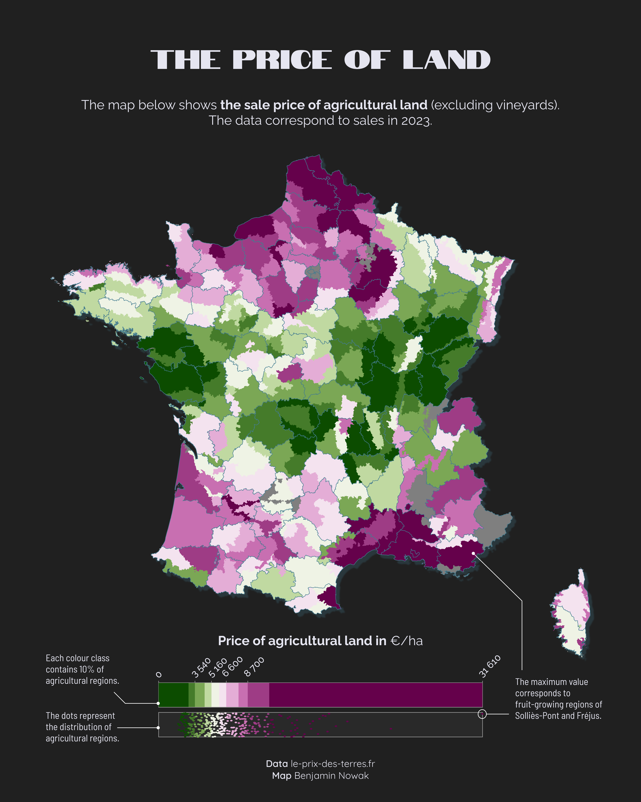

```{r global options, include = FALSE}
knitr::opts_chunk$set(warning = FALSE, message = FALSE)
```

<div class="container">


# 0. Two types of color scale
***

There are two main ways of creating univariate choropleth colour gradients: classes of **equal size** or classes with the **same number of entities** (equal quantiles). In both cases, it may be worth modifying the legend so that this choice is clearly represented on the map.

The case of equal classes has already been covered in [this tutorial](https://r-graph-gallery.com/web-choropleth-barchart-map.html) by Vinicius Oike Reginatto, who shows how to use a histogram to represent the number of entities per class. 

Here we will see how to create **a specific legend for maps with the same number of entities per class**. We are going to do this in three stages: create the map, create the legend and then assemble the two.

This tutorial has been written by [Benjamin Nowak](https://www.linkedin.com/in/benjamin-nowak-561296352/). Thanks to him for sharing his work! 🙏

This is what we're going to build:

<div style="text-align: center;">
  
</div>


# 1. Load data
***

First, we will load the packages required for this tutorial:

```{r, warning=FALSE, message=FALSE}
library(patchwork)   # To assemble plots
library(scico)       # For color gradients
library(sf)          # To handle vector map objects
library(tidyverse)   # For everything else ;)
```

We may then load the data as shown below:

```{r, warning=FALSE, message=FALSE}
# Load data
map<-read_sf('https://github.com/BjnNowak/TidyTuesday/raw/refs/heads/main/map/price_map_france.gpkg')
# This map is only for department borders
fr<-sf::read_sf('https://github.com/BjnNowak/lego_map/raw/main/data/france_sport.gpkg')

# Take a look at first lines
head(map)
```

The main map gives the price of farming land (in euros per ha) for each agricultural region. Borders of the region came from a file created by [Pierre Nansot](https://github.com/PierreNansot/pra-shapefiles). I have then extracted the price of farming land from this website, [le-prix-des-terres.fr](https://www.le-prix-des-terres.fr/).


# 2. Make map
***

Before making the map, we will extract the percentiles, and then create a specific class for each percentile:

```{r, warning=FALSE, message=FALSE}
# Extract percentiles
bks<-quantile(map$price_ha,na.rm=TRUE,probs=seq(0,1,0.1))

# Add classes based on price of land for each region 
map_cl<-map%>%
  mutate(cl=case_when(
    price_ha<bks[2]~"A", 
    price_ha<bks[3]~"B",
    price_ha<bks[4]~"C",
    price_ha<bks[5]~"D",
    price_ha<bks[6]~"E",
    price_ha<bks[7]~"F",
    price_ha<bks[8]~"G",
    price_ha<bks[9]~"H",
    price_ha<bks[10]~"I",
    price_ha<=bks[11]~"J",
    TRUE~NA
  ))

```

We may then create the color palette, using the [{scico}](https://github.com/thomasp85/scico) package from Fabio Crameri and Thomas Lin Pedersen.

```{r eval=TRUE, message=FALSE, warning=FALSE}
# Create color palette
pl<-rev(scico(10, palette = 'bam'))

# Set color for each class
pal<-c(
  "A"=pl[1],
  "B"=pl[2],
  "C"=pl[3],
  "D"=pl[4],
  "E"=pl[5],
  "F"=pl[6],
  "G"=pl[7],
  "H"=pl[8],
  "I"=pl[9],
  "J"=pl[10]
)

# Color for na values
na_col<-'grey50'
# Color for department borders 
col_border<-'#437C90'
# Create custom theme
custom_theme<-theme_void()+
  theme(plot.background = element_rect(fill="#202020",color=NA))

```

We are now ready to make the map:

```{r eval=TRUE, message=FALSE, warning=FALSE, fig.dim=c(10,10)}
# Make map
mp<-ggplot()+
  geom_sf(
    map_cl,
    mapping=aes(fill=cl,color=cl,geometry=geom),
  )+
  geom_sf(
    fr,
    mapping=aes(geometry=geom),
    fill=NA,color=col_border,linewidth=0.15,alpha=1
  )+
  scale_fill_manual(values=pal,na.value=na_col)+
  scale_color_manual(values=pal,na.value=na_col)+
  guides(fill='none',color="none")+
  custom_theme

mp

```

# 3. Make legend
***

To make the legend, we will create a tibble with the min and max coordinates of each quantile of our variable of interest. We may then use *geom_rect()* to plot these quantiles in a *ggplot()* object.

```{r eval=TRUE, message=FALSE, warning=FALSE}
# Set min value at 0 for color palette
bks[1]=0

tib<-tibble(
    end=bks
  )%>%
  mutate(
    start=lag(bks, 1),
    cl=c(0,"A","B","C","D","E",'F','G','H','I','J')
  )%>%
  # Remove first row
  slice(2:11)

```

We are now ready to plot the color gradient. In addition of the quantiles, we will also plot the points to show the distribution of the region, using *geom_jitter()* to add some noise on the y-axis.

```{r eval=TRUE, message=FALSE, warning=FALSE,fig.dim=c(10,2.5)}
lg<-ggplot()+
  # Add color gradient
  ####################
  geom_rect(
    data=tib,
    aes(xmin=start,xmax=end,ymin=0,ymax=1,fill=cl)
  )+
  # Add labels
  geom_text(
    data=tib%>%slice(c(seq(1,10,2))),
    mapping=aes(x=start,y=1.1,label=start),
    angle=45,hjust=0,vjust=0,
    color="white"
  )+
  # Add points to show distribution
  #################################
  # Create one box behind points
  annotate(
    geom="rect",
    xmin=0,xmax=max(bks),ymin=-1.25,ymax=-0.25,
    fill=NA,color="dimgrey"
  )+
  geom_jitter(
    data=map_cl%>%st_drop_geometry(),
    mapping=aes(x=price_ha,y=-0.75,fill=cl,color=cl),
    pch=21,
    # Control jitter amplitude
    width=0,height=0.5
  )+
  scale_y_continuous(limits=c(-1.5,1.5))+
  scale_fill_manual(values=pal,na.value=na_col)+
  scale_color_manual(values=pal,na.value=na_col)+
  guides(fill='none',color='none')+
  custom_theme

lg

```

# 4. Assemble plots
***

We may then use patchwork to assemble both plots

```{r eval=TRUE, message=FALSE, warning=FALSE,fig.dim=c(10,12.5)}
# Define layout
layout <- c(
  area(t = 0, l = 0, b = 10, r = 10),
  area(t = 11, l = 0, b = 13, r = 10)
)

mp + lg +
  plot_layout(design = layout)+ 
  plot_annotation(
    title = 'The price of land',
    subtitle = 'The map below show the price of agricultural land, in euros per hectare.'
  )& 
  theme(
    plot.background = element_rect(fill="#202020",color=NA),
    text = element_text('mono',hjust=0.5,color="white"),
    plot.title = element_text(hjust=0.5,face='bold'),
    plot.subtitle = element_text(hjust=0.5)
  )

```

# Source
***

**Data** [le-prix-des-terres.fr](https://www.le-prix-des-terres.fr/) 
<!-- Close container -->
</div>


```{r, echo=FALSE}
htmltools::includeHTML("htmlChunkRelatedMap.html")
```
