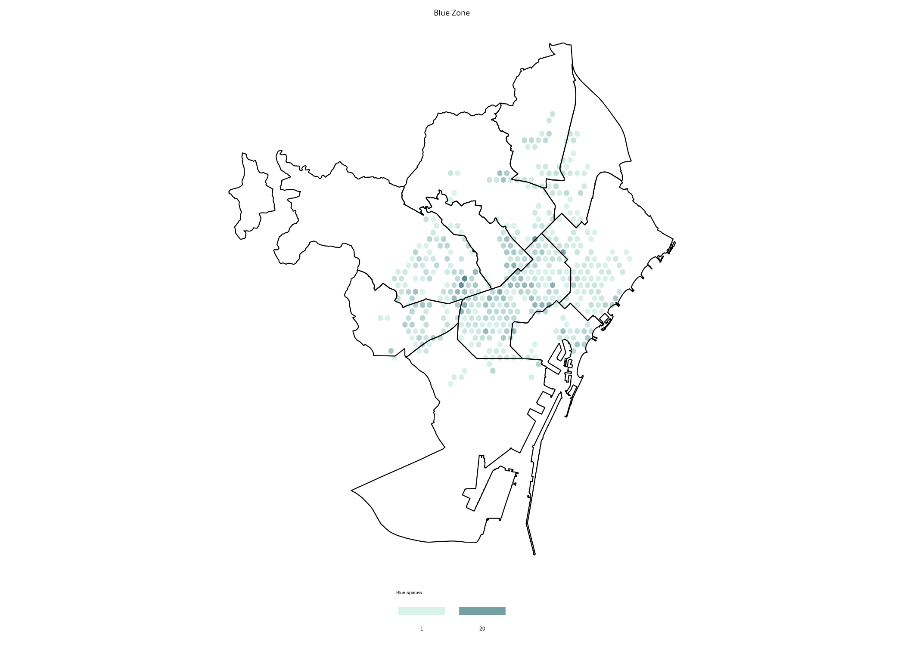
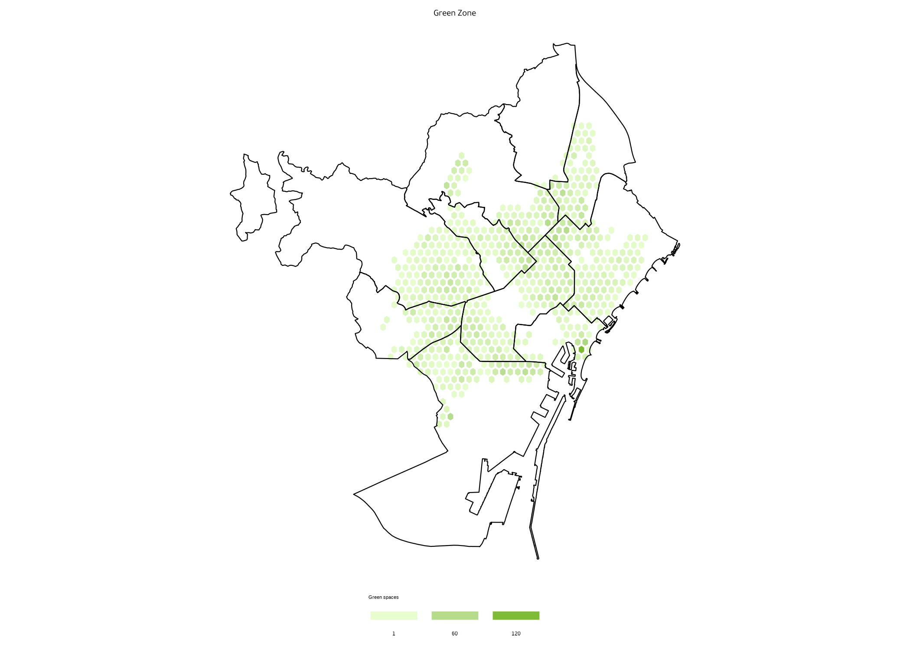
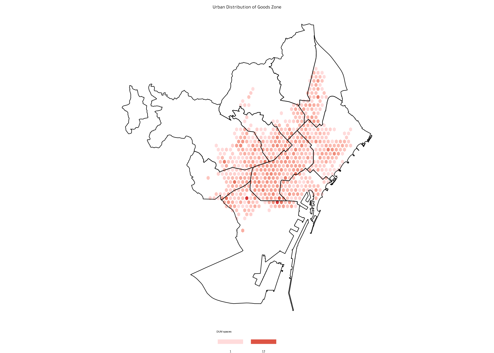

```{r global options, include = FALSE}
knitr::opts_chunk$set(warning = FALSE, message = FALSE, fig.align = "center")
```

<div class="container">


# Packages
***

In order to create this chart, we need to load the **following packages**, as well as some **fonts**:

```{r thecode2, echo=TRUE, out.width = "100%", fig.height=7}
# Libraries that we need
library(tidyverse)
library(viridis)
library(hrbrthemes)
library(geojsonio)
library(sf)
library(broom)
library(cowplot)
library(hexbin)
library(showtext)

# Loading fonts
font_add_google("DM Serif Display", "abril")
font_add_google("Tajawal", "tawa")
showtext_auto()
```


# Dataset
***

The data consists of a CSV file containing information about parking areas in Barcelona, which is loaded into a data frame called `data`. The data is then filtered to include **only rows** with `TIPUS_TRAM` equal to "AZL", "VR", or "VM", and the results are stored in the `tram_AZL`, `tram_VR`, and `tram_DUM` data frames, respectively.

Additionally, a **geojson file** containing the boundaries of Barcelona's districts is loaded into a data frame called `districts`.

```{r}
data <- read.csv("https://raw.githubusercontent.com/lau-cloud/30DayMapChallenge/main/parking_areas/TRAMS.csv", sep = ",", header = T)

# Loading Barcelona's district boundaries
districts <- st_read("https://raw.githubusercontent.com/lau-cloud/30DayMapChallenge/main/parking_areas/0301040100_Districtes_UNITATS_ADM.json",
  stringsAsFactors = FALSE,
  as_tibble = TRUE
)

# Filtering types
trams_verda <- c("VR", "VM")

tram_AZL <- data |>
  filter(TIPUS_TRAM == "AZL")

tram_VR <- data |>
  filter(TIPUS_TRAM %in% trams_verda)

tram_DUM <- data |>
  filter(TIPUS_TRAM == "DUM")
```

# Only one map: blue zone
***

We start by creating a single map using the blue zone only. It mainly relies on the `geom_sf()` function from the [sf package](package/sf.html) and the `geom_hex()` function.

```{r, fig.show='hide'}
mapa_AZL <- ggplot() +
  geom_hex(
    data = tram_AZL, aes(x = LONGITUD_I, y = LATITUD_I),
    color = "white", alpha = 0.8, bins = 35
  ) +
  geom_sf(
    data = districts, fill = "transparent",
    color = "black", linewidth = .25
  ) +
  labs(
    title = "Blue Zone",
    caption = ""
  ) +
  theme_void() +
  scale_fill_gradient(
    low = "#D1F0E5",
    high = "#306D75",
    breaks = c(1, 20, 40),
    name = "Blue spaces",
    guide = guide_legend(keyheight = unit(2.5, units = "mm"), keywidth = unit(10, units = "mm"), label.position = "bottom", title.position = "top", nrow = 1)
  ) +
  theme(
    legend.position = "bottom",
    legend.title = element_text(color = "black", size = 8),
    text = element_text(color = "black"),
    plot.subtitle = element_text(hjust = 0.5, size = 8, color = "black"),
    plot.title = element_text(hjust = 0.5, size = 16, family = "tawa"),
    plot.caption = element_text(hjust = 1, size = 7, color = "black")
  )

mapa_AZL
ggsave("img/graph/single-density-map-1.png")
```

<center>
  
</center>

# Only one map: green zone
***

Now we create the same chart but using the **green zone only**. The code is pretty much the same as above:

```{r, fig.show='hide'}
mapa_VR <- ggplot() +
  geom_hex(
    data = tram_VR, aes(x = LONGITUD_I, y = LATITUD_I),
    color = "white", alpha = 0.8, bins = 35
  ) +
  geom_sf(
    data = districts, fill = "transparent",
    color = "black", linewidth = .25
  ) +
  labs(
    title = "Green Zone",
    caption = ""
  ) +
  theme_void() +
  scale_fill_gradient(
    low = "#E1FCC1",
    high = "#5DAA01",
    breaks = c(1, 60, 120),
    name = "Green spaces",
    guide = guide_legend(keyheight = unit(2.5, units = "mm"), keywidth = unit(10, units = "mm"), label.position = "bottom", title.position = "top", nrow = 1)
  ) +
  theme(
    legend.position = "bottom",
    legend.title = element_text(color = "black", size = 8),
    text = element_text(color = "black"),
    plot.subtitle = element_text(hjust = 0.5, size = 8, color = "black"),
    plot.title = element_text(hjust = 0.5, size = 16, family = "tawa"),
    plot.caption = element_text(hjust = 0.5, size = 7, color = "black")
  )

mapa_VR
ggsave("img/graph/single-density-map-2.png")
```

<center>
  
</center>


# Only one map: red zone
***

Now we create the same chart but using the **red zone only**. The code is pretty much the same as above:

```{r, fig.show='hide'}
mapa_DUM <- ggplot() +
  geom_hex(
    data = tram_DUM, aes(x = LONGITUD_I, y = LATITUD_I),
    color = "white", alpha = 0.8, bins = 35
  ) +
  geom_sf(
    data = districts, fill = "transparent",
    color = "black", linewidth = .25
  ) +
  labs(
    title = "Urban Distribution of Goods Zone"
  ) +
  theme_void() +
  scale_fill_gradient(
    low = "#FFD2D2",
    high = "#CD0000",
    breaks = c(1, 12, 25),
    name = "DUM spaces",
    guide = guide_legend(keyheight = unit(2.5, units = "mm"), keywidth = unit(10, units = "mm"), label.position = "bottom", title.position = "top", nrow = 1)
  ) +
  theme(
    legend.position = "bottom",
    legend.title = element_text(color = "black", size = 8),
    text = element_text(color = "black"),
    plot.subtitle = element_text(hjust = 0.5, size = 8, color = "black"),
    plot.title = element_text(hjust = 0.5, size = 16, family = "tawa"),
    plot.caption = element_text(hjust = 1, size = 7, color = "black")
  )

mapa_DUM
ggsave("img/graph/single-density-map-3.png")
```

<center>
  
</center>

# Combine plots
***

Now that we have the charts that we needed, we can **concatenate** them into a single one thanks to the `plot_grid()` function:

```{r, fig.show='hide'}
# Title
ggdraw() +
  draw_text("Parking Areas in Barcelona",
    size = 24, family = "abril", fontface = "bold"
  ) -> header_plot

# Caption
ggdraw() +
  draw_text("Data: OpenData BCN | Visualization: Laura Navarro",
    size = 16, family = "tawa", color = "grey", hjust = 0.5
  ) -> caption_plot

# Grid plots
grid_plots <- plot_grid(
  mapa_AZL,
  mapa_VR,
  mapa_DUM,
  nrow = 1,
  ncol = 3
)

# Final plot
plot_grid(

  header_plot,
  grid_plots,
  caption_plot,

  ## plot settings
  nrow = 3,
  ncol = 1,
  rel_heights = c(1, 5, 1)
)
ggsave("img/graph/multiple-density-map.png")
```

<center>
  
</center>


# Going further
***

You might be interested in:

- this beautiful [ridgeline plot](web-ridgeline-plot-with-inside-plot-and-annotations.html) about rental prices
- how to create a [small multiple line chart](web-line-chart-small-multiple-all-group-greyed-out.html)
- how to mix [time series and facetting](web-time-series-and-facetting.html)


<!-- Close container -->
</div>


```{r, echo=FALSE}
htmltools::includeHTML("htmlChunkRelatedRanking.html")
```
