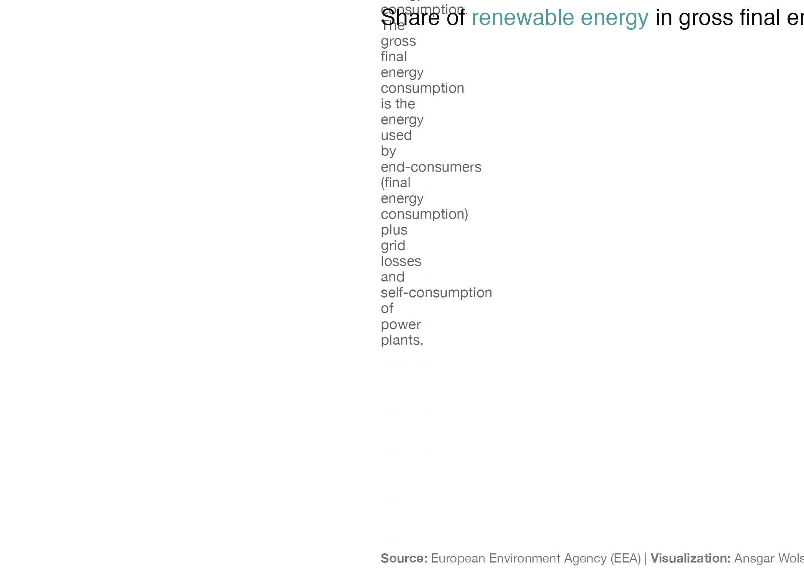

```{r global options, include = FALSE}
knitr::opts_chunk$set(
  warning=FALSE, 
  message=FALSE#,
  #fig.align='center'
)
```

<div class="container" style="padding-top: 100px">


# About
***

The chart we want to reproduce is a [waffle chart](https://r-graph-gallery.com/barplot.html) about the **share of renewable energy** of different countries.

It has been created by [Ansgar Wolsing](https://twitter.com/_ansgar). Thanks to him for accepting sharing his work here!

As a teaser, here's the chart we want to reproduce:

<div style="text-align: center;">
  
</div>

# Libraries

In order to create this chart, we will use the following **libraries**:

- `tidyverse` to manipulate the data
- `ggtext` to add HTML/CSS in ggplot2
- `here` to manage the paths
- `waffle` to create waffle charts


```{r}
library(tidyverse)
library(ggtext)
library(waffle)
```


# Data

The data used for this chart can be found at [this adress](https://ec.europa.eu/eurostat/databrowser/view/sdg_07_40/default/table?lang=en) via **Download > Full dataset > TSV**.

```{r}
df_raw <- read_tsv("DATA/sdg_07_40_tabular.tsv", na = ":")

# let's clean a bit the data
df_2020 <- df_raw %>%
  rename(X1 = 1) %>% 
  mutate(countrycode = str_match(X1, "(?:.+?,){3}(.{2})")[, 2]) %>% 
  select(countrycode, share_renewable = `2020`) %>% 
  mutate(country = countrycode::countrycode(countrycode, origin = "eurostat", destination = "country.name")) %>% 
  na.omit()
```


# Set up parameters for the chart
***

Before starting to actually create the chart, we need to **set up some parameters** that will be used later on such as colors and annotations.

### Annotations

Let's define a few **annotations** that will be used in the chart. We will use the `glue` function to interpolate the colors.

```{r}
eu_countries <- c("BE", "BG", "CZ", "DK", "DE", "EE", "IE", "EL", "ES", 
                  "FR", "HR", "IT", "CY", "LV", "LT", "LU", "HU", "MT", 
                  "NL", "AT", "PL", "PT", "RO", "SI", "SK", "FI", "SE")

plot_labs <- labs(
  title = glue::glue("Share of
    <span style='color:{colorspace::darken(\"#77C3C2\", 0.2)}'>renewable energy</span> 
                       in gross final energy consumption (2020)"),
  subtitle = "The indicator measures the share of renewable energy consumption 
    in gross final energy consumption. 
    The gross final energy consumption is the energy used by end-consumers 
    (final energy consumption) plus grid losses and self-consumption of power plants.",
  caption = "**Source:** European Environment Agency (EEA) | **Visualization:** Ansgar Wolsing"
)
```

### Theme

We will use the `theme_minimal()` theme from the `ggplot2` package. We will then update it to match the style of the chart.

Here are the main parameters that we will update:

- `plot.background`: set in white
- `axis.text`: removed
- `panel.grid`: removed
- `text`: set in grey38
- `plot.title`: set in grey4, with the "Oswald" font and a size of 14
- `plot.subtitle`: set in grey46, with a lineheight of 1.1 and a size of 9
- `plot.caption`: set in grey46, with a size of 8
- `strip.text`: set in grey46, with a size of 8

```{r}
theme_set(theme_minimal(base_family = "Helvetica Neue"))
theme_update(
  plot.background = element_rect(color = NA, fill = "white"),
  axis.text = element_blank(),
  panel.grid = element_blank(),
  text = element_text(color = "grey38"),
  plot.title = element_markdown(color = "grey4", family = "Oswald", size = 14),
  plot.subtitle = element_textbox_simple(
    lineheight = 1.1, size = 9,
    margin = margin(t = 8, b = 6)
  ),
  plot.caption = element_markdown(hjust = 0, color = "grey46", size = 8),
  strip.text = element_markdown(hjust = 0, lineheight = 1.2, size = 8,
                                margin = margin(t = 8, b = 2, l = 2))
)
```


# Dumbell chart

Now let's actually create the chart. Here is what the code mainly does:

### Data manipulation

- Create new columns `share_renewable_precise` that contains the **share of renewable energy**
- Pivot the data to have a column `name` that contains the **type of energy** (renewable or other)

### Plot

- Create a **waffle chart** with 10 rows and 100 columns
- Use the `share_renewable_precise` column to display the **share of renewable energy** in the chart
- Add a **facet** for each country
- Add the **title** and the **subtitle** to the chart

```{r}
df_2020_waffle <- df_2020 %>% 
  filter(countrycode %in% eu_countries) %>% 
  mutate(share_renewable_precise = share_renewable,
         share_renewable = round(share_renewable),
         share_other = 100 - share_renewable) %>% 
  pivot_longer(cols = c(share_renewable, share_other), names_pattern = "share_(.+)") %>% 
  mutate(name = factor(name, levels = c("renewable", "other")))

p <- df_2020_waffle %>% 
  mutate(
    share_fmt = sprintf("%.1f", share_renewable_precise),
    label = glue::glue("**{country}**<br>{share_fmt} %"),
    label = fct_reorder(label, -share_renewable_precise)) %>%
  ggplot(aes(fill = name, values = value)) +
  geom_waffle(n_rows = 10, cols = 100, size = 0.2, colour = "white", flip = TRUE,
              show.legend = FALSE) +
  scale_fill_manual(name = NULL,
                    values = c("#77C3C2", "grey87")) +
  coord_fixed() +
  facet_wrap(vars(label)) +
  plot_labs +
  theme(axis.title = element_blank())

# save
ggsave("img/graph/web-waffle-by-countries.png", p)
p
```


<!--<center>
  
</center>-->

# Going further

This post explains how to create a [waffle chart](https://r-graph-gallery.com/barplot.html) with nice features such as **annotations**, nice **color** theme and others, using R and [ggplot2](https://r-graph-gallery.com/ggplot2-package.html).

If you want to learn more, you can check the [bar chart section](https://r-graph-gallery.com/barplot.html) of the gallery and [another beautiful bar chart](https://r-graph-gallery.com/web-circular-barplot-with-R-and-ggplot2.html) built with ggplot2.

<!-- Close container -->
</div>

```{r, echo=FALSE}
# Correlation | Ranking | Evolution.. 
htmltools::includeHTML("htmlChunkRelatedRanking.html")
```
