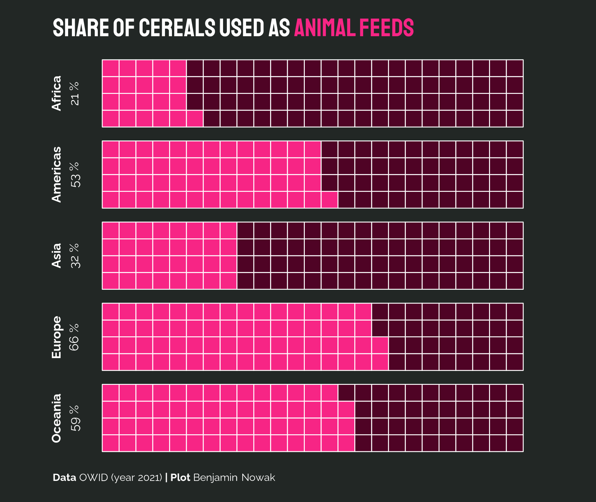

```{r global options, include = FALSE}
knitr::opts_chunk$set(
  warning=FALSE, 
  message=FALSE,
  fig.align='center'
)
```

<div class="container" style="padding-top: 100px">


# About

This chart has been realised by [Benjamin Nowak](https://twitter.com/BjnNowak). Thanks to him for sharing this content!

As a **teaser**, here is the chart we are going to build:

<div style="text-align: center;">
  
</div>

# Load packages

In R, waffle charts may be created with the [waffle](waffle.html) package. In addition to this library, we will load several packages that we will need for this tutorial: 

```{r, warning=FALSE, message=FALSE}
library(tidyverse)
library(patchwork)
library(camcorder)
library(showtext)
library(ggtext)
library(waffle)      
```

# Data

The dataset contains **1 one row per continent**, with the share of cereals used as animal feed.

You can directly load the data from the gallery's repo:

```{r, warning=FALSE, message=FALSE}
path = 'https://raw.githubusercontent.com/holtzy/R-graph-gallery/master/DATA/share-cereals.csv'
path = 'DATA/share-cereals.csv'
data <- read_csv(path)
```

# Settings

Before actually creating the waffle chart, we need to **set the fonts** and the **plot size**. This is done as follows:

```{r, warning=FALSE, message=FALSE}
# Set fonts
font_add_google("Staatliches","sta")
font_add_google("Raleway","ral")
showtext_auto()

# Plot size
gg_record(
  dir = file.path(tempdir(),"recording"), 
  device = "png", 
  height = 13.5, 
  width = 16, 
  units = "cm", 
  dpi = 300 
)
```

# Make waffle chart for wheat

The waffle chart is created using the `geom_waffle()` function. Here are the main arguments:

- `fill`: the **color** of the waffle chart.
- `values`: the value to represent. Here, it is the **percentage of cereals** used as animal feed.
- `n_rows`: the **number of rows** in the waffle chart.
- `flip`: **whether to flip** the waffle chart.
- `size`: the size of the waffle chart.
- `colour`: the **color of the border** of the waffle chart.

```{r, warning=FALSE, message=FALSE}
ggplot(data, aes(fill = type, values = percent))+
  geom_waffle(na.rm=TRUE, n_rows=4, flip=F, size = 0.33, colour = "white")+
  facet_wrap(~reorder(lab, percent),ncol=1,strip.position = "left")+
  coord_equal()+
  guides(fill='none')+
  labs(
    title="<b>Share of cereals used as <span style='color:#f72585;'>animal feeds</span></b>",
    caption="<b>Data</b> OWID (year 2021) <b>| Plot</b> Benjamin Nowak"
  )+
  scale_fill_manual(values=c('#f72585','#4F0325'))+
  theme_void()+
  theme(
    plot.background = element_rect(fill="#222725",color=NA),
    plot.title = element_markdown(size=60,family='sta',margin=margin(0.5,0,0.5,-0.75,'cm'),color='white'),
    strip.text = element_markdown(hjust=0.5,size=30,family='ral',angle=90,margin=margin(0,0,0,0,'cm'),lineheight = 0.45,color='white'),
    plot.caption = element_markdown(size=25,family='ral',margin=margin(0.5,0,0.5,-0.75,'cm'),hjust=0,color='white'),
  )

# Save the plot
ggsave("img/graph/web-waffle-chart-share.png", width = 16, height = 13.5, units = "cm")
```


# Going further

This post explains how to create a [waffle chart](waffle.html) as a way to visualize the distribution of various groups.

If you want to learn more, you can check the [waffle section](waffle.html) of the gallery and [how to play with subgroups and colors](407-geom-waffle-multiple-groups.html) in waffle charts.

<!-- Close container -->
</div>

```{r, echo=FALSE}
# Correlation | Ranking | Evolution.. 
htmltools::includeHTML("htmlChunkRelatedRanking.html")
```
